# IndieRay — User Manual

**theindieray.com**

---

> This guide walks you through everything you can do on IndieRay — from landing on the home page all the way to generating videos. Every button, every screen, every error is covered here.
>
> **How to use this guide:** Read it top to bottom the first time. After that, jump to any section using the Table of Contents below.

---

## Table of Contents

1. The Home Page
2. Exploring the Site
3. Sign Up
4. Sign In
5. Your Dashboard
6. Creating a Project
7. The Project Hub
8. Paying for a Plan
9. Using IndieAgent
10. Using the Playground
11. Using IndieShots
12. Troubleshooting
13. Quick Reference
14. Notes for the Doc Owner

---

## Before You Start — Quick Answers

New to IndieRay? These 18 plain-language answers cover every concept you will encounter in this guide. Read them once and everything else will make sense faster.

| Question | Answer |
|:---------|:-------|
| **What is IndieRay?** | An AI-powered platform that helps you research, write, and create content — scripts, images, and videos — all in one place. |
| **What is IndieAgent?** | Your AI assistant inside IndieRay. Chat with it to do research, write scripts, generate images and videos, and get answers about your project. |
| **What is the Playground?** | A workspace where you upload references, write your script, and chat with an AI that uses everything you uploaded to help you. |
| **What is IndieShots?** | The visual creation tool where you generate images and videos on a canvas, connect them together, and build your content step by step. |
| **What are credits?** | The currency the AI spends every time it does work — research, image generation, video generation, document analysis. Each plan gives you a set number. |
| **What is a project?** | A container for one piece of work. It holds your resources, scripts, chats, and generated content all in one place. |
| **What is a resource?** | Anything you give the AI to work from — a video, a document, a website, an image, or a piece of text. Lives in the Playground. |
| **What is a session?** | One conversation thread. You can have many sessions per project and switch between them any time without losing history. |
| **What is Research mode?** | Tells IndieAgent to focus on finding trends, analysing competitors, and looking up real information before writing anything. |
| **What is Brief mode?** | Tells IndieAgent to focus on developing and refining your creative direction — shaping what the content should say and who it is for. |
| **What is UGC Studio?** | A mode in IndieShots where you upload product photos, presenter photos, and a voiceover, then ask the AI to generate a short-form ad video. |
| **Can IndieRay post content for me?** | No. IndieRay helps you research, plan, write, and generate content. Publishing to social platforms is something you do yourself. |
| **Do I own what IndieRay creates?** | Yes. Everything you generate is yours. Keep in mind AI outputs are not unique — a similar prompt from someone else could produce a similar result. |
| **Is there a free plan?** | Yes. A free tier with limited credits exists. The Pricing page shows exactly what each plan includes. |
| **What happens when I run out of credits?** | The AI tools stop working and you see an upgrade prompt. Your projects and content stay safe — nothing is deleted. Top up and everything resumes immediately. |
| **Does IndieRay work on my phone?** | It works in a mobile browser, but the Playground and IndieShots are designed for larger screens. For the best experience use a laptop or desktop. |
| **Can I share a project with my team?** | Yes. From the Playground, click the share icon in the header and invite teammates by email with read-only or read-and-write access. |
| **How do I get help if something goes wrong?** | Email **contactus_indieray@theindierise.com** or use the contact form at theindieray.com/contact. |

---

## How IndieRay Works — Overview

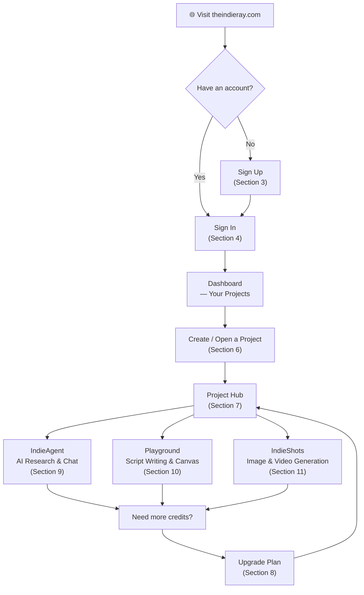

---

## 1. The Home Page

> **📸 SCREENSHOT PLACEHOLDER — Home page, full view (desktop)**
> *Capture: theindieray.com loaded in a desktop browser showing the background video, hero text, two CTA buttons, and the navigation bar.*

When you visit **theindieray.com** you land on the home page. A background video plays automatically. The hero text reads **"Your AI content studio — Idea to video in minutes"** with a short supporting line beneath it.

### What you see — at a glance

| Area | What's there | What it does |
|:-----|:-------------|:-------------|
| Center | **Learn IndieRay** button | Opens the help / documentation section |
| Center | **Get Started** button | Goes to Dashboard (signed in) or Sign-In page (signed out) |
| Top nav | Blog · How it Works · Pricing · About · Contact | Opens those pages |
| Top nav right | **Explore IndieRay** button | Takes a signed-out visitor to the sign-in page |
| Top nav right | ☀/🌙 icon | Toggles light / dark mode |

> **📸 SCREENSHOT PLACEHOLDER — Navigation bar, signed-out state**
> *Capture: Top nav bar showing Blog, How it Works, Pricing, About, Contact links and the "Explore IndieRay" button on the right.*

### If you are already signed in

The top right changes: the **Explore IndieRay** button is replaced by a **My Projects** button (folder icon), a theme toggle, and your profile picture in a small circle. Clicking **My Projects** takes you to your dashboard.

> **📸 SCREENSHOT PLACEHOLDER — Navigation bar, signed-in state**
> *Capture: Top nav bar showing the "My Projects" button and the user avatar circle on the right.*

Scrolling further down the home page shows tool demos, sample videos, and feature highlights. You do not need to scroll to use anything — it is informational only.

---

## 2. Exploring the Site

No account needed. Every page below is open to anyone.

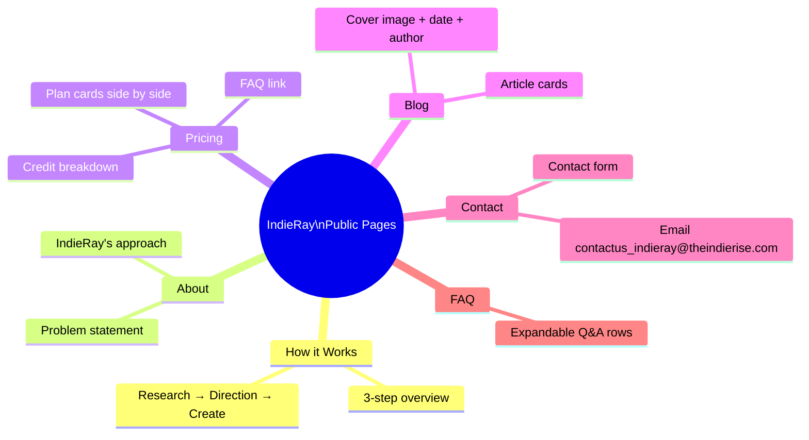

### How it Works — `/how-it-works`

> **📸 SCREENSHOT PLACEHOLDER — How it Works page**
> *Capture: The three-step breakdown showing Research, Direction, and Create steps.*

A one-minute read that explains IndieRay in three steps: **Research & gather references → Get clarity on direction → Write & create.** Good starting point if you are not sure what IndieRay is for.

---

### About — `/about`

> **📸 SCREENSHOT PLACEHOLDER — About page**
> *Capture: Full page showing the two sections — problem statement at top, IndieRay's approach below.*

Two sections: the top explains the problem most content tools have; the bottom explains how IndieRay approaches it differently. The core idea is that understanding your audience comes *before* writing.

---

### Pricing — `/pricing`

> **📸 SCREENSHOT PLACEHOLDER — Pricing page, all plan cards visible**
> *Capture: All plan cards side by side with the "Most Popular" badge on the middle plan.*

| What you see on each card | Meaning |
|:--------------------------|:--------|
| Plan name & monthly price | What you are buying |
| Credits included | The AI fuel for all tools |
| Feature list | What is unlocked at this tier |
| **Most Popular** glowing badge | Shown on the middle plan only |
| Green checkmark + **Current plan** | Your active plan |
| **Included in your plan** (grey) | Plans below your current tier — cannot be selected |
| Upgrade button | Plans above your current tier — click to buy |

> If you click a plan button while signed out, you are sent to the sign-up page. Return to Pricing after signing up.

---

### FAQ — `/faq`

Each question is a row you click to expand. Topics covered: what IndieRay is, what tools are included, IndieAgent, IndieShots, free plan availability, and content ownership.

---

### Blog — `/blog`

> **📸 SCREENSHOT PLACEHOLDER — Blog listing page**
> *Capture: Grid of article cards each showing cover image, category badge, title, author, and date.*

Each article appears as a card: cover image, category badge, title, short description, author name, and date. Click any card to read the full article.

---

### Contact — `/contact`

> **📸 SCREENSHOT PLACEHOLDER — Contact page showing both the email link and the contact form**
> *Capture: Page with the email address visible and the full form below it.*

Two ways to reach the team:

- **Email directly:** `contactus_indieray@theindierise.com` — click the address on the page and your email app opens automatically.
- **Contact form:** Fill in your name, email, inquiry type (dropdown), and your role (dropdown). Message is optional. Click **Send Message**. A thank-you confirmation appears when it is sent.

**Role dropdown options:**

| Option | When to pick it |
|:-------|:----------------|
| Writer / Creator | Personal or solo content work |
| Marketing Team | In-house brand team |
| Agency / Studio | Client-facing production work |
| Enterprise | Large-scale or custom needs |
| Other | Anything else |

---

## 3. Sign Up

Go to **theindieray.com/sign-up** or click **Explore IndieRay** in the top navigation.

> **📸 SCREENSHOT PLACEHOLDER — Sign-up page, desktop view**
> *Capture: Full page showing the left feature-preview panel and the right sign-up form side by side.*

On desktop the screen is split: the left side previews what IndieRay does (script generation, image generation, video generation); the right side has the sign-up form. On mobile only the form is shown.

### Sign-Up Flow

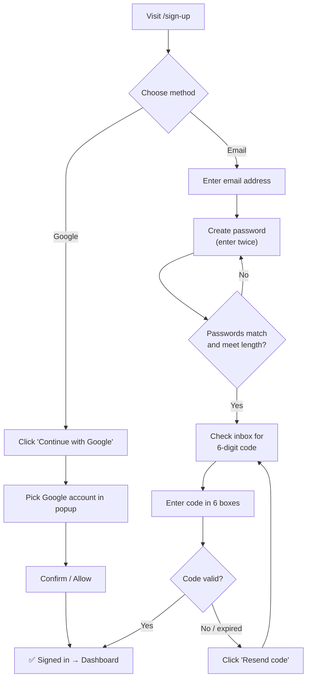

---

### Option A — Sign up with Google *(fastest)*

1. Click **Continue with Google** (Google logo on the button).
2. Pick the Google account you want from the popup.
3. Click **Continue** or **Allow** when Google asks.
4. Done — you are signed in and taken straight to your dashboard.

---

### Option B — Sign up with email

**Step 1 — Enter your email**

Type your email address into the **Email address** field. Click **Continue**.

**Step 2 — Create a password**

Two fields appear: **Password** and **Confirm password**. Type your chosen password in both. They must match exactly and meet the minimum length shown on screen. Click **Continue**.

**Step 3 — Verify your email**

> **📸 SCREENSHOT PLACEHOLDER — Email verification screen**
> *Capture: The six-box verification code entry screen with the "Resend code" link visible below.*

A screen with six empty boxes appears. IndieRay has sent a 6-digit code to your inbox.

- Check your inbox. If nothing arrives in two minutes, check **Spam / Junk** and — for Gmail — the **Promotions** tab.
- Type one digit per box.
- Click **Verify**.

You are now signed in and taken to your dashboard.

> **Already have an account?** At the bottom of the form, click **Already have an account? Sign in** to go to the sign-in page instead.

---

## 4. Sign In

Go to **theindieray.com/sign-in** or click **Explore IndieRay** in the top navigation.

> **📸 SCREENSHOT PLACEHOLDER — Sign-in page, desktop view**
> *Capture: The same split layout as sign-up — feature preview on left, sign-in form on right.*

The layout mirrors sign-up: feature highlights on the left, form on the right.

### Sign-In Flow

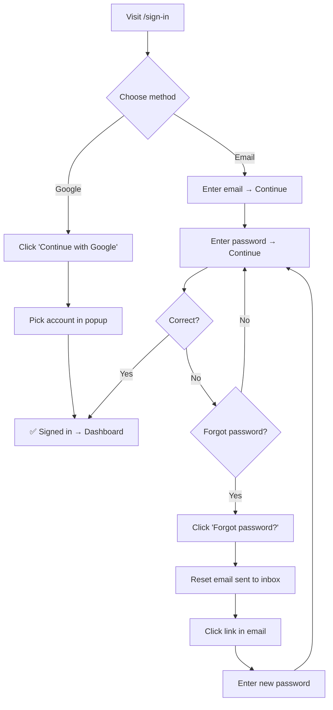

---

### Option A — Sign in with Google

Click **Continue with Google**, pick your account from the popup. You are in.

---

### Option B — Sign in with email

1. Enter your email address → click **Continue**.
2. Enter your password → click **Continue**.

> **Forgot your password?** After entering your email, click **Forgot password?** on the password screen. A reset link is sent to your inbox. Open it, set a new password, and sign in.

> **No account yet?** Click **Don't have an account? Sign up** at the bottom of the form.

> **Tip:** If you signed up with Google, the email + password route will not work. Always use the same method you signed up with.

---

## 5. Your Dashboard

After signing in you land on **theindieray.com/dashboard** — this is where all your projects live.

> **📸 SCREENSHOT PLACEHOLDER — Dashboard with multiple projects**
> *Capture: Dashboard showing the "My Projects" heading, the Upgrade and "+ New Project" buttons, and a grid of project cards.*

### Dashboard anatomy

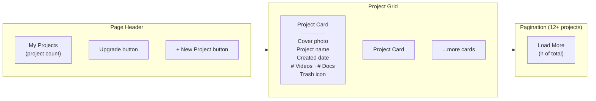

### Project card breakdown

| Element on card | What it shows |
|:----------------|:--------------|
| Cover photo | Auto-pulled from Unsplash based on project topic |
| Project name | The name you gave it |
| Created date | When it was created |
| Video count | Reference videos attached |
| Document count | Documents attached |
| Trash icon (bottom right) | Hover the card to reveal it — click to delete |

Click any card to open that project.

---

### When you have no projects yet

> **📸 SCREENSHOT PLACEHOLDER — Empty dashboard state**
> *Capture: The empty state showing the large folder icon, "No projects yet" message, and "+ Create Your First Project" button.*

The page shows a large folder icon, the text **No projects yet**, and a **+ Create Your First Project** button. Click it to get started.

---

## 6. Creating a Project

Click **+ New Project** at the top right of the dashboard. If you have no projects yet, click **+ Create Your First Project** in the center of the screen.

> **📸 SCREENSHOT PLACEHOLDER — Create New Project popup**
> *Capture: The modal with the "Project Name" input field, character counter, Create button, and Cancel/X button.*

A popup appears in the center of the screen.

### Project name rules

| Rule | Detail |
|:-----|:-------|
| Minimum length | 3 characters |
| Maximum length | 100 characters |
| Counter | Shows progress, e.g. **18/100 characters** |
| Good example names | "Skincare Brand Launch", "YouTube Series October" |

Type the name and click **Create**. The button shows **Creating...** with a spinner while it works. Once done, the popup closes and you are taken directly into that project's hub.

Click **Cancel** or the **X** to close without creating anything.

---

### Deleting a Project

You can delete from two places:

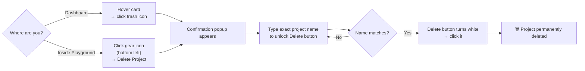

> **⚠ There is no undo.** The project, its scripts, resources, and all chat history are gone permanently. Type the project name carefully before confirming.

---

## 7. The Project Hub

Clicking a project from the dashboard opens the **Project Hub** — the central launchpad for all three tools.

> **📸 SCREENSHOT PLACEHOLDER — Project Hub, desktop view**
> *Capture: Full hub screen showing the background video, project name in the nav bar, the headline text, and the three tool cards on the right.*

### Hub layout

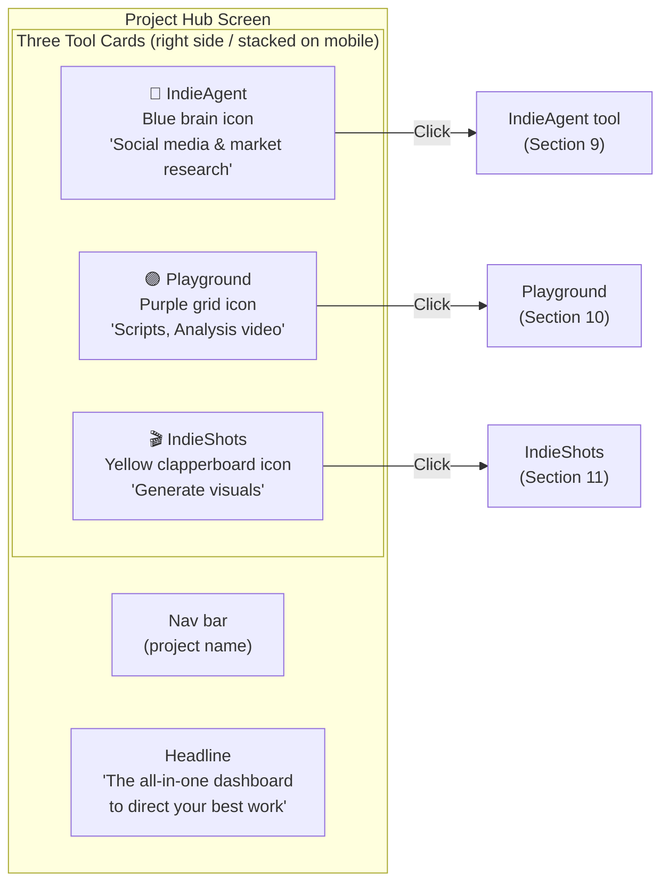

> The animated lines flowing between the heading and the cards are decorative — they show how the tools connect but have no interactive function.

You can always return to the Project Hub by clicking the **project name** in the top navigation bar of any tool.

---

## 8. Paying for a Plan

Go to **theindieray.com/pricing** or click the **Upgrade** button in the top right of IndieAgent or your dashboard.

> **📸 SCREENSHOT PLACEHOLDER — Pricing page with plan cards**
> *Capture: All plan cards visible with labels showing "Current plan", "Included in your plan", and the clickable upgrade buttons.*

### How credits work

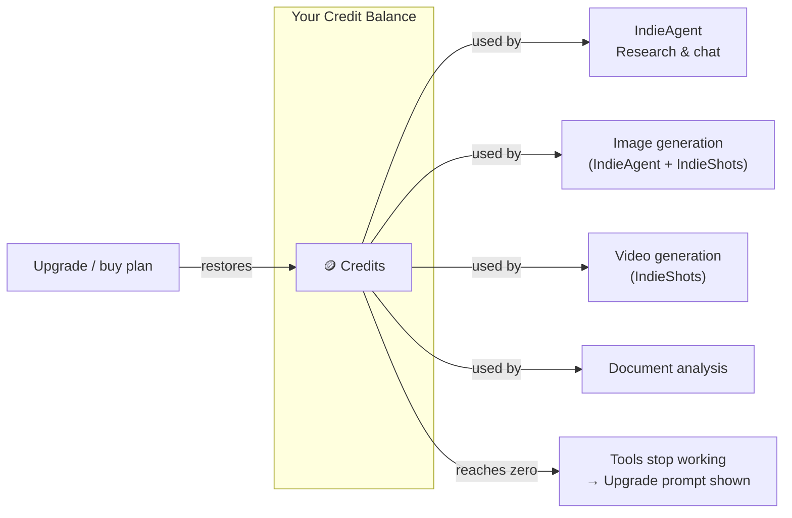

Your remaining credits are shown as a **circular indicator in the top right of IndieAgent**. When it hits zero, all AI tools pause until you top up.

> **📸 SCREENSHOT PLACEHOLDER — IndieAgent header showing the credit indicator and Upgrade button**
> *Capture: The top-right area of IndieAgent with the circular credit count and the "Upgrade" button clearly visible.*

### Buying a plan — step by step

| Step | What happens |
|:-----|:-------------|
| 1 | Click the plan's button on the Pricing page |
| 2 | Razorpay checkout window opens over the page; your account email is pre-filled |
| 3 | Enter card number, expiry, CVV — or switch to UPI / net banking / wallet |
| 4 | Click **Pay** |
| 5 | Payment confirmed → window closes → you are taken to your receipts page; credits are added immediately |

### Viewing receipts — `/dashboard/receipts`

> **📸 SCREENSHOT PLACEHOLDER — Receipts page**
> *Capture: The three summary cards at the top (receipt count, total paid, last payment date) and at least one receipt card below with the "Open receipt" button.*

| Summary card | What it shows |
|:-------------|:--------------|
| Left | Total number of receipts |
| Center | Total amount paid (all time) |
| Right | Date of most recent payment |

Each receipt card shows: plan name, date/time, credits granted, and invoice number. Click **Open receipt** to view the official Razorpay receipt in a new tab (downloadable as PDF).

Use the **Refresh** button (top right of the receipts page) if a receipt has not appeared yet after paying.

---

## 9. Using IndieAgent

IndieAgent is IndieRay's AI assistant. It can research trends, analyse content, write scripts, generate images, generate videos, answer questions about your project, and guide you through the entire content creation process.

Open it by clicking the **IndieAgent** card from your project hub.

> **📸 SCREENSHOT PLACEHOLDER — IndieAgent, first-open state (empty screen)**
> *Capture: The mostly empty screen with the "Hi [name], what to create today?" greeting and the message input bar at the bottom.*

---

### Screen layout

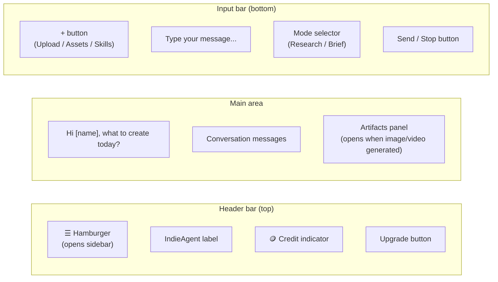

---

### The sidebar

> **📸 SCREENSHOT PLACEHOLDER — IndieAgent sidebar open**
> *Capture: The sidebar slid out showing the logo, close arrow, New chat, Playground, IndieShots, Resources links, and the Recent sessions list.*

Click the **☰ hamburger icon** to open the left sidebar.

| Sidebar item | What it does |
|:-------------|:-------------|
| **New chat** | Starts a fresh conversation (old ones are kept) |
| **Playground** | Navigates to the Playground within this project |
| **IndieShots** | Navigates to IndieShots within this project |
| **Resources** | Opens a panel showing all project files and assets |
| **Recent** section | Lists all past chat sessions, most recent first |

**Managing sessions in the sidebar:**

Hover any session name → three-dot menu appears.

- **Rename** — turns the name into an editable field. Press **Enter** to save, **Escape** to cancel.
- **Delete** — shows a confirmation dialog. Click **Delete** (red) to confirm.

---

### The input bar

> **📸 SCREENSHOT PLACEHOLDER — IndieAgent input bar close-up**
> *Capture: The input bar showing the + button on the left, the text field, the mode selector, and the send arrow button on the right.*

#### The + button

Click it to open a menu with three options:

| Option | What it does |
|:-------|:-------------|
| **Upload** | Opens your file picker — supports images (JPG, PNG, GIF, WebP, BMP), videos (MP4, MOV, WebM), audio (MP3, WAV, M4A), and documents (PDF, Word, Excel, plain text) |
| **Assets** | Opens the library of files already uploaded to this project |
| **Skills** | Shows available agent skills; click one to hint the agent to use it |

You can also **drag and drop** a file directly onto the input area — a blue dashed border appears while you are dragging.

#### Mode selector

| Mode | When to use it |
|:-----|:---------------|
| **Research** | You want live research, trending content, and competitor scans |
| **Brief** | You already have a direction and want to develop and refine it |

The selected mode is saved automatically.

#### Send / Stop button

- **Inactive** (nothing typed): grey, cannot be clicked.
- **Active** (text or file attached): white circle with upward arrow — click to send.
- **While responding**: white circle with a square — click to stop the response mid-way.

---

### While the agent is working

> **📸 SCREENSHOT PLACEHOLDER — IndieAgent mid-response**
> *Capture: The "Working..." shimmer animation and/or the tool-running banner above the response area (e.g. "Searching trending videos...").*

- A **shimmer "Working..."** animation appears while the agent thinks.
- A banner above the response shows what tool is running, e.g. **"Searching trending videos..."**
- The response streams in word by word with a blinking cursor at the end.

---

### MCQ question cards

Sometimes the agent asks you a multiple-choice question before continuing. This card appears above the input bar.

> **📸 SCREENSHOT PLACEHOLDER — MCQ card in IndieAgent**
> *Capture: The multiple-choice question card with options and the "2 of 8" counter in the top right.*

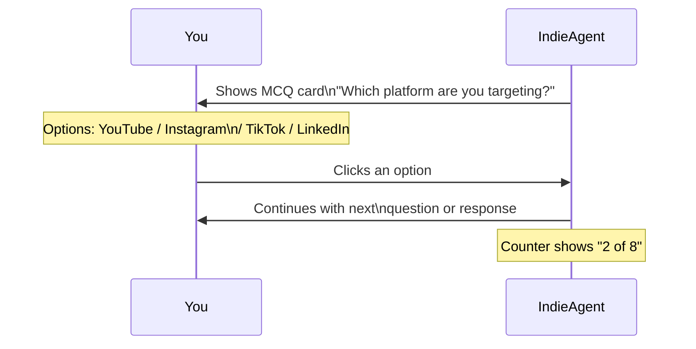

Click any option — the agent continues automatically. No separate submit button needed.

---

### The artifacts panel

When the agent generates an image or video, an **artifacts panel** opens on the right side. The chat stays on the left. A drag handle in the middle lets you resize the split.

> **📸 SCREENSHOT PLACEHOLDER — IndieAgent with artifacts panel open**
> *Capture: Split-screen view with the chat on the left and a generated image/video in the artifact panel on the right, with the drag handle visible.*

---

### Out of credits

> **📸 SCREENSHOT PLACEHOLDER — "You're out of credits" screen in IndieAgent**
> *Capture: The full-screen empty state with the coin icon, "You're out of credits" message, and the two buttons.*

| Button | Where it goes |
|:-------|:--------------|
| **View plans** | Pricing page |
| **Back to project** | Project hub |

You cannot use IndieAgent again until you top up.

---

## 10. Using the Playground

The Playground is the workspace for writing scripts, doing research with uploaded references, and planning on a visual canvas. It is a full-screen editor — the site navigation bar is replaced by the Playground's own header.

Open it by clicking the **Playground** card from your project hub.

> **📸 SCREENSHOT PLACEHOLDER — Playground, first-open state (full screen)**
> *Capture: The full Playground with the header bar, floating dock on the left edge, Script Writer in the center, and chatbot panel on the right.*

---

### The welcome tour

The first time you open the Playground for any project, a popup offers a guided tour.

- **Show me around** — walks through each part of the screen with tooltips.
- **Skip for now** — goes straight to work.

> The tour is offered once per account per project. It will not reappear after you dismiss it.

---

### Playground layout

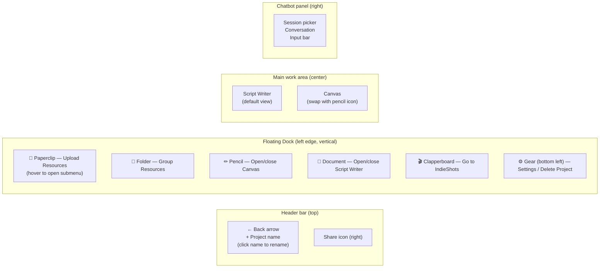

---

### Uploading resources

Hover over the **📎 paperclip icon** in the dock. A popup slides out with six resource types.

> **📸 SCREENSHOT PLACEHOLDER — Resource upload popup**
> *Capture: The popup showing all six resource type buttons (Document, Social, Audio, Image, Web, Text) in the two-column grid.*

| Resource type | What you provide | How it's processed |
|:--------------|:-----------------|:-------------------|
| **Document** | PDF, Word, Excel, plain text | Text extracted |
| **Social** | YouTube, Instagram, TikTok URL | Transcript & metadata fetched |
| **Audio** | MP3, WAV, M4A | Auto-transcribed |
| **Image** | JPG, PNG | Analysed and described |
| **Web** | Website URL | Page content fetched |
| **Text** | Type / paste directly | Stored as-is — **no credits used** |

> Resources that require AI processing (everything except Text) use credits. If you have no credits, those options are greyed out and cannot be clicked.

A spinning indicator appears in the chatbot panel while a resource is being processed. Once it disappears, the chatbot can reference that resource.

---

### The Script Writer

> **📸 SCREENSHOT PLACEHOLDER — Script Writer active, with content**
> *Capture: The Script Writer filled with example script text, and the AI "write to script" prompt bar visible at the bottom.*

The Script Writer is the default view. Click anywhere and start typing. **Saves automatically** — no save button.

When the chatbot suggests content to add, a prompt appears at the bottom of the Script Writer:

- Click **Accept** to insert the suggested content.
- Click **Cancel** to ignore it.

---

### The Canvas

Click the **✏ pencil icon** in the dock to switch to the Canvas. Click it again (or click the **📄 document icon**) to return to the Script Writer.

> **📸 SCREENSHOT PLACEHOLDER — Canvas, with some nodes/shapes visible**
> *Capture: The infinite Canvas view with the toolbar at the top showing selection, pan, text, shapes, and connecting line tools.*

The Canvas is an infinite blank board for mind maps, storyboards, flow diagrams, or any visual planning. **Saves automatically.** Use the toolbar at the top of the canvas area, or right-click any empty spot for a context menu.

---

### The chatbot panel

> **📸 SCREENSHOT PLACEHOLDER — Chatbot panel, right side**
> *Capture: The chatbot panel showing the session picker at the top, a conversation thread, and the input bar at the bottom with the @ symbol hint.*

**Mentioning a resource with @**

Type **@** in the input bar → a dropdown shows your uploaded resources → click one to attach it. The chatbot focuses its response on that specific resource.

**Sending content to the Script Writer**

When the chatbot generates a script or written content, a **Write to script** button appears in or below the response. Click it. Accept or cancel the insert in the Script Writer.

**Managing sessions**

Click the session name at the top of the chatbot panel to open the session picker.

| Element | What it does |
|:--------|:-------------|
| **+ Add Chat** button | Starts a new session (keyboard shortcut: **Ctrl + '**) |
| Session name in list | Click to switch to that session |
| Tick mark | Shows the currently active session |

**Creating or editing a session**

Click **+** in the chatbot panel header to open the new-session modal. Fill in the **Session Name** (required) and optional **Description**, then click **Create Session**. To edit, use the three-dot hover menu on any session.

---

### Sharing a project

Click the **share icon** in the Playground header. A **Share project** modal appears.

> **📸 SCREENSHOT PLACEHOLDER — Share project modal**
> *Capture: The full modal showing the three sections: Workspace link, Invite by email, and People with access.*

| Section | What it does |
|:--------|:-------------|
| **Workspace link** | Copy the direct URL to this Playground. Share with people already invited. |
| **Invite by email** | Enter email(s) separated by commas, set **Read only** or **Read & write** permission, click **Invite**. |
| **People with access** | Lists you (Owner) and all collaborators. Each collaborator has a ✏ edit and 🗑 remove button. |

Clicking ✏ on a collaborator lets you change their permission level inline. Clicking 🗑 removes them immediately with a green confirmation message.

---

## 11. Using IndieShots

IndieShots is IndieRay's visual creation tool. The workspace is a node-based canvas — each piece of work (image, video, note) is a **node**, and nodes can be connected to show relationships between your creative assets.

Open it from the **IndieShots card** on the Project Hub, or from the **🎬 clapperboard icon** in the Playground dock.

> **📸 SCREENSHOT PLACEHOLDER — IndieShots, empty canvas on first open**
> *Capture: The full IndieShots screen — infinite canvas, header bar at top, nav rail on left edge, tool dock at bottom center, floating chat panel at top right.*

---

### Screen layout

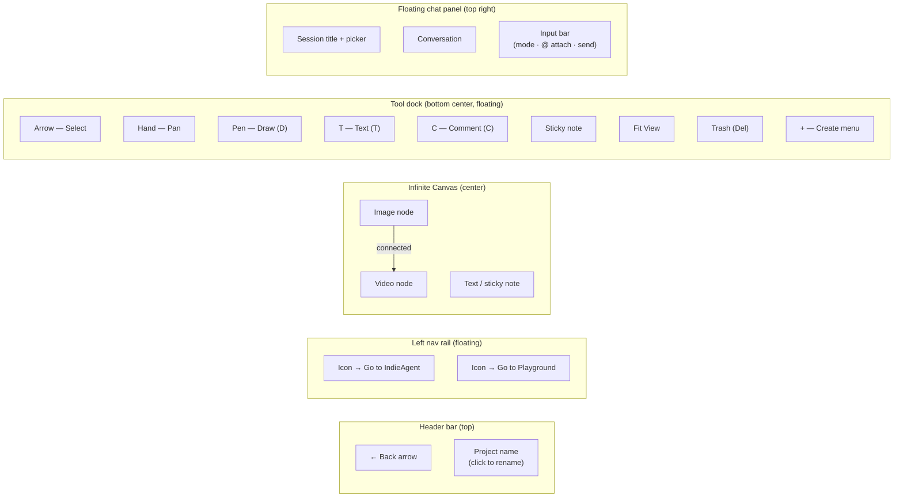

---

### Navigating the canvas

| Action | How to do it |
|:-------|:-------------|
| Pan (move around) | Hold and drag on any empty area, or use the Hand tool |
| Zoom in | Scroll up / two-finger swipe up on trackpad |
| Zoom out | Scroll down / two-finger swipe down |
| Fit all nodes in view | Click **Fit View** in the tool dock |
| Select one node | Arrow tool → click the node |
| Select multiple nodes | Arrow tool → click and drag a selection box |
| Add a new node | Right-click canvas, or click **+** in the tool dock |

---

### The tool dock

> **📸 SCREENSHOT PLACEHOLDER — IndieShots tool dock close-up**
> *Capture: The horizontal floating bar at the bottom center showing all tools clearly labelled.*

| Tool | Icon | Keyboard shortcut |
|:-----|:-----|:------------------|
| Select (Arrow) | ↖ | — |
| Hand (Pan) | ✋ | — |
| Draw (Pen) | ✒ | **D** |
| Text | T | **T** |
| Comment | 💬 | **C** |
| Sticky Note | 📝 | — |
| Fit View | ⛶ | — |
| Trash (Delete selected) | 🗑 | **Delete** / **Backspace** |
| Create menu (+) | + | — |

---

### The floating chat panel

> **📸 SCREENSHOT PLACEHOLDER — IndieShots chat panel, open state**
> *Capture: The chat panel in the top right showing the session title, a conversation thread, and the full input bar with mode selector.*

**Minimising and restoring:**

- Click the **−** icon in the top right of the panel to minimise it to a small floating bubble.
- Click the bubble to reopen.

**The input bar:**

| Element | What it does |
|:--------|:-------------|
| Text area | Type your creation request |
| **@** | Opens node picker — attach canvas nodes as references |
| Mode selector (bottom left) | Currently: **UGC Studio** |
| Send button | Grey when empty, white when ready; red square to cancel mid-generation |

---

### Generating an image

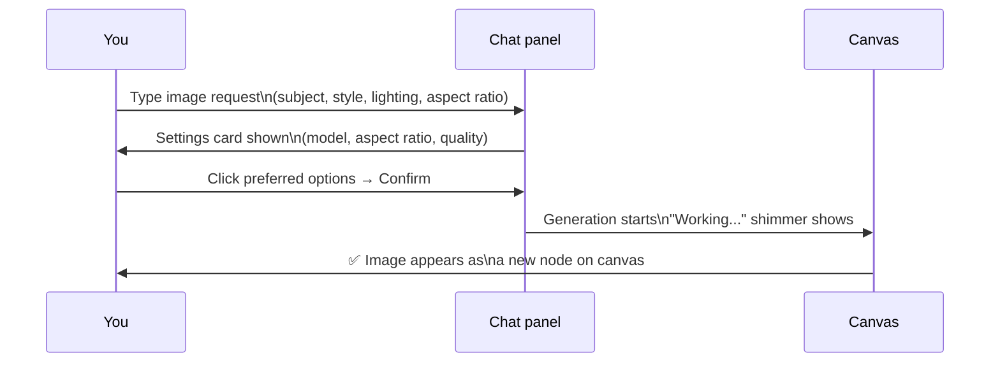

**Example prompt:**
> "Generate a cinematic product shot of a glass serum bottle on white marble, soft natural light from the left, portrait orientation."

To regenerate or try a variation: click the image node and use the options, or send a follow-up like *"Try this again with warmer lighting."*

> **📸 SCREENSHOT PLACEHOLDER — Generated image node on canvas**
> *Capture: The canvas with a generated image node visible, connected to the chat panel via the session.*

---

### Generating a video from an image

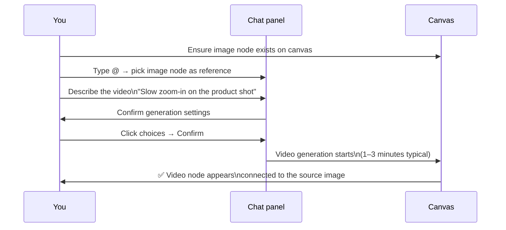

> **Keep the browser tab open** during generation. Do not close it. Video generation typically takes 1–3 minutes.

> **📸 SCREENSHOT PLACEHOLDER — Canvas showing an image node connected to a generated video node**
> *Capture: Two connected nodes — source image on the left, generated video on the right — showing the node relationship.*

---

### Attaching canvas nodes with @

Type **@** in the chat input → a picker lists all nodes with usable content → click to attach. The node appears as a thumbnail chip above the input bar. Hover a chip and click **×** to remove it before sending.

---

### UGC Studio mode

> **📸 SCREENSHOT PLACEHOLDER — IndieShots in UGC Studio mode**
> *Capture: The wider chat panel with the left drawer open showing the Product, Presenter, and Voiceover upload sections.*

When the mode is set to **UGC Studio**, the chat panel widens and a left drawer slides out.

| Drawer section | What to upload |
|:---------------|:---------------|
| **Product** | Photos of the item being advertised (multiple allowed) |
| **Presenter** | Photos of the person or character presenting the product (multiple allowed) |
| **Voiceover** | Audio file for the voiceover track |

Upload your assets, then type your video brief in the input and send. IndieShots generates a UGC-style video using those assets. If generation fails, an error card appears with a **Retry** button.

---

### Auto-save

Everything on the canvas saves automatically. There is no save button.

> **⚠ Yellow banner: "Canvas is not being saved until the session loads."**
> Do not close the tab. Wait for the banner to disappear before making changes. Any edits made while this banner is visible may not be saved.

---

## 12. Troubleshooting

Each problem below is stated as exactly what you see on screen, followed by exactly what to do.

---

### Sign-Up problems

> **📸 SCREENSHOT PLACEHOLDER — Verification code screen with "Resend code" link**
> *Capture: The six-box code entry screen highlighting the Resend code link below the boxes.*

| What you see | What to do |
|:-------------|:-----------|
| **No verification email arrived** | Wait 2 full minutes. Check Spam, Junk, and — on Gmail — the Promotions tab. Confirm your email was typed correctly; go back and re-enter if unsure. Click **Resend code** below the six boxes. If still nothing after a second attempt, try a different email address. |
| **Code rejected** | Codes expire after a few minutes. Click **Resend code** immediately and type the new code quickly. Numbers only — no spaces or letters. |
| **"Email already registered"** | You already have an account. Go to the sign-in page. If you forgot your password, use **Forgot password?** from sign-in. If you signed up with Google, use the **Continue with Google** button — there is no separate password on Google-linked accounts. |
| **Password rejected** | Password is too short or too simple. Use at least 8 characters. Avoid all-number or common passwords. Ensure both password fields match exactly — one mistyped character causes a mismatch. |
| **Page blank or frozen** | Press **F5** (or **Ctrl + R** / **Cmd + R**) to refresh. Try a different browser (Chrome or Firefox). Disable ad blockers or VPN extensions temporarily. Try an incognito window. |

---

### Sign-In problems

| What you see | What to do |
|:-------------|:-----------|
| **Forgot password** | Enter your email → click Continue → click **Forgot password?** → check inbox → click link → set new password → sign in. |
| **Email or password not accepted** | Double-check you are using the same email as when you signed up. Passwords are case-sensitive — check Caps Lock is off. Use Forgot password if unsure. If you signed up with Google, use the **Continue with Google** button instead. |
| **Wrong sign-in method (Google vs email)** | Always use the same method you created your account with. Google signup = always use the Google button. Email signup = always use email + password. These cannot be mixed on one account. |
| **Redirected back to sign-in repeatedly** | Your browser session cookie is corrupted. Clear cookies and site data for theindieray.com in your browser settings. Close and reopen a fresh tab. Try incognito. If it persists, try a different browser. |

---

### Dashboard problems

| What you see | What to do |
|:-------------|:-----------|
| **Spinner that never stops** | Refresh the page. If it still doesn't load, sign out and back in. Try a different browser or clear your browser cache. |
| **Clicked a project card and nothing happened** | The project may have been deleted. Return to the dashboard by clicking the IndieRay logo. If the card is still there, try clicking again. If it's gone, the project no longer exists. |
| **Accidentally deleted a project** | Deletion is permanent. Email **contactus_indieray@theindierise.com** immediately with the project name and approximate deletion time. Recovery is not guaranteed. |

---

### Payment problems

> **📸 SCREENSHOT PLACEHOLDER — Razorpay checkout window open over the Pricing page**
> *Capture: The Razorpay modal overlay showing the email pre-filled and the card entry fields.*

| What you see | What to do |
|:-------------|:-----------|
| **Razorpay checkout didn't open** | Browser is blocking popups. Look for a popup-blocked notification in the address bar and allow popups from theindieray.com. Disable ad blockers temporarily. Refresh and try again. |
| **Card declined** | Verify card number, expiry, and CVV. Check that your card has online transactions enabled (check your bank's app or call your bank). Try a different card, or switch to UPI or net banking in the Razorpay window. |
| **Money deducted but no credits** | First check the receipts page at **theindieray.com/dashboard/receipts**. If a receipt shows, your credits were granted — try refreshing or signing out and back in. If no receipt and money left your account, contact your bank first, then email **contactus_indieray@theindierise.com** with the amount, date, and your account email. |
| **Receipt not on receipts page** | Click the **Refresh** button. Payments can take up to a minute to confirm. If it still doesn't appear after 5 minutes and you received a Razorpay confirmation, email the team with your Razorpay payment ID. |

---

### IndieAgent problems

> **📸 SCREENSHOT PLACEHOLDER — IndieAgent "out of credits" screen**
> *Capture: The full-page empty state with coin icon, the error message, and the two action buttons.*

| What you see | What to do |
|:-------------|:-----------|
| **Stuck on "Loading IndieAgent..."** | Refresh the page. If an error message says "Please sign in to continue," your session expired — sign back in. If the problem persists, try a different browser. |
| **Response stopped mid-sentence** | Your connection may have dropped. Click the **Try again** link below the error, or retype your message. If it keeps stopping, check the credit indicator — you may be running low. |
| **"You're out of credits"** | Click **View plans** to upgrade. Return to IndieAgent after purchasing. No workaround is possible without topping up. |
| **File attachment failed** | Check the file type is supported (see Section 9). Check the file isn't password-protected. Try a smaller file if it may have timed out. If the error says "No extractable text was returned," try converting to PDF or using the Text Box resource option in the Playground instead. |
| **Agent gave wrong or unhelpful answer** | Correct it in your next message (e.g. "That's not right — the product is actually X"). For research tasks, switch to **Research mode** in the mode selector. |
| **MCQ card appeared and page seems frozen** | It is waiting for your click. Click any option on the card — the agent will continue immediately. |

---

### Playground problems

> **📸 SCREENSHOT PLACEHOLDER — Playground skeleton screen (loading state)**
> *Capture: The skeleton/placeholder loading state showing grey blocks where content will appear.*

| What you see | What to do |
|:-------------|:-----------|
| **Skeleton screen that never resolves** | Refresh. On slow connections the Playground can take 10–15 seconds to load fully. |
| **Clicked Back in browser and script seems gone** | The script auto-saves. Return to the Playground — your content should be there. If it's missing after a refresh, contact **contactus_indieray@theindierise.com** with your project name and the approximate time you last saw the content. |
| **Resource stuck with a spinning indicator** | Transcription and extraction can take up to a minute. Leave the tab open. Videos over 30 minutes can take several minutes. If it's still spinning after 5 minutes, close and reopen the resource modal to check status. If it persists, try re-uploading. |
| **Chatbot says it doesn't know about an upload** | Confirm the resource finished processing (spinner gone). Use **@** in the input bar to explicitly mention the resource. If it was a video and the transcript seems missing, try re-pasting the URL. |
| **Resource options greyed out in the popup** | You have no credits. Only **Text** boxes still work. Upgrade at the pricing page to restore access to other resource types. |
| **Share modal says "You cannot invite yourself"** | You tried to invite your own email. You are already the owner — no invite needed. |
| **Collaborator cannot access the project** | Make sure you invited them using the email they signed up with on IndieRay. Check the **People with access** section in the share modal. If they accepted but still get an error, ask them to sign out and back in. |

---

### IndieShots problems

> **📸 SCREENSHOT PLACEHOLDER — IndieShots yellow "not being saved" warning banner**
> *Capture: The canvas view with the yellow warning banner visible at the top of the canvas area.*

| What you see | What to do |
|:-------------|:-----------|
| **"Loading IndieShots..." never finishes** | Refresh. If it persists, sign out and back in, then reopen IndieShots from the project hub. |
| **Yellow banner: "Canvas is not being saved until the session loads"** | Do not close the tab. Wait for the banner to clear before making any changes. |
| **Generated image is not what you asked for** | Be more specific: include subject, background, lighting, camera angle, colour palette, and aspect ratio. Check which model was selected on the settings card. Try sending the same request again — results vary between runs. |
| **Video generation taking very long** | Typical time is 1–3 minutes. Keep the tab open. If it has been over 5 minutes, refresh and check your canvas — the completed node may already be there. If no node and no error, try generating again. |
| **Ran out of credits mid-generation** | Generation stops; an error appears. Go to pricing, upgrade, then return and try again. |
| **Canvas blank when you return** | Refresh once — the canvas may take a moment to load from the server. If still blank after a full refresh, check if you saw the yellow warning banner before closing last time. Contact support if you believe work was saved but has disappeared. |
| **Chat panel is blank and unresponsive** | Check your internet connection. Click the **−** button to minimise the panel, then click the bubble to reopen it. If it shows an error with a **Retry** button, click it. If credits are mentioned, upgrade your plan. |
| **You removed a node chip before sending** | Nothing was deleted. The node is still on the canvas. Type **@** again to re-attach it. |

---

### General problems (any page)

| What you see | What to do |
|:-------------|:-----------|
| **Blank/white screen** | Usually a JavaScript error. Refresh. If still blank, clear browser cache and cookies (Settings → Privacy → Clear browsing data). Try a different browser. If all browsers fail, check your internet connection. |
| **Signed out unexpectedly** | Your session expired. Sign back in. If it keeps happening, check that your browser is not set to clear cookies on close — that removes your session every time. |
| **Feature not working on your phone** | IndieRay is designed for desktop and laptop browsers. The Playground canvas and IndieShots work best on larger screens. Try the same page on a desktop or laptop. |
| **Need help with something not covered here** | Email **contactus_indieray@theindierise.com** or use the contact form at **theindieray.com/contact**. Include: what you were trying to do, what happened instead, and your browser name and device type. |

---

## 13. Quick Reference

A one-stop lookup for the most common actions.

| What you want to do | Where to go |
|:--------------------|:------------|
| Create an account | theindieray.com/sign-up |
| Sign in | theindieray.com/sign-in |
| Reset your password | Sign-in page → Forgot password? |
| See pricing and plans | theindieray.com/pricing |
| View payment receipts | theindieray.com/dashboard/receipts |
| Create a new project | Dashboard → **+ New Project** |
| Open IndieAgent | Project hub → IndieAgent card |
| Open the Playground | Project hub → Playground card |
| Open IndieShots | Project hub → IndieShots card |
| Delete a project | Dashboard → hover card → trash icon |
| Share a project | Playground header → share icon |
| Change composer mode | IndieAgent input bar → mode selector |
| Upload a resource to Playground | Dock → hover paperclip icon |
| Start a new chat in IndieAgent | Sidebar → New chat |
| Stop a response mid-generation | Click the square stop button |
| Contact support | contactus_indieray@theindierise.com |

---

### Full user journey at a glance

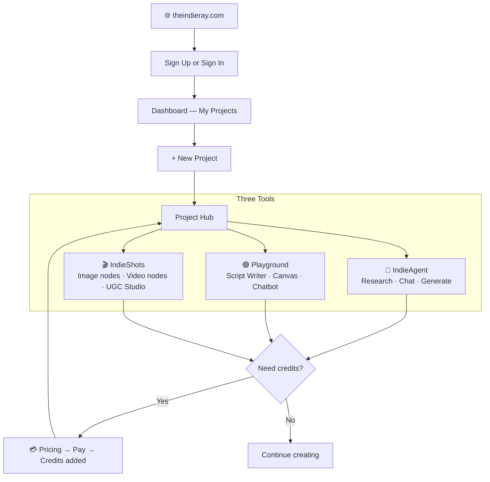

---

*IndieRay runs in your browser — no app download needed. Works best on Chrome, Firefox, and Safari on a desktop or laptop.*

---

## 14. Notes for the Doc Owner — Not Yet Included

> **This section is for whoever maintains this manual, not for end users.** Nothing below has been fixed in the sections above — it is flagged here so it does not get missed.

---

### Critical — address before publishing

These will actively mislead or strand a reader if left as-is.

| # | Issue | Why it matters |
|:--|:------|:---------------|
| 1 | The **Explore IndieRay** nav button is documented as going to the sign-in page in Section 1, but Sections 3 and 4 both claim it as their own entry point (sign-up and sign-in respectively). | The manual contradicts itself on where a core nav button leads. Verify against the live site and make it consistent everywhere it appears. **Also check:** the home page has both a Get Started button and an Explore IndieRay button sending a signed-out visitor to the same destination — confirm this is intentional. |
| 2 | Troubleshooting tells readers to "sign out from your account menu" in at least six places, but no section explains what the account menu is or where to find it. | A reader following this fix has no way to locate the menu from this manual alone. |
| 3 | Section 8 tells readers to reach receipts by "clicking your profile avatar," which refers to the same undocumented menu as issue #2. | Same root cause as #2 — resolving #2 resolves this too. |

---

### Deferred — sections to add later

Lower urgency — these are gaps in coverage rather than contradictions.

- **Cancelling or downgrading a paid plan** — upgrading is fully documented; there is no equivalent walkthrough for cancelling or moving to a lower tier.
- **A proper Account Settings section** — covering the profile / account menu itself, signing out, changing email or password outside of the "forgot password" flow, and deleting an account.
- **Deleting a project from inside IndieShots** — Section 6 documents this from the Dashboard and from the Playground's gear icon, but not from IndieShots itself. Confirm whether that path exists.
- **Session length** — troubleshooting mentions "your session expired" several times but never says how long a session lasts or what triggers expiry.
- **Footer links beyond Product and Legal** — only the FAQ (Product) and Contact (Legal) footer entries are documented. If a Privacy Policy or Terms of Service link exists in the footer, it is not covered here.

---

### Screenshot checklist for the Doc Owner

Every `📸 SCREENSHOT PLACEHOLDER` line in this document corresponds to a real screenshot needed. Summary of all required captures:

| Section | Screenshot needed |
|:--------|:------------------|
| 1 — Home Page | Full home page (desktop), Nav bar signed-out, Nav bar signed-in |
| 3 — Sign Up | Sign-up page desktop, Email verification screen |
| 4 — Sign In | Sign-in page desktop |
| 5 — Dashboard | Dashboard with projects, Empty dashboard state |
| 6 — Creating a Project | Create New Project popup |
| 7 — Project Hub | Project Hub full view |
| 8 — Paying | Pricing plan cards, Receipt page, IndieAgent credit indicator |
| 9 — IndieAgent | First open (empty), Sidebar open, Input bar close-up, Mid-response shimmer, MCQ card, Artifacts panel open, Out of credits screen |
| 10 — Playground | Full playground view, Resource upload popup, Script Writer with content, Canvas with shapes, Chatbot panel, Share modal |
| 11 — IndieShots | Empty canvas, Tool dock close-up, Chat panel open, Generated image node, Image→Video connected nodes, UGC Studio mode, Yellow save warning banner |
| 12 — Troubleshooting | Verification code + resend link, Razorpay checkout overlay, IndieAgent out-of-credits, Playground skeleton screen, IndieShots yellow warning banner |

---

*End of IndieRay User Manual*
