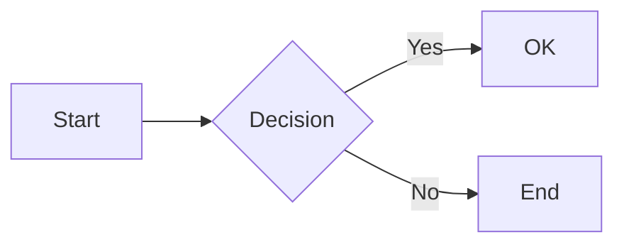
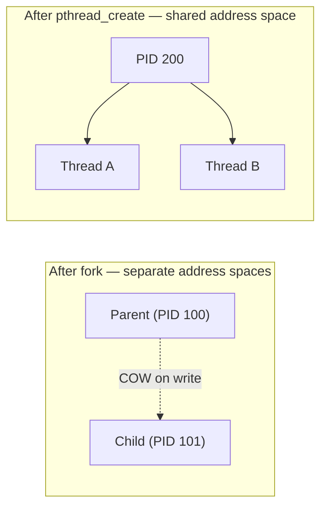
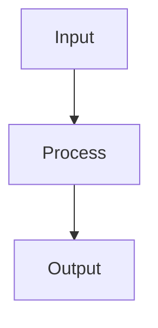

# Markdown to PDF — Formatting Rules for Perfect Conversion

Follow these rules to get clean, well-formatted PDFs from your Markdown. The app supports GFM (GitHub Flavored Markdown).

---

## 1. Supported Markdown Syntax

Use **only** these syntaxes for reliable conversion:

| Element | Syntax | Notes |
|---------|--------|-------|
| **Headings** | `# H1` through `###### H6` | Use one space after `#`. Avoid headings inside tables. |
| **Bold** | `**text**` | Prefer `**` over `__`. |
| **Italic** | `*text*` | Prefer `*` over `_`. |
| **Strikethrough** | `~~text~~` | GFM only. |
| **Inline code** | `` `code` `` | Use backticks, not double backticks for inline. |
| **Code block** | ` ``` ` with optional language | Fenced with triple backticks on their own line. |
| **Diagram** | ` ```mermaid ` | Mermaid diagram rendered as SVG. See Section 4. |
| **Bullet list** | `-` or `*` + space | Use consistent bullet style. |
| **Numbered list** | `1.` + space | Numbers can be `1.` for all (auto-numbering). |
| **Task list** | `- [ ]` and `- [x]` | Space inside brackets for unchecked; `x` for checked. |
| **Nested list** | Indent 2–4 spaces | Align with parent item. |
| **Blockquote** | `> ` at line start | Add space after `>`. |
| **Table** | `| col | col |` and `|---|` | See table rules below. |
| **Link** | `[text](url)` | URL in parentheses. |
| **Horizontal rule** | `---` (3+ hyphens) | On its own line, blank line before/after. |

---

## 2. Table Rules for Clean PDFs

### Structure
- Put a blank line **before** and **after** the table.
- Alignment row uses `:---` (left), `:---:` (center), `---:` (right).
- Keep column widths similar to avoid layout issues.

### Example

```markdown
| Left   | Center | Right  |
|:-------|:------:|-------:|
| A      | B      | C      |
| 1      | 2      | 3      |
```

### Avoid
- Very long cells without spaces (can break layout).
- Tables inside blockquotes or lists.
- More than ~8 columns.

---

## 3. Code Blocks

### Use fenced code blocks

````markdown
```language
// code
```
````

### Supported language tags
`c`, `cpp`, `python`, `javascript`, `bash`, `json`, etc. Language tag improves syntax highlighting in preview; PDF shows plain monospace.

### Long lines — break onto next line
Long lines in code blocks can be cut off or overflow in PDF. Keep lines under ~72–80 characters where practical.

**How to handle:**
- Break long statements onto the next line with proper indentation.
- Use parentheses or backslash for line continuation.
- Extract sub-expressions into named variables to shorten lines.
- Split list comprehensions, function args, and multi-part conditions across multiple lines.

**Example — before (long line, may be cut):**

```python
results.append((pid, arrival, burst, completion, completion - arrival, completion - arrival - burst, current_time - arrival))
```

**Example — after (split for readability and PDF-safe width):**

```python
tat = completion - arrival
wt = tat - burst
rt = current_time - arrival
results.append((pid, arrival, burst, completion, tat, wt, rt))
```

**Example — long list comprehension split:**

```python
ready = [
    (pid, procs[pid])
    for pid in procs
    if procs[pid][0] <= current_time and procs[pid][2] > 0
]
```

### Avoid
- Indented code blocks (4 spaces) for multi-line code — prefer fenced blocks.
- Tabs inside code — use spaces.
- Lines longer than ~80 characters — break them for PDF safety.

---

## 4. Diagrams and Infographics (Mermaid)

The app renders **Mermaid** diagram fences into live SVG in preview, PDF, and Word exports. Use ` ```mermaid ` fenced blocks instead of ASCII art for diagrams that need to look sharp at any zoom level and remain readable in exported PDFs.

### Basic syntax

````markdown

````

The diagram renders as a centered SVG in the preview pane and in all exports.

### Supported diagram types

| Type | Opening keyword | Typical use |
|------|-----------------|-------------|
| Flowchart | `flowchart TD` or `flowchart LR` | Process flows, algorithms, decision trees |
| Sequence | `sequenceDiagram` | API calls, protocol exchanges |
| State | `stateDiagram-v2` | Process lifecycles, FSMs |
| Class | `classDiagram` | OOP structures, relationships |
| ER | `erDiagram` | Database schemas |
| Gantt | `gantt` | Timelines, project schedules |
| Pie | `pie` | Proportional data |
| Mindmap | `mindmap` | Topic exploration, brainstorming |
| Git graph | `gitGraph` | Branch workflows |

Full reference: [mermaid.js.org/intro](https://mermaid.js.org/intro/)

### Rules for clean Mermaid in PDF

1. **One diagram per fenced block.** Do not put two separate diagrams inside the same ` ```mermaid ` fence.
2. **Keep diagrams compact.** Very wide flowcharts may be clipped or scaled down in A4 PDF. Use `TD` (top-down) orientation for tall diagrams or split wide ones into subgraphs.
3. **No spaces in node IDs.** Use `camelCase` or `underscores` for identifiers; put display labels in brackets: `myNode[My Label]`.
4. **Quote edge labels with special characters.** Wrap in double quotes: `A -->|"O(n) time"| B`.
5. **Avoid inline CSS / `style` directives.** The default Mermaid theme produces clean SVGs; custom colours may not carry over to Word export.
6. **Blank line before and after** the fenced block — same rule as code blocks and tables.
7. **Syntax errors show the raw code block** with a red left border, so double-check your diagram at [mermaid.live](https://mermaid.live/) if it does not render.

### When to prefer ASCII art over Mermaid

- **Simple text boxes** shown in monospace (e.g. a single-column pipeline) are sometimes clearer as plain code blocks, especially when the viewer may not have Mermaid support (e.g. plain-text `README` files in terminals).
- You can keep **both** side by side: a ` ```mermaid ` block for the rendered diagram and an ASCII fallback inside a regular ` ``` ` code block, labelled accordingly. The rendered version will appear in preview/PDF; the ASCII version will appear in plain-text viewers.

### Example: process vs thread memory layout

````markdown

````

### Word export notes

Mermaid SVGs are automatically converted to inline PNG images when you choose **Download Word**. Colours and fonts may shift slightly versus the preview; use simple diagrams for best results.

---

## 5. Page Breaks (Practical File mode)

- Each `## Heading` starts a new page when using **Practical File** mode.
- Use `## Practical 1: Title` style headings for per-practical page breaks.
- Put a blank line after `---` before the next `##` for cleaner breaks.

---

## 6. Spacing and Layout

- **Blank lines**: Use one blank line between blocks (paragraphs, lists, tables, headings).
- **No trailing spaces**: Remove spaces at end of lines.
- **Consistent newlines**: Use single line breaks; avoid multiple blank lines in a row.
- **Lists**: One blank line before and after lists.

---

## 7. Characters to Avoid

| Avoid | Use Instead | Reason |
|-------|-------------|--------|
| Tab characters | Spaces (2–4) | Tabs can render inconsistently. |
| Smart/curly quotes | `"` and `'` | Straight quotes ensure proper display. |
| Zero-width chars | — | Invisible characters can cause odd gaps. |
| Emoji in headings | Text or skip | May not render well in all viewers. |

---

## 8. File Length and Size

- **Recommendation**: Up to ~50 pages for smooth export.
- **Images**: Only base64 inline images work in some export paths; prefer links or attachments.
- **Very long code blocks**: Consider splitting or shortening for readability. For long *lines* within code, see Section 3 (Code Blocks) — break them onto the next line.
- **Mermaid diagrams**: Very complex diagrams with many nodes add to export time. See Section 4 (Diagrams) for sizing tips.

---

## 9. PDF vs Print to PDF

| Output | When to Use |
|--------|-------------|
| **Download PDF** | Quick one-click file. Text is **not selectable** (image-based). |
| **Print to PDF** | Choose “Save as PDF” in the print dialog for **selectable, copyable text**. |
| **Download Word** | Editable .docx; best for further editing in Word. |

---

## 10. Checklist Before Export

- [ ] Headings use `#` with a space after.
- [ ] Tables have alignment row and blank lines around them.
- [ ] Code blocks use triple backticks, not indentation.
- [ ] Long code lines are split with proper indentation for PDF-safe display.
- [ ] No trailing spaces or odd characters.
- [ ] Lists are indented with spaces, not tabs.
- [ ] In Practical mode, `##` is used for each practical title.
- [ ] Mermaid diagrams render correctly in preview (no red-bordered code blocks).
- [ ] Diagrams use `TD` or `LR` orientation appropriate for page width.
- [ ] For copyable text, use **Print to PDF**, not Download PDF.

---

## 11. Example: Well-Formatted Document

````markdown
# Document Title

Short intro paragraph.

## Section One

- Bullet one
- Bullet two

## Section Two

| A   | B   |
|-----|-----|
| 1   | 2   |

## Section Three

```python
print("Hello")
```

## Section Four — Diagram



> Important note here.
````

---

*Following these rules ensures consistent, high-quality PDF output from the Markdown to PDF converter.*
