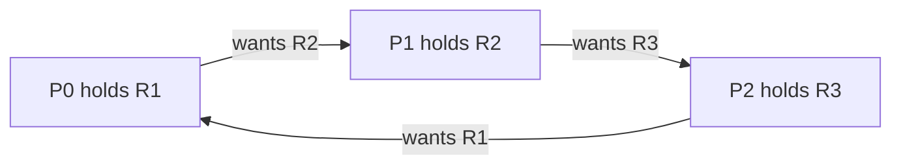
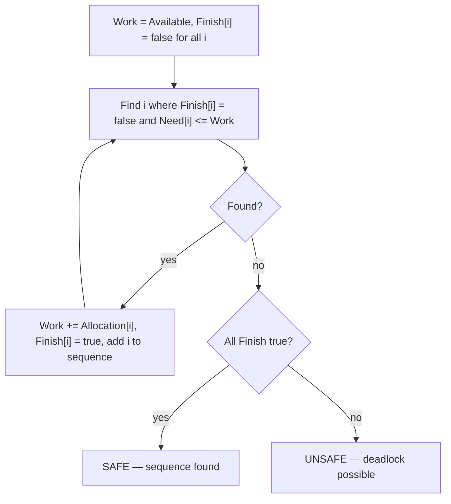
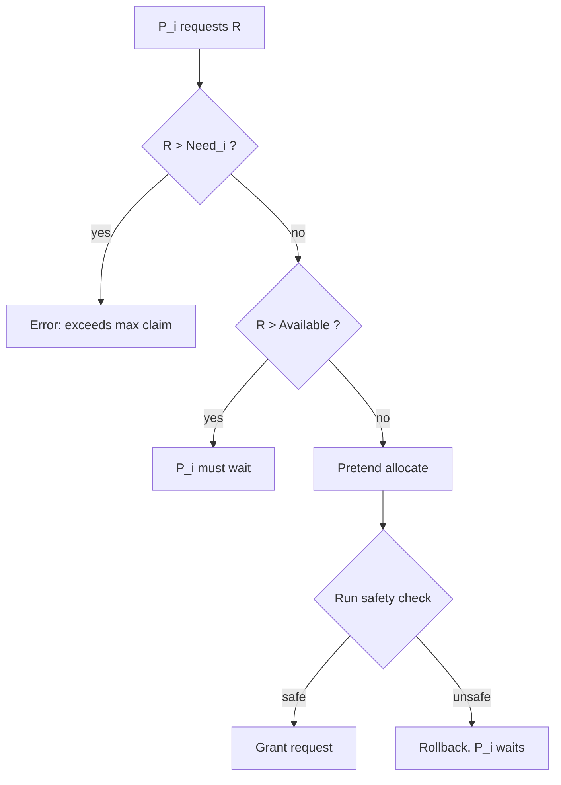
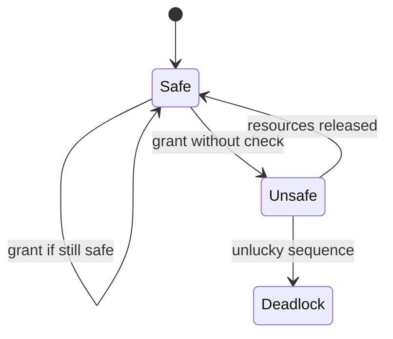

## Practical 10: Banker's Algorithm for Deadlock Avoidance

**Topic:** Implementation of the **Banker's Algorithm** to determine whether a system is in a **safe state** and to simulate **resource requests**.

### How to run (gcc — Windows MinGW, Linux, or WSL)

- Standard **C** (`stdio` only). From **`Misc/os_pr10_code/`**:

```bash
gcc -Wall -o bankers bankers.c
```

- Windows: `.\bankers.exe` — Linux/WSL: `./bankers`
- Enter **number of processes**, **number of resource types**, **Allocation** matrix, **Maximum** matrix, and **Available** vector. Optionally test a **resource request** at the end.

---

### 1. Theory: deadlocks

- **Aim:** Understand what a **deadlock** is, the four **necessary conditions**, and the strategies an OS can use to handle them.

- **Theory:**

A **deadlock** occurs when a set of processes are each **waiting** for a resource held by **another process in the set**, forming a **circular dependency** so none can proceed.

**Four necessary conditions (Coffman conditions) — all must hold simultaneously:**

| Condition | Meaning |
|:----------|:--------|
| **Mutual exclusion** | At least one resource is held in a non-sharable mode. |
| **Hold and wait** | A process holding one resource waits for additional ones. |
| **No preemption** | Resources cannot be forcibly taken; only the holder releases them. |
| **Circular wait** | A closed chain P0 waits for P1, P1 for P2, … Pn for P0. |

If **any one** condition is prevented, deadlock **cannot** occur.

**Infographic — circular wait (classic)**



---

### 2. Deadlock handling strategies

| Strategy | Idea | Practical example |
|:---------|:-----|:------------------|
| **Prevention** | Break one of the four conditions at design time. | Ordering resources (break circular wait). |
| **Avoidance** | Allow all four conditions but never enter an **unsafe** state. | **Banker's Algorithm**. |
| **Detection and recovery** | Allow deadlocks; detect (e.g. cycle in wait-for graph) and kill/rollback a process. | Databases, some OSes. |
| **Ignore** | Assume deadlocks are rare; restart if they occur. | Most desktop OSes ("ostrich algorithm"). |

---

### 3. Theory: Banker's Algorithm

- **Aim:** Describe the **Banker's Algorithm** data structures, the **safety algorithm**, and the **resource-request** algorithm.

- **Theory:**

The **Banker's Algorithm** (Dijkstra, 1965) is a **deadlock avoidance** scheme. It models the OS as a "banker" who only grants a loan (resource allocation) if the system can still guarantee that **every** process can eventually finish — i.e. the resulting state is **safe**.

**Data structures (n processes, m resource types)**

| Symbol | Size | Meaning |
|:-------|:-----|:--------|
| **Available** | m | Number of free instances of each resource right now. |
| **Max** | n x m | Maximum demand each process may ever make. |
| **Allocation** | n x m | Resources **currently** held by each process. |
| **Need** | n x m | `Need[i][j] = Max[i][j] - Allocation[i][j]` — remaining demand. |

**Safe state:** A state is **safe** if there exists at least one **safe sequence** — an ordering of processes such that each process can acquire its remaining **Need**, finish, and release all resources, with the **Available** vector growing at each step.

**Infographic — safety algorithm (conceptual)**



**Resource-request algorithm (when Pi asks for Request[i]):**

1. If **Request[i] > Need[i]** → error (process exceeds its declared max).
2. If **Request[i] > Available** → process must **wait**.
3. Else **pretend** to allocate: `Available -= Request`, `Allocation[i] += Request`, `Need[i] -= Request`.
4. Run the **safety algorithm**. If **safe** → grant. If **not** → **rollback** and make the process wait.

**Infographic — request decision**



---

### 4. Example scenario (classic textbook, verified)

**Setup:** 5 processes (P0–P4), 3 resource types (A, B, C).

**Allocation matrix**

| Process | A | B | C |
|:--------|:--|:--|:--|
| P0 | 0 | 1 | 0 |
| P1 | 2 | 0 | 0 |
| P2 | 3 | 0 | 2 |
| P3 | 2 | 1 | 1 |
| P4 | 0 | 0 | 2 |

**Maximum matrix**

| Process | A | B | C |
|:--------|:--|:--|:--|
| P0 | 7 | 5 | 3 |
| P1 | 3 | 2 | 2 |
| P2 | 9 | 0 | 2 |
| P3 | 2 | 2 | 2 |
| P4 | 4 | 3 | 3 |

**Available:** A = 3, B = 3, C = 2

**Need = Max - Allocation**

| Process | A | B | C |
|:--------|:--|:--|:--|
| P0 | 7 | 4 | 3 |
| P1 | 1 | 2 | 2 |
| P2 | 6 | 0 | 0 |
| P3 | 0 | 1 | 1 |
| P4 | 4 | 3 | 1 |

**Safety check (step by step)**

| Step | Work (A B C) | Pick Pi | Need[i] <= Work? | New Work after release |
|:-----|:-------------|:--------|:------------------|:-----------------------|
| 1 | 3 3 2 | P1 | 1 2 2 <= 3 3 2 yes | 3+2 3+0 2+0 = 5 3 2 |
| 2 | 5 3 2 | P3 | 0 1 1 <= 5 3 2 yes | 5+2 3+1 2+1 = 7 4 3 |
| 3 | 7 4 3 | P4 | 4 3 1 <= 7 4 3 yes | 7+0 4+0 3+2 = 7 4 5 |
| 4 | 7 4 5 | P0 | 7 4 3 <= 7 4 5 yes | 7+0 4+1 5+0 = 7 5 5 |
| 5 | 7 5 5 | P2 | 6 0 0 <= 7 5 5 yes | 7+3 5+0 5+2 = 10 5 7 |

All finished → **SAFE**. Safe sequence: **P1 → P3 → P4 → P0 → P2**

**Resource request example:** P1 requests **(1, 0, 2)**.

- Need[P1] = (1,2,2); request (1,0,2) <= (1,2,2) ✓
- Available = (3,3,2); request (1,0,2) <= (3,3,2) ✓
- Pretend: Available becomes (2,3,0), Alloc[P1] becomes (3,0,2), Need[P1] becomes (0,2,0).
- Safety check passes → **request granted**.

---

### 5. C implementation

**File:** `Misc/os_pr10_code/bankers.c`

- Reads **n**, **m**, **Allocation**, **Max**, **Available**.
- Computes and prints **Need**.
- Runs the **safety algorithm**; prints the **safe sequence** or warns about an **unsafe** state.
- Optionally simulates one **resource request**.

```c
/*
 * Save as: bankers.c
 * Build: gcc -Wall -o bankers bankers.c
 */
#include <stdio.h>

#define MAX_P 10
#define MAX_R 10

static int n, m;
static int alloc[MAX_P][MAX_R];
static int maxm[MAX_P][MAX_R];
static int need[MAX_P][MAX_R];
static int avail[MAX_R];

static void read_input(void)
{
    printf("Number of processes: ");
    scanf("%d", &n);
    printf("Number of resource types: ");
    scanf("%d", &m);

    printf("Allocation matrix (%d x %d):\n", n, m);
    for (int i = 0; i < n; i++)
        for (int j = 0; j < m; j++)
            scanf("%d", &alloc[i][j]);

    printf("Maximum matrix (%d x %d):\n", n, m);
    for (int i = 0; i < n; i++)
        for (int j = 0; j < m; j++)
            scanf("%d", &maxm[i][j]);

    printf("Available vector (%d): ", m);
    for (int j = 0; j < m; j++)
        scanf("%d", &avail[j]);
}

static void calc_need(void)
{
    printf("\nNeed matrix (Max - Alloc):\n");
    for (int i = 0; i < n; i++) {
        printf("P%d:", i);
        for (int j = 0; j < m; j++) {
            need[i][j] = maxm[i][j] - alloc[i][j];
            printf(" %d", need[i][j]);
        }
        printf("\n");
    }
}

static int find_safe_sequence(int seq[])
{
    int work[MAX_R];
    int finish[MAX_P] = {0};
    int count = 0;

    for (int j = 0; j < m; j++)
        work[j] = avail[j];

    while (count < n) {
        int found = 0;
        for (int i = 0; i < n; i++) {
            if (finish[i]) continue;

            int ok = 1;
            for (int j = 0; j < m; j++) {
                if (need[i][j] > work[j]) {
                    ok = 0;
                    break;
                }
            }
            if (!ok) continue;

            for (int j = 0; j < m; j++)
                work[j] += alloc[i][j];
            finish[i] = 1;
            seq[count++] = i;
            found = 1;
        }
        if (!found) return 0;
    }
    return 1;
}

static void try_request(void)
{
    int pid;
    int req[MAX_R];

    printf("\n--- Resource Request Simulation ---\n");
    printf("Process number (0-%d, or -1 to skip): ",
           n - 1);
    scanf("%d", &pid);
    if (pid < 0 || pid >= n) return;

    printf("Request vector (%d): ", m);
    for (int j = 0; j < m; j++)
        scanf("%d", &req[j]);

    for (int j = 0; j < m; j++) {
        if (req[j] > need[pid][j]) {
            printf(
                "Error: request exceeds Need for P%d.\n",
                pid
            );
            return;
        }
    }
    for (int j = 0; j < m; j++) {
        if (req[j] > avail[j]) {
            printf(
                "P%d must wait: not enough available.\n",
                pid
            );
            return;
        }
    }

    for (int j = 0; j < m; j++) {
        avail[j]      -= req[j];
        alloc[pid][j] += req[j];
        need[pid][j]  -= req[j];
    }

    int seq[MAX_P];
    if (find_safe_sequence(seq)) {
        printf("Request can be granted. Safe sequence: ");
        for (int i = 0; i < n; i++)
            printf(
                "P%d%s",
                seq[i],
                i < n - 1 ? " -> " : ""
            );
        printf("\n");
    } else {
        printf(
            "Request denied: would lead to unsafe state.\n"
        );
        for (int j = 0; j < m; j++) {
            avail[j]      += req[j];
            alloc[pid][j] -= req[j];
            need[pid][j]  += req[j];
        }
    }
}

int main(void)
{
    int seq[MAX_P];

    printf("=== Banker's Algorithm ===\n");
    read_input();
    calc_need();

    printf("\n--- Safety Check ---\n");
    if (find_safe_sequence(seq)) {
        printf("System is in a SAFE state.\n");
        printf("Safe sequence: ");
        for (int i = 0; i < n; i++)
            printf(
                "P%d%s",
                seq[i],
                i < n - 1 ? " -> " : ""
            );
        printf("\n");
    } else {
        printf(
            "System is NOT safe (deadlock possible).\n"
        );
    }

    try_request();

    return 0;
}
```

**Quick test input (matches Section 4):**

```
5
3
0 1 0
2 0 0
3 0 2
2 1 1
0 0 2
7 5 3
3 2 2
9 0 2
2 2 2
4 3 3
3 3 2
1
1 0 2
```

**Expected output:** Need matrix as above, safe sequence **P1 → P3 → P4 → P0 → P2**, request **(1,0,2)** from P1 **granted**.

**Remark:** The safe sequence is not unique — other orderings may also be valid. The program finds the **first** safe sequence using a forward scan (P0 first).

---

### 6. Key observations

- If the system is **safe**, at least one ordering of processes lets **everyone** finish. More than one safe sequence may exist.
- If a request would make the state **unsafe**, the Banker rolls it back and makes the process **wait** — this is **conservative** but guarantees no deadlock.
- **Limitation:** The algorithm needs **declared maximum** demands up front, which is often unknown in practice. Modern systems tend to use **detection + recovery** instead.

**Infographic — safe vs unsafe vs deadlock**



---

### 7. Overall conclusion

This practical covers the **theory** of deadlocks (four conditions, handling strategies), the **Banker's Algorithm** (data structures, safety check, request algorithm), a **hand-solved** textbook example with step-by-step **Work** vector, and a **C implementation** that prints the **Need matrix**, the **safe sequence**, and simulates a **resource request** — all runnable with **gcc** on Windows or Linux.

> **Export note:** Diagrams use ` ```mermaid ` fences for SVG in preview, PDF, and Word. If a diagram fails, check at [mermaid.live](https://mermaid.live/).
