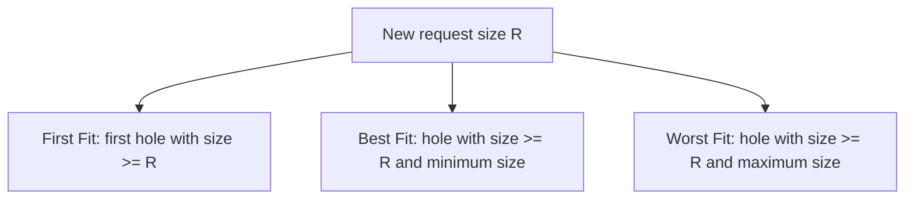
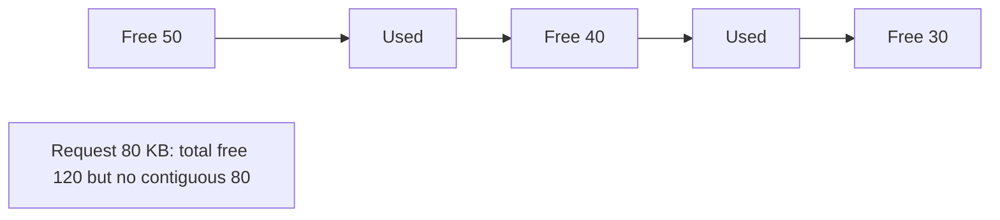

## Practical 11: Contiguous Memory Allocation — First Fit, Best Fit, Worst Fit

**Topic:** **Dynamic partitioning** and three classical **placement policies** for variable-size allocations in main memory.

### How to run (gcc — Windows MinGW, Linux, or WSL)

- Standard **C** (`stdio`, `string.h`, `limits.h`). From **`Misc/os_pr11_code/`**:

```bash
gcc -Wall -o memory_fit memory_fit.c
```

- Windows: `.\memory_fit.exe` — Linux/WSL: `./memory_fit`
- Enter **number of free blocks**, their **sizes (KB)** in list order, then **number of requests** and each **request size (KB)**.
- The program runs **First Fit**, **Best Fit**, and **Worst Fit** on a **fresh copy** of the same free list each time.

---

### 1. Background: memory and contiguous allocation

- **Aim:** Relate **logical vs physical** addressing and **contiguous** allocation to the placement algorithms.

- **Theory (from memory management notes):**
  - A program must be **loaded into memory** before execution. The OS tracks **free** and **used** regions.
  - **Logical (virtual) addresses** are generated by the CPU; **physical addresses** refer to real RAM. The **MMU** maps between them at run time.
  - **Contiguous allocation** gives each process **one continuous** range of physical memory. The OS partition and **user** partition are typical; **dynamic partitioning** means holes grow and shrink as processes load and exit — hole sizes are **variable**.
  - **Dynamic partitioning** (variable-size partitions): each process takes only as much memory as needed when loaded; free memory appears as a **list of holes** of different sizes.

**Infographic — dynamic holes**


---

### 2. Three placement strategies

| Strategy | Rule | Scan |
|:---------|:-----|:-----|
| **First Fit** | Allocate the **first** free block that is **large enough**, scanning from the **start** of the list (or from a cursor in some implementations). | Often **fast**; tends to use **low-address** holes first. |
| **Best fit** | Allocate the **smallest** block that still **fits** the request (minimize leftover inside the hole). | May need a **full scan**; leaves **tiny** fragments. |
| **Worst fit** | Allocate the **largest** available block that fits (idea: leftover piece stays **large** and reusable). | Full scan; **counter-intuitive** name — “worst” for the biggest hole. |

All three apply when free memory is represented as a **list of hole sizes** (order matters for **first fit**).

**Infographic — choice rule**



---

### 3. Fragmentation (from notes)

| Type | Meaning | Typical context |
|:-----|:--------|:----------------|
| **Internal fragmentation** | Wasted space **inside** an allocated block (e.g. fixed partition larger than process). | **Fixed** partitions; less central to pure variable-hole **first/best/worst** on exact splits. |
| **External fragmentation** | **Enough total** free memory exists, but **no single** contiguous hole satisfies the request. | **Dynamic** partitions after many allocations and frees. |
| **Compaction** | Shuffle memory to merge scattered holes into **one** large block (expensive; needs relocation). | Mitigates **external** fragmentation. |

**Infographic — external fragmentation**



---

### 4. Example scenario (solved — matches `memory_fit.c`)

**Initial free blocks (KB), in order:** 100, 500, 200, 300, 600  

**Requests (KB):** 212, 417, 112, 426

#### First Fit

| Step | Request | Chosen hole | Leftover in that hole | Free list after (KB) |
|:-----|:--------|:------------|:----------------------|:---------------------|
| 1 | 212 | First with size >= 212 → **500** (index 1) | 288 | 100, **288**, 200, 300, 600 |
| 2 | 417 | First >= 417 → **600** | 183 | 100, 288, 200, 300, **183** |
| 3 | 112 | First >= 112 → **288** | 176 | 100, **176**, 200, 300, 183 |
| 4 | 426 | No hole >= 426 | — | **Fails** (largest single hole 300) |

#### Best Fit

| Step | Request | Chosen hole | Rationale | Free list after (KB) |
|:-----|:--------|:------------|:----------|:---------------------|
| 1 | 212 | **300** | Smallest hole still >= 212 | 100, 500, 200, **88**, 600 |
| 2 | 417 | **500** | Smallest >= 417 among 500, 600 | 100, **83**, 200, 88, 600 |
| 3 | 112 | **200** | Smallest >= 112 | 100, 83, **88**, 88, 600 |
| 4 | 426 | **600** | Only hole >= 426 | 100, 83, 88, 88, **174** |

**All four requests succeed** under best fit for this data.

#### Worst Fit

| Step | Request | Chosen hole | Rationale | Free list after (KB) |
|:-----|:--------|:------------|:----------|:---------------------|
| 1 | 212 | **600** | Largest hole >= 212 | 100, 500, 200, 300, **388** |
| 2 | 417 | **500** | Largest >= 417 | 100, **83**, 200, 300, 388 |
| 3 | 112 | **388** | Largest >= 112 | 100, 83, 200, 300, **276** |
| 4 | 426 | None >= 426 | — | **Fails** |

**Remark:** Same total free space can **succeed** under one policy and **fail** under another — classic **external fragmentation** effect.

**Comparison (this example)**

| Policy | All four requests satisfied? |
|:-------|:------------------------------|
| First Fit | No (last request fails) |
| Best Fit | Yes |
| Worst Fit | No (last request fails) |

---

### 5. Qualitative comparison

| Aspect | First Fit | Best Fit | Worst Fit |
|:-------|:----------|:---------|:----------|
| **Speed** | Usually **fastest** (early exit) | **Slower** (full scan) | **Slower** (full scan) |
| **Fragmentation** | Can cluster small holes at **front** | Many **tiny** unusable holes | Tries to keep **larger** leftovers |
| **Typical use** | Simple allocators, good enough in practice | When minimizing **waste per hole** | Less common; educational |

---

### 6. C implementation

**File:** `Misc/os_pr11_code/memory_fit.c`

- Copies the **initial** free list before each policy.
- For each request: selects a block index by policy, subtracts request size, **removes** the block if size becomes **0**.
- Prints the free list after every step.

```c
/*
 * Save as: memory_fit.c
 * Build: gcc -Wall -o memory_fit memory_fit.c
 */
#include <limits.h>
#include <stdio.h>
#include <string.h>

#define MAX_BLOCKS 32
#define MAX_REQS 32

static void remove_block(int b[], int *count, int idx)
{
    for (int k = idx; k < *count - 1; k++)
        b[k] = b[k + 1];
    (*count)--;
}

static void print_blocks(const int b[], int count)
{
    printf("  Free blocks:");
    for (int i = 0; i < count; i++)
        printf(" %d", b[i]);
    printf("\n");
}

/*
 * mode: 0 = first fit, 1 = best fit, 2 = worst fit
 */
static int simulate(
    const char *title,
    int mode,
    const int *initial,
    int nblk,
    const int *req,
    int nreq)
{
    int b[MAX_BLOCKS];
    int count = nblk;

    memcpy(b, initial, (size_t)nblk * sizeof(int));

    printf("\n--- %s ---\n", title);
    print_blocks(b, count);

    for (int r = 0; r < nreq; r++) {
        int need = req[r];
        int idx = -1;

        if (mode == 0) {
            for (int i = 0; i < count; i++) {
                if (b[i] >= need) {
                    idx = i;
                    break;
                }
            }
        } else if (mode == 1) {
            int best = INT_MAX;
            for (int i = 0; i < count; i++) {
                if (b[i] >= need && b[i] < best) {
                    best = b[i];
                    idx = i;
                }
            }
        } else {
            int worst = -1;
            for (int i = 0; i < count; i++) {
                if (b[i] >= need && b[i] > worst) {
                    worst = b[i];
                    idx = i;
                }
            }
        }

        if (idx < 0) {
            printf(
                "Request %d KB: NO hole large enough.\n",
                need
            );
            print_blocks(b, count);
            return 0;
        }

        printf(
            "Request %d KB: use block[%d] size %d -> leftover %d\n",
            need,
            idx,
            b[idx],
            b[idx] - need
        );
        b[idx] -= need;
        if (b[idx] == 0)
            remove_block(b, &count, idx);
        print_blocks(b, count);
    }
    return 1;
}

int main(void)
{
    int blocks[MAX_BLOCKS];
    int reqs[MAX_REQS];
    int nblk;
    int nreq;

    printf("=== First / Best / Worst Fit ===\n");
    printf("Number of free blocks: ");
    scanf("%d", &nblk);
    printf("Enter %d block sizes (KB): ", nblk);
    for (int i = 0; i < nblk; i++)
        scanf("%d", &blocks[i]);

    printf("Number of allocation requests: ");
    scanf("%d", &nreq);
    printf("Enter %d request sizes (KB): ", nreq);
    for (int i = 0; i < nreq; i++)
        scanf("%d", &reqs[i]);

    int init[MAX_BLOCKS];
    memcpy(init, blocks, (size_t)nblk * sizeof(int));

    simulate("First Fit", 0, init, nblk, reqs, nreq);
    simulate("Best Fit", 1, init, nblk, reqs, nreq);
    simulate("Worst Fit", 2, init, nblk, reqs, nreq);

    return 0;
}
```

**Quick test input (paste-friendly):**

```
5
100 500 200 300 600
4
212 417 112 426
```

**Output:** Attach **screenshots** for your practical file.

---

### 7. Overall conclusion

**First fit**, **best fit**, and **worst fit** are three ways to place variable-size requests in a **dynamic** contiguous memory model. None is universally best: **first fit** is fast; **best fit** can reduce wasted space in a hole but may create **small unusable fragments**; **worst fit** sometimes preserves **larger** leftovers but can still fail early on some sequences. **External fragmentation** explains why **total** free memory is not enough — only **largest contiguous** hole matters until **compaction** or **non-contiguous** schemes (paging, segmentation) are used.

> **Export note:** Diagrams use ` ```mermaid ` fences for SVG in preview, PDF, and Word. If a diagram fails, check at [mermaid.live](https://mermaid.live/).
