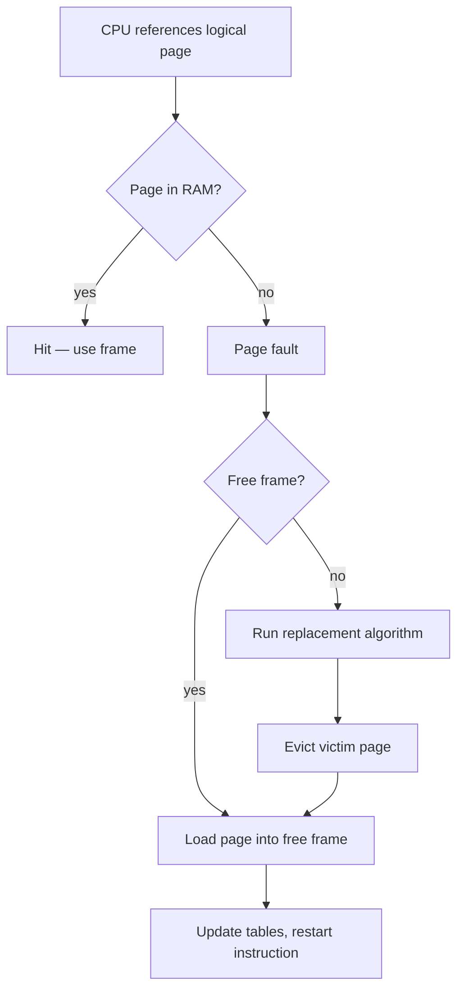
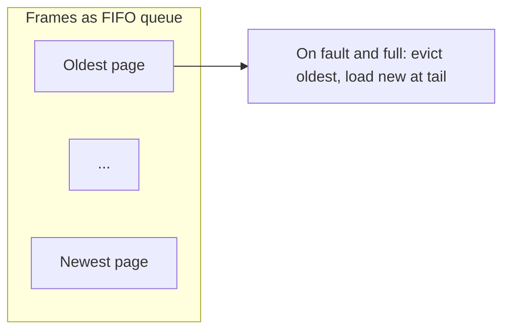
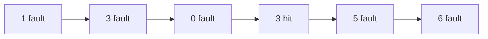

## Practical 12: Page Replacement — FIFO (First In First Out)

**Topic:** **FIFO** page replacement under **demand paging**, including **page faults**, **hits**, and **Belady's anomaly**.

> **Note:** **FIFO** also names a **disk scheduling** policy (serve requests in arrival order). This practical is **only** about **virtual memory** and **which page to evict** when RAM is full — not disk arm movement. See **`Misc/disk scheduling.pdf`** for I/O queueing; **`Misc/memory_management.pdf`** for paging and replacement.

### How to run (gcc — Windows MinGW, Linux, or WSL)

- Standard **C** (`stdio` only). From **`Misc/os_pr12_code/`**:

```bash
gcc -Wall -o fifo_page fifo_page_replacement.c
```

- Windows: `.\fifo_page.exe` — Linux/WSL: `./fifo_page`
- Enter **number of frames**, **number of references**, then the **reference string** (page numbers separated by spaces).

**Quick test (from notes):** frames **`3`**, references **`6`**, string **`1 3 0 3 5 6`** → **5** faults, **1** hit.

---

### 1. Background: demand paging and page faults

- **Aim:** Explain why **page replacement** is needed and what counts as a **hit** or **fault**.

- **Theory (from memory management notes):**
  - **Virtual memory** gives the illusion of a large address space; often implemented with **demand paging** — load pages **only when referenced**, not the whole process up front.
  - A **lazy pager** brings a page from **secondary storage** into a **frame** only when it is needed.
  - **Page fault:** on a reference, if the page is **not** in a frame, the OS traps, finds a **free frame** (or must **replace**), loads the page, updates tables, and restarts the instruction.
  - **Page hit:** the referenced page is **already** in memory — no disk I/O for that reference.
  - When **all frames** are full and a new page is needed, the OS must **evict** one page — chosen by a **page replacement algorithm**.

**Infographic — page fault path (conceptual)**



---

### 2. Theory: FIFO page replacement

- **Aim:** Describe **FIFO** replacement and its strengths and weaknesses.

- **Theory (from notes):**
  - **FIFO** keeps pages in memory in **order of arrival** (a **queue**): **oldest** page at the **front**, **newest** at the **back**.
  - On replacement, the OS **removes the page that entered memory first** among those currently resident — independent of how often it is used.
  - **Advantages:** **Simple** to implement; **low** bookkeeping overhead.
  - **Disadvantages:** **Ignores locality** — a frequently used page may be evicted just because it was loaded early; **performance** is often worse than LRU or optimal.
  - **Belady's anomaly:** For **FIFO** (and some other policies), **increasing** the number of **frames** can **increase** the number of **page faults** for **some** reference strings — counter-intuitive and specific to the algorithm, not a property of all policies.

**Infographic — FIFO queue**



---

### 3. Example scenario (solved — matches notes and program)

**Reference string:** 1, 3, 0, 3, 5, 6  

**Number of frames:** 3  

**FIFO rule:** On a fault with full memory, evict the page that was **loaded earliest** among the three. Listed frames are shown in **FIFO order** (left = oldest).

| Step | Reference | Frames after (FIFO order) | Result |
|:----:|:---------:|:--------------------------|:-------|
| 1 | 1 | [1] | Fault |
| 2 | 3 | [1, 3] | Fault |
| 3 | 0 | [1, 3, 0] | Fault |
| 4 | 3 | [1, 3, 0] | **Hit** |
| 5 | 5 | [3, 0, 5] | Fault — evict **1** |
| 6 | 6 | [0, 5, 6] | Fault — evict **3** |

**Total page faults:** **5**  
**Total page hits:** **1**  
**Hit ratio:** 1 / 6 ≈ **16.67%**

**Infographic — timeline**



---

### 4. Belady's anomaly (brief)

- For **FIFO**, there exist reference strings where **more frames** yield **more** faults than **fewer** frames.
- **Example class (textbook):** string **`1 2 3 4 1 2 5 1 2 3 4 5`** — with **3** frames FIFO gives **9** faults; with **4** frames FIFO gives **10** faults for the same string.
- **Takeaway:** More RAM does **not** always help **FIFO**; **LRU** and **optimal** do **not** suffer this anomaly.

**Remark:** Verify Belady with the program by running the same string twice with different frame counts and comparing **Page faults**.

---

### 5. Comparison (FIFO vs others — from notes overview)

| Algorithm | Idea | FIFO vs |
|:----------|:-----|:--------|
| **FIFO** | Evict **oldest** in memory | Baseline simplicity |
| **Optimal** | Evict page used **farthest in future** | Needs future — not practical |
| **LRU** | Evict **least recently used** | Uses past; usually better than FIFO |

---

### 6. C implementation

**File:** `Misc/os_pr12_code/fifo_page_replacement.c`

- Maintains resident pages in **FIFO order** in an array; on fault with full memory, **shifts** the queue left and appends the new page at the end.
- Prints **HIT** or **FAULT** per reference and final **fault count**, **hit count**, **hit ratio**.

```c
/*
 * Save as: fifo_page_replacement.c
 * Build: gcc -Wall -o fifo_page fifo_page_replacement.c
 */
#include <stdio.h>

#define MAX_FRAMES 16
#define MAX_REFS 128

static int in_queue(const int q[], int sz, int page)
{
    for (int i = 0; i < sz; i++)
        if (q[i] == page) return 1;
    return 0;
}

int main(void)
{
    int cap;
    int nref;
    int ref[MAX_REFS];
    int q[MAX_FRAMES];
    int sz = 0;
    int faults = 0;
    int hits = 0;

    printf("=== FIFO Page Replacement ===\n");
    printf("Number of frames: ");
    scanf("%d", &cap);
    if (cap < 1 || cap > MAX_FRAMES) {
        printf("Frames must be 1-%d.\n", MAX_FRAMES);
        return 1;
    }

    printf("Number of page references: ");
    scanf("%d", &nref);
    if (nref < 1 || nref > MAX_REFS) {
        printf("Refs must be 1-%d.\n", MAX_REFS);
        return 1;
    }

    printf("Enter %d page numbers: ", nref);
    for (int i = 0; i < nref; i++)
        scanf("%d", &ref[i]);

    printf(
        "\n%-6s %-8s %-20s %s\n",
        "Step",
        "Ref",
        "Frames (FIFO order)",
        "Result"
    );

    for (int step = 0; step < nref; step++) {
        int p = ref[step];

        if (in_queue(q, sz, p)) {
            hits++;
            printf(
                "%-6d %-8d [",
                step + 1,
                p
            );
            for (int i = 0; i < sz; i++)
                printf("%d%s", q[i], i < sz - 1 ? " " : "");
            printf("] HIT\n");
            continue;
        }

        faults++;
        if (sz < cap) {
            q[sz++] = p;
        } else {
            for (int i = 0; i < sz - 1; i++)
                q[i] = q[i + 1];
            q[sz - 1] = p;
        }
        printf(
            "%-6d %-8d [",
            step + 1,
            p
        );
        for (int i = 0; i < sz; i++)
            printf("%d%s", q[i], i < sz - 1 ? " " : "");
        printf("] FAULT\n");
    }

    printf("\nTotal references: %d\n", nref);
    printf("Page faults:      %d\n", faults);
    printf("Page hits:        %d\n", hits);
    printf(
        "Hit ratio:        %.2f%%\n",
        100.0 * (double)hits / (double)nref
    );

    return 0;
}
```

**Output:** Attach **screenshots** for your submission.

---

### 7. Overall conclusion

**FIFO** is the simplest **page replacement** policy: evict the page that entered memory **first**. It is easy to code but often **underperforms** policies that use **recency** (LRU) or **future** (optimal). It can exhibit **Belady's anomaly**, where **more frames** sometimes mean **more faults**. Demand paging, page faults, and replacement together let the OS run programs larger than physical RAM while trading **disk I/O** for **memory** pressure.

> **Export note:** Diagrams use ` ```mermaid ` fences for SVG in preview, PDF, and Word. If a diagram fails, check at [mermaid.live](https://mermaid.live/).
