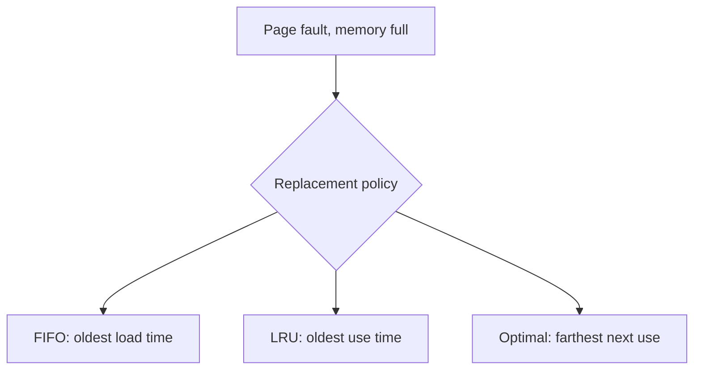
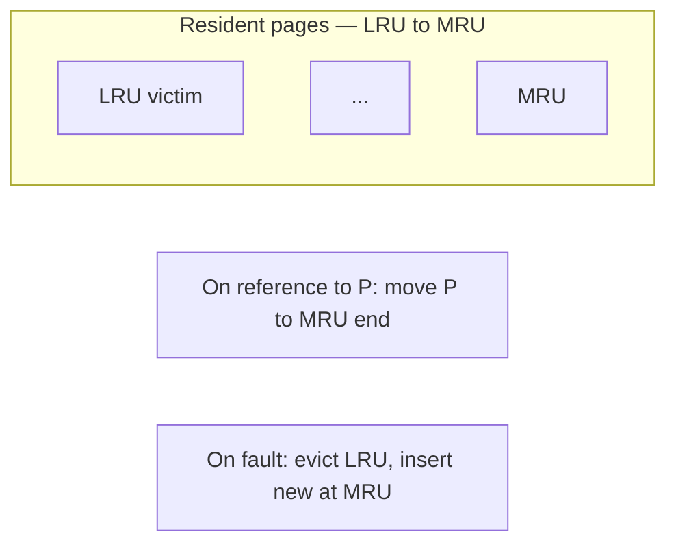

## Practical 13: Page Replacement — LRU (Least Recently Used)

**Topic:** **LRU** page replacement under **demand paging** — using **past** references to choose the **victim** page.

> **Note:** This practical is about **RAM / virtual memory** only. **Disk scheduling** (see **`Misc/disk scheduling.pdf`**) uses different queues and optimality criteria. **Paging, demand paging, and replacement** are covered in **`Misc/memory_management.pdf`**.

### How to run (gcc — Windows MinGW, Linux, or WSL)

- Standard **C** (`stdio` only). From **`Misc/os_pr13_code/`**:

```bash
gcc -Wall -o lru_page lru_page_replacement.c
```

- Windows: `.\lru_page.exe` — Linux/WSL: `./lru_page`
- Enter **number of frames**, **number of references**, then the **reference string** (page numbers separated by spaces).
- Output lists frames in **LRU → MRU** order (left = **next victim** if a fault occurs when full).

**Quick tests:**
- Frames **`3`**, string **`1 3 0 3 5 6`** → **5** faults, **1** hit (same counts as FIFO on this string; **order** inside frames differs after the hit on **3**).
- Frames **`2`**, string **`1 2 1 3 1 2`** → LRU **4** faults vs FIFO **5** faults (LRU uses **recency**).

---

### 1. Background: page replacement

- **Aim:** Recall **hits**, **faults**, and the role of a **replacement policy**.

- **Theory (from memory management notes):**
  - **Page replacement** decides **which resident page to swap out** when a new page is needed and **no free frame** exists.
  - A **hit** means the page is **already** in memory; a **fault** triggers loading (and possibly **eviction**).
  - Algorithms try to **reduce faults** (and thus disk I/O). **FIFO** is simple but ignores usage; **optimal** needs **future** knowledge; **LRU** uses **past** behaviour.

**Infographic — replacement decision**



---

### 2. Theory: LRU

- **Aim:** Define **LRU** and compare it to **FIFO** and **optimal**.

- **Theory (from notes):**
  - **LRU** replaces the page that has **not been referenced for the longest time** (equivalently: **least recently used** among resident pages).
  - It uses **past** reference information — often a good approximation of **locality** (recent pages are likely to be used again).
  - Implementation ideas: **stack** of pages (most recent on one end), **counters** on each page, or **hardware** support; full **exact LRU** can be **expensive**, so real systems may use **approximations** (e.g. clock / second-chance).
  - Compared to **FIFO**, LRU usually gives **fewer faults** on typical workloads because it keeps **hot** pages.
  - Compared to **optimal**, LRU does **not** need the future reference string but is **not** theoretically minimal.
  - **Belady's anomaly:** **FIFO** can fault **more** when **frames increase** for some strings. **LRU** (and **optimal**) do **not** exhibit this counter-intuitive behaviour — more frames generally **help**.

**Infographic — LRU stack idea**



---

### 3. Example A — same string as FIFO notes (3 frames)

**Reference string:** 1, 3, 0, 3, 5, 6  

Frames shown **LRU → MRU** (left evicted first when full).

| Step | Ref | Frames (LRU → MRU) | Result |
|:----:|:---:|:-------------------|:-------|
| 1 | 1 | [1] | Fault |
| 2 | 3 | [1 3] | Fault |
| 3 | 0 | [1 3 0] | Fault |
| 4 | 3 | [1 0 3] | **Hit** — **3** becomes MRU |
| 5 | 5 | [0 3 5] | Fault — evict **1** |
| 6 | 6 | [3 5 6] | Fault — evict **0** |

**Faults:** **5** — **Hits:** **1** — same **total** as **FIFO** here, but after step 4 the **FIFO** order would still be **[1 3 0]** (FIFO does not reorder on a hit).

---

### 4. Example B — LRU beats FIFO (2 frames)

**Reference string:** 1, 2, 1, 3, 1, 2  

| Policy | Page faults | Comment |
|:-------|:------------|:--------|
| **FIFO** | **5** | Ignores that **1** and **2** repeat. |
| **LRU** | **4** | After **1 2 1**, **2** is LRU when **3** arrives; keeps **1** longer when useful. |

Run both **`lru_page`** and **`fifo_page`** on this input to compare.

---

### 5. LRU vs Belady string (illustration)

For string **`1 2 3 4 1 2 5 1 2 3 4 5`**:

| Frames | FIFO faults | LRU faults |
|:-------|:------------|:-----------|
| 3 | 9 | 10 |
| 4 | 10 | 8 |

**FIFO** shows **Belady** (9 → 10 when going from 3 to 4 frames). **LRU** drops from **10** to **8** when frames increase — **no** Belady anomaly for this case.

---

### 6. Three-way summary (from notes)

| Algorithm | Information used | Typical faults vs FIFO |
|:----------|:-----------------|:-----------------------|
| **FIFO** | Order of **load** | Baseline |
| **LRU** | Order of **last use** | Often **better** |
| **Optimal** | **Future** references | **Best** (unrealistic) |

The notes state that for a representative comparison, **LRU** sits **better than FIFO** but **worse than optimal** — your program lets you measure this on any string.

---

### 7. C implementation

**File:** `Misc/os_pr13_code/lru_page_replacement.c`

- Keeps resident pages in an array: index **0** = **LRU**, last index = **MRU**.
- **Hit:** remove the page from its position, shift left, append at **MRU** end.
- **Fault, full:** shift left (drop LRU), put new page at **MRU** end.

```c
/*
 * Save as: lru_page_replacement.c
 * Build: gcc -Wall -o lru_page lru_page_replacement.c
 */
#include <stdio.h>

#define MAX_FRAMES 16
#define MAX_REFS 256

static int find_idx(const int f[], int c, int page)
{
    for (int i = 0; i < c; i++)
        if (f[i] == page) return i;
    return -1;
}

static void print_frames(const int f[], int c)
{
    printf("[");
    for (int i = 0; i < c; i++)
        printf("%d%s", f[i], i < c - 1 ? " " : "");
    printf("]");
}

int main(void)
{
    int cap;
    int nref;
    int ref[MAX_REFS];
    int f[MAX_FRAMES];
    int count = 0;
    int faults = 0;
    int hits = 0;

    printf("=== LRU Page Replacement ===\n");
    printf("Number of frames: ");
    scanf("%d", &cap);
    if (cap < 1 || cap > MAX_FRAMES) {
        printf("Frames must be 1-%d.\n", MAX_FRAMES);
        return 1;
    }

    printf("Number of page references: ");
    scanf("%d", &nref);
    if (nref < 1 || nref > MAX_REFS) {
        printf("Refs must be 1-%d.\n", MAX_REFS);
        return 1;
    }

    printf("Enter %d page numbers: ", nref);
    for (int i = 0; i < nref; i++)
        scanf("%d", &ref[i]);

    printf(
        "\n%-6s %-8s %-22s %s\n",
        "Step",
        "Ref",
        "Frames LRU to MRU",
        "Result"
    );

    for (int step = 0; step < nref; step++) {
        int p = ref[step];
        int i = find_idx(f, count, p);

        if (i >= 0) {
            hits++;
            for (int k = i; k < count - 1; k++)
                f[k] = f[k + 1];
            f[count - 1] = p;
            printf("%-6d %-8d ", step + 1, p);
            print_frames(f, count);
            printf(" HIT\n");
            continue;
        }

        faults++;
        if (count < cap) {
            f[count++] = p;
        } else {
            for (int k = 0; k < count - 1; k++)
                f[k] = f[k + 1];
            f[count - 1] = p;
        }
        printf("%-6d %-8d ", step + 1, p);
        print_frames(f, count);
        printf(" FAULT\n");
    }

    printf("\nTotal references: %d\n", nref);
    printf("Page faults:      %d\n", faults);
    printf("Page hits:        %d\n", hits);
    printf(
        "Hit ratio:        %.2f%%\n",
        100.0 * (double)hits / (double)nref
    );

    return 0;
}
```

**Output:** Attach **screenshots** for your submission.

**Remark:** Exact LRU with **timestamps** or a **doubly linked list** is common in textbooks; this lab uses an **array + shift** for clarity (acceptable for small **frame** counts).

---

### 8. Overall conclusion

**LRU** replaces the page whose **last use** is **oldest** among those in memory, exploiting **temporal locality** better than **FIFO**. It does **not** need future knowledge like **optimal**, and it **does not** suffer **Belady's anomaly** in the way **FIFO** can. Hardware and kernel cost mean **approximate** LRU is often used in real systems.

> **Export note:** Diagrams use ` ```mermaid ` fences for SVG in preview, PDF, and Word. If a diagram fails, check at [mermaid.live](https://mermaid.live/).
