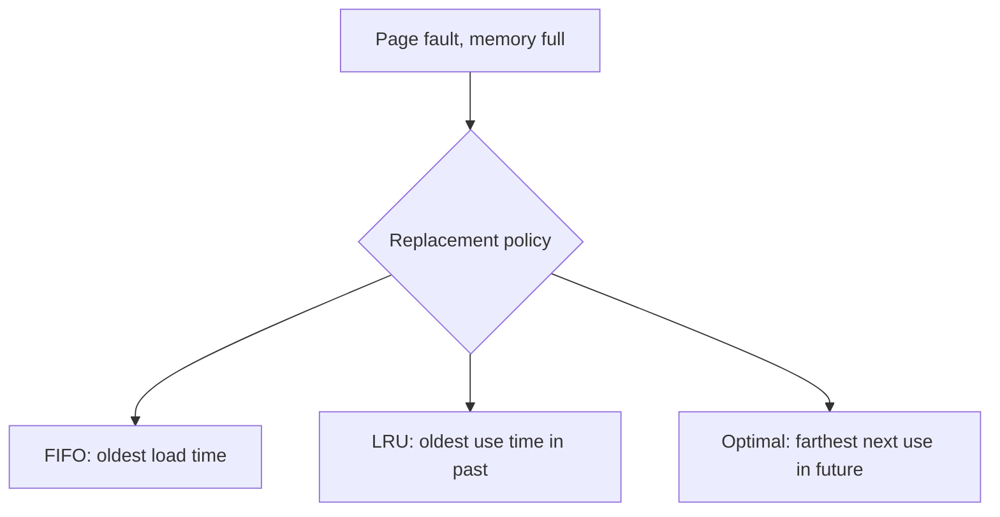
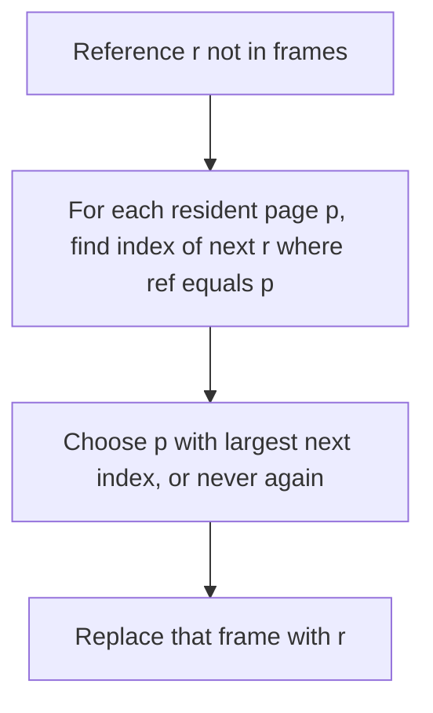

## Practical 14: Page Replacement — Optimal (MIN)

**Topic:** **Optimal** (also called **MIN**) page replacement under **demand paging** — using **future** references to choose the **victim** page.

> **Note:** This practical is about **RAM / virtual memory** only. **Disk scheduling** (see **`Misc/disk scheduling.pdf`**) concerns I/O request ordering on a disk, not which **page** to evict. **Paging, demand paging, and replacement policies** are covered in **`Misc/memory_management.pdf`**, which describes **optimal** replacement as evicting the page that will **not be used for the longest time** (equivalently: whose **next** use is **farthest** in the future, or **never** again).

### How to run (gcc — Windows MinGW, Linux, or WSL)

- Standard **C** (`stdio` only). From **`Misc/os_pr14_code/`**:

```bash
gcc -Wall -o optimal_page optimal_page_replacement.c
```

- Windows: `.\optimal_page.exe` — Linux/WSL: `./optimal_page`
- Enter **number of frames**, **number of references**, then the **reference string** (page numbers separated by spaces).
- The program prints frames in **array order** (order of insertion until a slot is overwritten); **optimal** does **not** require a particular **stack** order on a **hit** — only **which page to replace** on a **fault** matters.

**Quick tests:**

- Frames **`3`**, string **`1 3 0 3 5 6`** → **5** faults, **1** hit (matches **FIFO** and **LRU** fault count on this string; victim choice may differ).
- Frames **`3`**, string **`1 2 3 4 1 2 5 1 2 3 4 5`** → **7** faults (**FIFO** gives **9**, **LRU** gives **10** on the same input — **optimal** is **best** here).

---

### 1. Background: page replacement

- **Aim:** Recall **hits**, **faults**, and why a **replacement policy** is needed when memory is full.

- **Theory (from memory management notes):**
  - Under **demand paging**, a referenced page may be **absent** from RAM → **page fault** → the OS loads it into a **frame**.
  - If **no free frame** exists, one **resident** page must be **evicted** (written back if dirty, then replaced).
  - Policies differ in **which** page to evict. **FIFO** uses **load order**; **LRU** uses **past** use; **optimal** uses **future** reference information.

**Infographic — replacement policies (information used)**



---

### 2. Theory: Optimal (MIN)

- **Aim:** Define **optimal** replacement and explain why it is a **theoretical benchmark**, not a practical default in real OSes.

- **Theory (from notes):**
  - **Optimal** replaces the page whose **next reference** is **farthest in the future** among pages currently in memory. If a page is **never** referenced again, it is an ideal victim (treat “next use” as **infinity**).
  - This rule **minimises** the number of page faults for a **fixed** frame count and a **known** reference string — hence the name **MIN** in some textbooks.
  - **Why not in production?** The OS does **not** know the **future** reference string. **Optimal** needs **oracle** knowledge or **offline** simulation (e.g. replaying a trace). Implementing it exactly online is **not** realistic; it is used to **evaluate** how close **FIFO**, **LRU**, or **approximate** policies come to the best possible fault count.
  - **Belady's anomaly:** **FIFO** can fault **more** when **frames increase** for some reference strings. **Optimal** and **LRU** belong to classes that **do not** show this anomaly in the same way — adding frames **never increases** the optimal fault count.

**Infographic — victim selection on a fault (memory full)**



---

### 3. Example A — same string as FIFO / LRU notes (3 frames)

**Reference string:** 1, 3, 0, 3, 5, 6  

When **5** arrives at step 5, pages **1**, **3**, and **0** never appear again in the suffix; the program breaks ties by the **first** slot (index **0**) → evict **1** → **[5 3 0]**. When **6** arrives, same tie → evict **5** → **[6 3 0]**.

| Step | Ref | Frames | Result |
|:----:|:---:|:-------|:-------|
| 1 | 1 | [1] | Fault |
| 2 | 3 | [1 3] | Fault |
| 3 | 0 | [1 3 0] | Fault |
| 4 | 3 | [1 3 0] | Hit |
| 5 | 5 | [5 3 0] | Fault |
| 6 | 6 | [6 3 0] | Fault |

**Faults:** **5** — **Hits:** **1** — **Hit ratio:** **16.67%**

---

### 4. Example B — optimal vs FIFO vs LRU (3 frames)

**Reference string:** 1, 2, 3, 4, 1, 2, 5, 1, 2, 3, 4, 5  

This string is often used to illustrate **FIFO** behaviour (including **Belady** when frame count changes). On **3** frames, running the three lab programs gives:

| Policy | Page faults | Page hits |
|:-------|:------------|:----------|
| **FIFO** | **9** | **3** |
| **LRU** | **10** | **2** |
| **Optimal** | **7** | **5** |

**Optimal** keeps pages that will be needed **soon** according to the **full** string (e.g. it can retain **1** and **2** across the middle section in a way that reduces faults). **LRU** can perform **worse** than **FIFO** on specific strings because it follows **past** use, not **future** need.

---

### 5. Example C — Belady-style string (3 frames)

**Reference string:** 1, 2, 3, 4, 1, 2, 5, 1, 2, 3, 4, 3 (ends with **3** instead of **5**)

**FIFO** suffers **Belady** when comparing **3** vs **4** frames on related strings. **Optimal** on **3** frames yields **7** faults for this variant (run **`optimal_page`** and compare with **`fifo_page`** on the same input).

---

### 6. Summary table (from notes)

| Algorithm | Information used | Practical? | Fault count |
|:----------|:-----------------|:-----------|:------------|
| **FIFO** | Order of **load** | Yes | Often **higher** |
| **LRU** | **Past** references | Yes (often approximated) | Usually **better** than FIFO |
| **Optimal** | **Future** references | **No** (offline / benchmark) | **Minimum** for that string |

---

### 7. C implementation

**File:** `Misc/os_pr14_code/optimal_page_replacement.c`

- Stores the **full** reference array first, then simulates step by step.
- **Hit:** no change to contents (only counts the hit).
- **Fault, full:** `pick_victim` maximises `next_use` (index of next occurrence; **INF** if none).

```c
/*
 * Optimal (MIN) page replacement — needs full reference string.
 * Evict the resident page whose *next* use is farthest in the future
 * (or never used again).
 * Build: gcc -Wall -o optimal_page optimal_page_replacement.c
 */
#include <stdio.h>

#define MAX_FRAMES 16
#define MAX_REFS 256
#define INF (MAX_REFS + 999)

static int next_use(
    const int *ref,
    int nref,
    int after_step,
    int page)
{
    for (int j = after_step + 1; j < nref; j++)
        if (ref[j] == page) return j;
    return INF;
}

static int in_frames(
    const int *f,
    int c,
    int page)
{
    for (int i = 0; i < c; i++)
        if (f[i] == page) return 1;
    return 0;
}

static int pick_victim(
    const int *ref,
    int nref,
    int step,
    const int *f,
    int count)
{
    int best_i = 0;
    int best_nu = -1;
    for (int i = 0; i < count; i++) {
        int nu = next_use(ref, nref, step, f[i]);
        if (nu > best_nu) {
            best_nu = nu;
            best_i = i;
        }
    }
    return best_i;
}

static void print_frames(const int *f, int c)
{
    printf("[");
    for (int i = 0; i < c; i++)
        printf("%d%s", f[i], i < c - 1 ? " " : "");
    printf("]");
}

int main(void)
{
    int cap;
    int nref;
    int ref[MAX_REFS];
    int f[MAX_FRAMES];
    int count = 0;
    int faults = 0;
    int hits = 0;

    printf("=== Optimal Page Replacement ===\n");
    printf("Number of frames: ");
    scanf("%d", &cap);
    if (cap < 1 || cap > MAX_FRAMES) {
        printf("Frames must be 1-%d.\n", MAX_FRAMES);
        return 1;
    }

    printf("Number of page references: ");
    scanf("%d", &nref);
    if (nref < 1 || nref > MAX_REFS) {
        printf("Refs must be 1-%d.\n", MAX_REFS);
        return 1;
    }

    printf("Enter %d page numbers: ", nref);
    for (int i = 0; i < nref; i++)
        scanf("%d", &ref[i]);

    printf(
        "\n%-6s %-8s %-18s %s\n",
        "Step",
        "Ref",
        "Frames",
        "Result"
    );

    for (int step = 0; step < nref; step++) {
        int p = ref[step];

        if (in_frames(f, count, p)) {
            hits++;
            printf("%-6d %-8d ", step + 1, p);
            print_frames(f, count);
            printf(" HIT\n");
            continue;
        }

        faults++;
        if (count < cap) {
            f[count++] = p;
        } else {
            int vi = pick_victim(ref, nref, step, f, count);
            f[vi] = p;
        }
        printf("%-6d %-8d ", step + 1, p);
        print_frames(f, count);
        printf(" FAULT\n");
    }

    printf("\nTotal references: %d\n", nref);
    printf("Page faults:      %d\n", faults);
    printf("Page hits:        %d\n", hits);
    printf(
        "Hit ratio:        %.2f%%\n",
        100.0 * (double)hits / (double)nref
    );

    return 0;
}
```

**Output:** Attach **screenshots** for your submission.

**Remark:** Ties (several pages **never** used again) are broken by choosing the **smallest** index in this implementation; fault **count** is still **optimal** — only the **internal** frame ordering may differ from another valid optimal eviction order.

---

### 8. Overall conclusion

**Optimal** page replacement evicts the page whose **next** reference is **farthest** ahead (or **absent**), which **minimises** faults for a **known** string. Because real systems **cannot** see the future, **optimal** is used as a **theoretical lower bound** and for **education**; **FIFO** and **LRU** (or **approximate** LRU) remain the practical policies.

> **Export note:** Diagrams use ` ```mermaid ` fences for SVG in preview, PDF, and Word. If a diagram fails, check at [mermaid.live](https://mermaid.live/).
