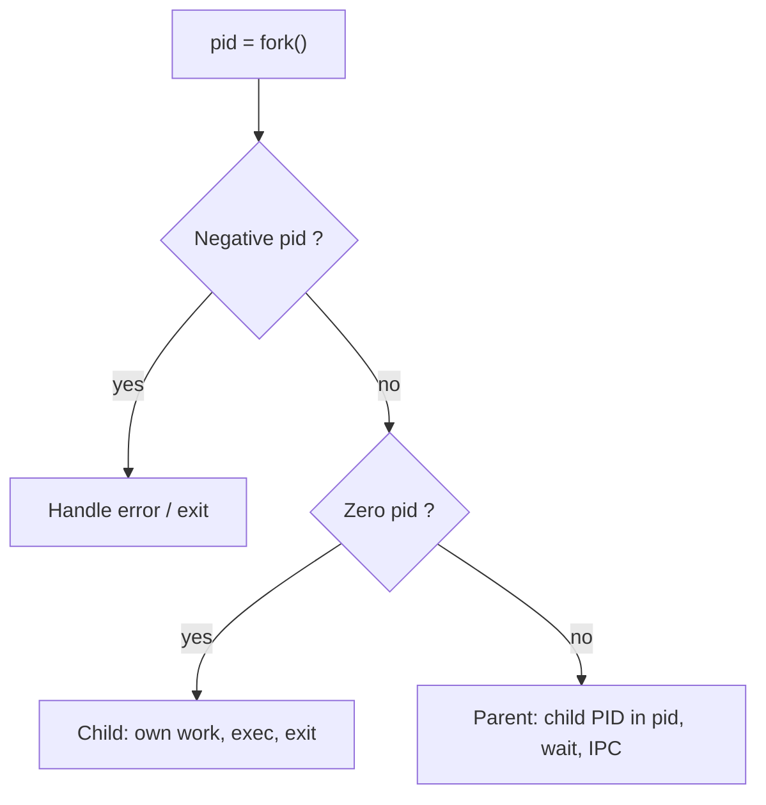
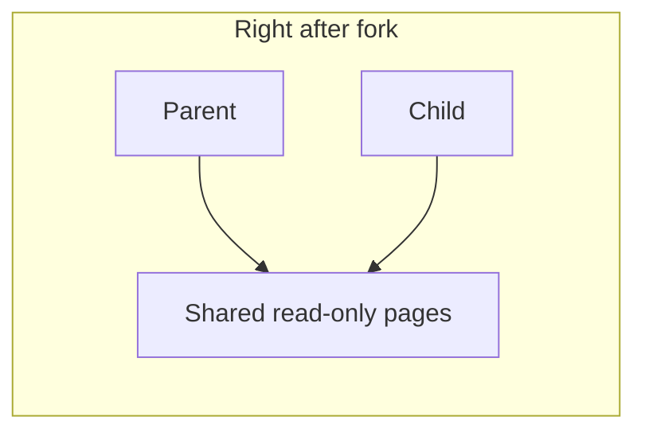
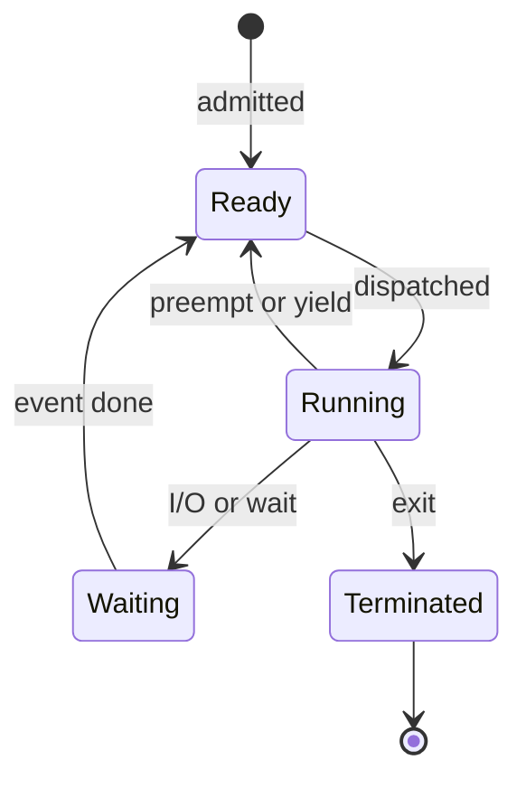
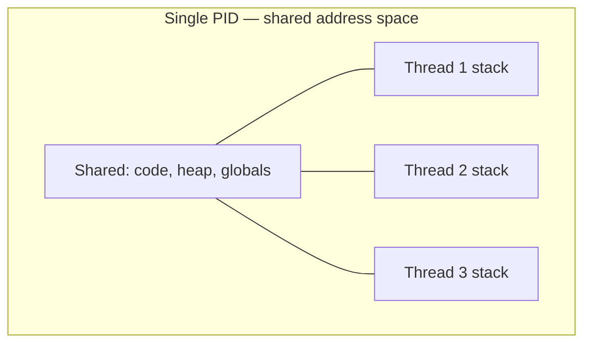
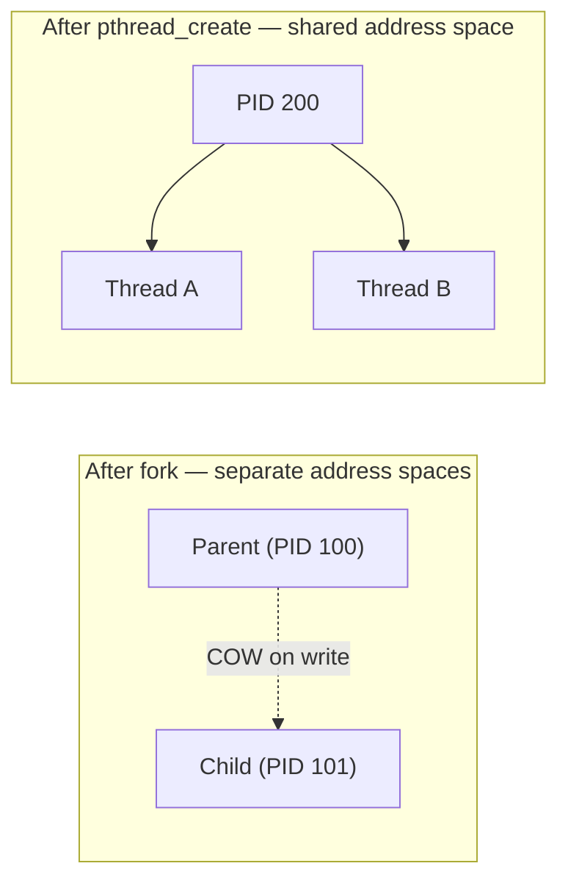
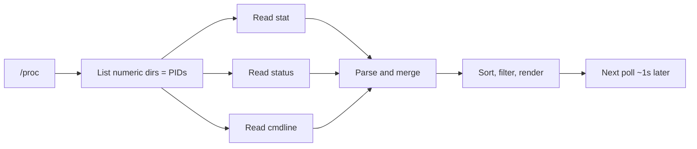

## Practical 4: Process and Thread Management

**Topic:** Process and Thread Management

### 1. Thread creation using `fork()`

- **Aim:** Demonstrate process creation with `fork()`, including a basic example and a loop that spawns multiple child processes.

- **Theory:**
  - In Linux, `fork()` is the primary mechanism for process creation. The calling process duplicates itself; the original is the **parent** and the new one is the **child**. They run the same program text but the kernel gives each process its **own** PID, file descriptor table, and memory view so they can diverge safely.
  - Modern kernels use **copy-on-write (COW)**: right after `fork()`, parent and child **share read-only pages** of physical memory; a page is copied only when one side **writes** to it. That keeps `fork()` affordable even for large programs.
  - `fork()` returns a `pid_t`: in the parent it returns the child's PID; in the child it returns `0`; on failure it returns a negative value. The child often later calls **`exec*()`** to load a new program image; until then, both continue the same code path after `fork()`.
  - If the parent exits before the child is reaped, the child may be **adopted by `init`**; if the child exits first and the parent never `wait()`s, you get a **zombie** until the parent collects the exit status.

**Infographic — return value of `fork()` (who runs which branch?):**



**Infographic — COW idea (logical):**



**Program Code:**

```c
#include <stdio.h>
#include <unistd.h>
#include <sys/types.h>

int main(void) {
    /* 1. Basic fork example */
    printf("--- Basic Fork ---\n");
    pid_t pid = fork();
    if (pid < 0) {
        printf("Fork failed!\n");
    } else if (pid == 0) {
        /* Child process */
        printf("Child Process: My PID is %d\n", (int)getpid());
    } else {
        /* Parent process */
        printf("Parent Process: I created child with PID %d\n", (int)pid);
    }

    /* 2. Loop fork: create 3 children */
    printf("\n--- Loop Fork ---\n");
    for (int i = 0; i < 3; i++) {
        if (fork() == 0) {
            printf("New Child Created in loop iteration %d (PID: %d)\n",
                   i, (int)getpid());
            break; /* Child exits the loop */
        }
    }
    return 0;
}
```

**Output:** Parent prints its message and child PIDs; each child in the loop prints its iteration index and PID. (Exact interleaving may vary.)

**Remark:** Only the child branch runs the `break`, so each child does not continue forking in the loop.

**Conclusion:** `fork()` splits execution into parent and child; return value distinguishes the two roles.

---

### 2. Extracting attributes of a process

- **Aim:** Observe and print core process attributes (PID, PPID, priority) using the shell and C.

- **Theory:**
  - The **Process Control Block (PCB)** is a kernel structure (sometimes called **task struct** on Linux) that tracks everything the scheduler and memory manager need for one runnable entity.
  - Typical fields include: identifiers (**PID**, **PPID**, user/group ids), **CPU registers** and program counter snapshot, **memory maps** (page tables, heap/stack bounds), **file descriptors**, **signal masks**, **nice value / priority**, **accounting** (CPU time), and **state** (running, interruptible sleep, zombie, etc.).
  - User space sees a **projection** of this via `/proc/[pid]/`, `ps`, and syscalls like `getpid`, `getpriority`, `times`.

**Infographic — process state lifecycle (simplified):**



**A. Linux command (`ps`)**

```bash
ps -eo pid,ppid,cmd,%mem,%cpu,stat --sort=-%cpu
```

- `-e`: all processes. `-o`: custom columns. `--sort=-%cpu`: sort by CPU use (descending).

**B. C system calls**

```c
#include <stdio.h>
#include <unistd.h>
#include <sys/resource.h>

void printAttributes(void) {
    pid_t pid = getpid();
    pid_t ppid = getppid();
    int priority = getpriority(PRIO_PROCESS, (id_t)pid);

    printf("--- Process Attributes ---\n");
    printf("PID: %d\n", (int)pid);
    printf("PPID: %d\n", (int)ppid);
    printf("Priority: %d\n", priority);
}

int main(void) {
    printAttributes();
    return 0;
}
```

**Output:** One line each for PID, PPID, and priority (nice value) for the current process.

**Remark:** `getpriority` reflects scheduling priority for the process; use `ps` for a full system view.

**Conclusion:** Attributes are available via libc (`getpid`, `getppid`, `getpriority`) and via `/proc` and `ps`.

---

### 3. Counting threads associated with a process

- **Aim:** Distinguish processes created by `fork()` from threads created by `pthread_create()`, and verify thread counts.

- **Theory:**
  - `fork()` creates a **new process**; each new process begins with **one thread** (the "main" thread). More processes imply more PIDs and more copies of the program (subject to COW).
  - `pthread_create()` creates a **new thread of execution** inside the **same** process: **same PID**, same address space, but a new stack and thread ID (TID / LWP). The kernel still schedules each thread independently.
  - **User-level vs kernel-level:** POSIX threads are **kernel threads** on Linux (1:1 model): each `pthread` maps to a schedulable entity; that is why `ps -L` can list them.
  - Tools like `htop` tree mode (F5) emphasize **parent to child process** relationships. **Per-thread** view is a different toggle (e.g. **H** in `htop`) or `ps -L`.

**Infographic — one process, many threads (shared vs private):**



**A. Why you may see one thread after `fork()`**

```bash
ps -L -p 1234 | wc -l
```

Replace `1234` with a child PID from a `fork()` program — often **1** (main thread only).

**B. Multiple threads (`threads.c`)**

```c
#include <stdio.h>
#include <unistd.h>
#include <pthread.h>

void *worker(void *arg) {
    (void)arg;
    printf(" Worker Thread started (TID: %lu)\n",
           (unsigned long)pthread_self());
    sleep(100); /* Keep alive to inspect in another terminal */
    return NULL;
}

int main(void) {
    pthread_t t1, t2;

    printf("Main Process PID: %d\n", (int)getpid());
    pthread_create(&t1, NULL, worker, NULL);
    pthread_create(&t2, NULL, worker, NULL);
    printf("Created 2 threads. Check count now!\n");
    pthread_join(t1, NULL);
    pthread_join(t2, NULL);
    return 0;
}
```

**Steps:** Compile with `gcc threads.c -o mythreads -lpthread`, run `./mythreads`, note PID, then in another terminal:

```bash
ps -L -p <PID> | wc -l
```

**Expected:** **3** lines (1 main + 2 workers) while workers are alive.

**Commands recap**

| Command | Purpose |
|:--------|:--------|
| `ps -L -p [PID]` | List LWPs (threads) for a PID |
| `ls /proc/[PID]/task` | Thread IDs as directories |
| `htop` then **H** | Toggle "show threads" |

**Remark:** `pthread_join` waits until threads finish; for a long `sleep` in workers, you have time to run `ps`.

**Conclusion:** Thread count rises with `pthread_create`, not with `fork()` alone.

---

### 4. Process vs multiple threads (memory and behaviour)

- **Aim:** Compare isolation and sharing between processes and threads.

- **Theory:**
  - **Process (`fork`):** The child is a **new process** with its own PID and kernel objects. Memory is logically separate; **COW** avoids immediate duplication until writes happen. IPC (pipes, sockets, shared memory) is needed for structured sharing.
  - **Thread (`pthread`):** Threads are **lightweight** because they share the **same page table**, open files (with caveats), and heap; synchronization (**mutexes**, **condition variables**, **atomics**) is required to avoid data races.
  - **Parallelism:** Multiple processes suit **strong isolation** (e.g. browser tabs, containers). Multiple threads suit **parallel work on shared data** (e.g. pool workers) with lower overhead than many processes.

**Infographic — fork vs pthread (address spaces):**



**Comparison table — process vs thread**

| Aspect | Process (`fork` / new program) | Thread (`pthread_create`) |
|:-------|:-------------------------------|:--------------------------|
| **Unit of resource ownership** | Owns PID, descriptors, quotas | Shares process-wide resources |
| **Address space** | Separate; COW after `fork` | Shared text, heap, globals |
| **Private per-unit data** | Everything private by default | Each thread has own **stack**; **TLS** for thread-local vars |
| **Creation cost** | Higher (new PCB, new mappings) | Lower (new thread struct + stack) |
| **Context switch** | Heavier (may change page tables, TLB pressure) | Lighter (same address space) |
| **Communication** | IPC: pipe, socket, shm, files | Shared memory + sync primitives |
| **Synchronization** | Often message-based | Mutex, rwlock, barriers, atomics |
| **Fault / security** | **Isolation** — one crash often spares others | **Shared fate** — bad pointer can kill whole process |
| **Scaling CPU-bound work** | Good with **multi-process** pools | Good with **thread pools** on shared data |
| **Typical use** | Services, shells, workers, sandboxes | Parallel algorithms, GUI + worker, servers |

**Remark:** Choose processes for isolation; choose threads for cheap communication within one program.

**Conclusion:** Trade-off between safety/isolation and sharing/performance.

---

### 5. Software process explorer: backend mechanism

- **Aim:** Describe how tools like `htop` obtain live process data.

- **Theory:** Monitor programs read kernel-exposed data, mainly via the **`/proc`** pseudo-filesystem.

1. Open **`/proc`** and list numeric subdirectories — each number is a **PID**.
2. For each PID, read files such as:
   - `/proc/[PID]/stat` — raw scheduling and CPU times
   - `/proc/[PID]/status` — human-readable name, VmSize, thread count
   - `/proc/[PID]/cmdline` — command line
3. **Display:** Build a table and refresh periodically (e.g. every second).

**Infographic — from `/proc` to UI (one scan cycle):**



**Conclusion:** No special syscall magic — periodic reads of `/proc` plus aggregation.

---

### 6. Multitasking in mobile OS (Android vs iOS)

- **Aim:** Contrast mobile multitasking with desktop-style multitasking.

- **Theory:** Mobile OSs favour **battery life**; background work is more restricted than on typical desktop Linux.

| Feature | Android | iOS |
|:--------|:--------|:----|
| Approach | Cooperative and preemptive; background limited by Doze / App Standby | Suspension-based; strict background APIs |
| Mechanisms | Services, `BroadcastReceiver`, WorkManager | Background tasks, push, Background Fetch |
| Low memory | **LMK** (OOM score) | **Jetsam** (aggressive termination) |
| UX | More flexible; potentially higher drain | Stricter; tuned for battery |

**Remark:** Both systems kill or freeze background work when resources are constrained.

**Conclusion:** Mobile scheduling and memory policies differ strongly from general-purpose desktop OS labs.

---

**Overall conclusion:** This practical ties together `fork()`, process attributes, pthreads, `/proc`, and mobile OS policy for a rounded view of processes and threads.

> **Export note:** Diagrams use ` ```mermaid ` fences so they render as SVG in this app's preview, PDF, and Word (per project formatting rules). If a diagram shows as raw code with a red border, validate it at [mermaid.live](https://mermaid.live/).
