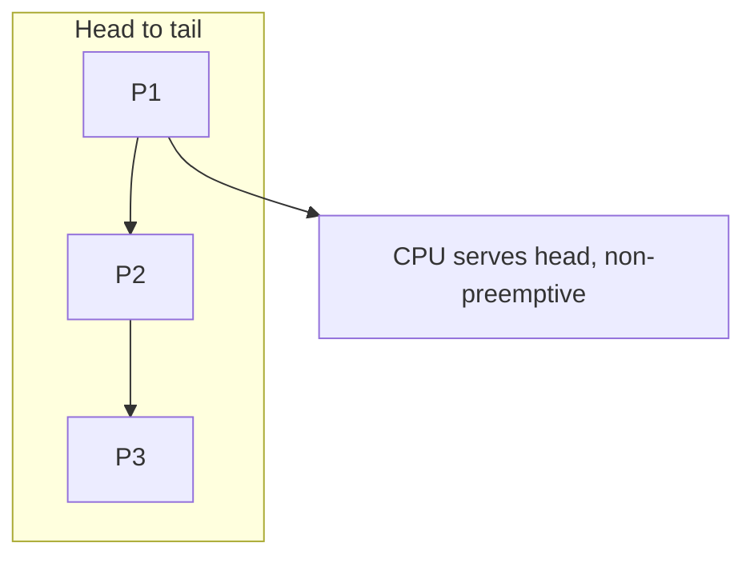
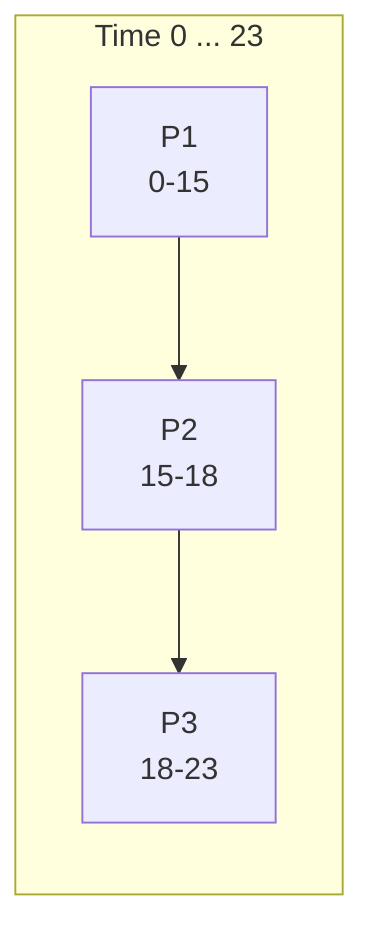

## Practical 5: First Come First Served (FCFS) Scheduling

**Topic:** Implementation of CPU scheduling — First Come First Served (FCFS)

### How to run the program

- Uses **standard C** only (`stdio`, `stdlib`). **gcc** on **Windows (MinGW)**, **Linux**, or **WSL**:
  - `gcc -Wall -o fcfs fcfs.c` then `.\fcfs.exe` or `./fcfs`
- Source file: **`Misc/os_pr4_code/fcfs.c`** (copy the fenced code below into the same file if you prefer a single document).

---

### 1. Theory: First Come First Served (FCFS)

- **Aim:** Implement **FCFS** scheduling, print a **Gantt-style** timeline, and compute **waiting time** and **turnaround time** averages.

- **Theory:**
  - **FCFS** is the simplest CPU scheduling policy: the process that **arrives first** (in terms of ordering used by the scheduler) gets the CPU first. It matches a **FIFO** queue.
  - **Non-preemptive:** Once a process holds the CPU, it runs until it finishes its **CPU burst** (or blocks for I/O in richer models; here we use CPU burst only).
  - **Scheduling criterion:** Order is driven by **arrival time** for **standard FCFS** (processes sorted by arrival time; ties broken by `pid`).
  - **Pros:** Easy to understand and code.
  - **Cons:**
    - **Convoy effect:** Short jobs wait behind one long job, hurting perceived responsiveness and average wait time.
    - **Average waiting time** can be high compared to SJF or RR.

**Formulas**

| Quantity | Formula |
|:---------|:--------|
| Waiting time | Start time minus arrival time (here: start is when the process first gets CPU) |
| Turnaround time | Completion time minus arrival time |
| Also | Turnaround time = burst time + waiting time |

**Infographic — FCFS as a FIFO queue (one CPU):**



---

### 2. Example scenario and Gantt (from syllabus)

**Scenario**

| Process | Arrival time | Burst time |
|:--------|:-------------|:-----------|
| P1 | 0 | 15 |
| P2 | 2 | 3 |
| P3 | 5 | 5 |

**Execution (standard FCFS by arrival: P1, then P2, then P3)**

- **0–15:** P1 runs (P2 and P3 have arrived and wait in queue).
- **15:** P1 completes; P2 runs next (waiting from time 2 to 15).
- **15–18:** P2 runs.
- **18:** P2 completes; P3 runs (waiting from time 5 to 18).
- **18–23:** P3 runs; then all finish.

**Infographic — CPU timeline**



**Resulting metrics (check with program)**

| Process | WT | TAT |
|:--------|---:|----:|
| P1 | 0 | 15 |
| P2 | 13 | 16 |
| P3 | 13 | 18 |

---

### 3. C implementation

- **Aim:** Read `n` processes (arrival time, burst time), then either:
  - **Menu 1 — Standard FCFS:** sort by **arrival time** (then `pid`), then simulate; or
  - **Menu 2 — Custom sequence:** run in an order of **process IDs** you type (for comparison / experiments).

**Program — save as `fcfs.c`**

```c
/*
 * Practical 5 — FCFS CPU scheduling (standard + custom order).
 * Build: gcc -Wall -o fcfs fcfs.c
 * Run:   fcfs.exe   or   ./fcfs
 */
#include <stdio.h>
#include <stdlib.h>

#define MAX_PROCESS 10

struct Process {
    int pid;
    int arrival_time;
    int burst_time;
    int waiting_time;
    int turnaround_time;
    int completion_time;
};

static int cmp_arrival(const void *a, const void *b)
{
    const struct Process *x = a;
    const struct Process *y = b;

    if (x->arrival_time != y->arrival_time) {
        return x->arrival_time - y->arrival_time;
    }
    return x->pid - y->pid;
}

static void calculate_times(struct Process output_sequence[], int n)
{
    int current_time = 0;
    float total_wt = 0.0f;
    float total_tat = 0.0f;
    int i;

    printf("\n\n--- GANTT CHART ---\n");
    printf("Time: %d", current_time);

    for (i = 0; i < n; i++) {
        if (current_time < output_sequence[i].arrival_time) {
            current_time = output_sequence[i].arrival_time;
        }
        output_sequence[i].waiting_time =
            current_time - output_sequence[i].arrival_time;
        if (output_sequence[i].waiting_time < 0) {
            output_sequence[i].waiting_time = 0;
        }
        current_time += output_sequence[i].burst_time;
        output_sequence[i].turnaround_time =
            output_sequence[i].burst_time + output_sequence[i].waiting_time;
        output_sequence[i].completion_time = current_time;
        total_wt += (float)output_sequence[i].waiting_time;
        total_tat += (float)output_sequence[i].turnaround_time;
        printf(
            " -> [P%d] -> %d",
            output_sequence[i].pid,
            current_time
        );
    }

    printf("\n-------------------\n");
    printf("\nProcess\t AT\t BT\t WT\t TAT\n");
    for (i = 0; i < n; i++) {
        printf(
            "P%d\t %d\t %d\t %d\t %d\n",
            output_sequence[i].pid,
            output_sequence[i].arrival_time,
            output_sequence[i].burst_time,
            output_sequence[i].waiting_time,
            output_sequence[i].turnaround_time
        );
    }
    printf("\nAverage Waiting Time: %.2f", total_wt / (float)n);
    printf("\nAverage Turnaround Time: %.2f\n", total_tat / (float)n);
}

int main(void)
{
    struct Process p[MAX_PROCESS];
    struct Process sequence[MAX_PROCESS];
    int n;
    int choice;
    int i;
    int j;

    printf("Practical 5: FCFS Implementation\n");
    printf("Enter number of processes: ");
    if (scanf("%d", &n) != 1 || n < 1 || n > MAX_PROCESS) {
        printf("Invalid n (use 1-%d).\n", MAX_PROCESS);
        return 1;
    }

    for (i = 0; i < n; i++) {
        p[i].pid = i + 1;
        printf("\nProcess P%d:\n", i + 1);
        printf(" Enter Arrival Time: ");
        if (scanf("%d", &p[i].arrival_time) != 1) {
            return 1;
        }
        printf(" Enter CPU Burst Time: ");
        if (scanf("%d", &p[i].burst_time) != 1) {
            return 1;
        }
    }

    while (1) {
        printf("\n\n--- MENU ---\n");
        printf("1. Standard FCFS (sort by arrival time)\n");
        printf("2. Custom sequence\n");
        printf("3. Exit\n");
        printf("Enter choice: ");
        if (scanf("%d", &choice) != 1) {
            break;
        }
        if (choice == 3) {
            break;
        }
        if (choice == 1) {
            for (i = 0; i < n; i++) {
                sequence[i] = p[i];
            }
            qsort(sequence, (size_t)n, sizeof sequence[0], cmp_arrival);
            calculate_times(sequence, n);
        } else if (choice == 2) {
            printf(
                "\nEnter the sequence of Process IDs "
                "(e.g. 2 1 3 for P2, P1, P3):\n"
            );
            for (i = 0; i < n; i++) {
                int pid_in;

                printf("Position %d: P", i + 1);
                if (scanf("%d", &pid_in) != 1) {
                    return 1;
                }
                for (j = 0; j < n; j++) {
                    if (p[j].pid == pid_in) {
                        sequence[i] = p[j];
                        break;
                    }
                }
            }
            calculate_times(sequence, n);
        } else {
            printf("Invalid choice.\n");
        }
    }
    return 0;
}
```

---

### 4. Sample run (matches syllabus example)

Enter **3** processes:

- P1: AT `0`, BT `15`
- P2: AT `2`, BT `3`
- P3: AT `5`, BT `5`

Choose **1** (standard FCFS). Expected Gantt line (values may match on one line):

```text
Time: 0 -> [P1] -> 15 -> [P2] -> 18 -> [P3] -> 23
```

**Remark:** **Menu 1** sorts by **arrival time** so the schedule matches textbook FCFS when arrivals differ. **Menu 2** follows the PDF-style **custom ID order** for experiments (not always the same as strict FCFS by arrival).

**Conclusion:** FCFS is non-preemptive and simple; average metrics depend strongly on arrival and burst patterns (convoy effect).

---

**Overall conclusion:** This practical implements FCFS with Gantt output and averages, aligned with **Practical 5** (FCFS) from the course notes.

> **Export note:** Diagrams use ` ```mermaid ` fences per `MD_TO_PDF_FORMATTING_RULES.md`. If a diagram fails in preview, check syntax at [mermaid.live](https://mermaid.live/).
