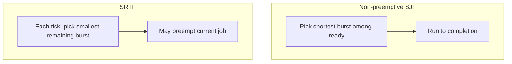
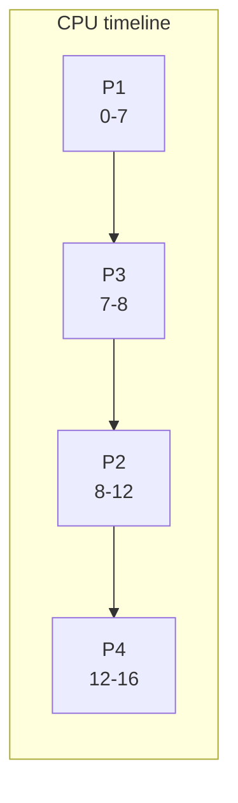
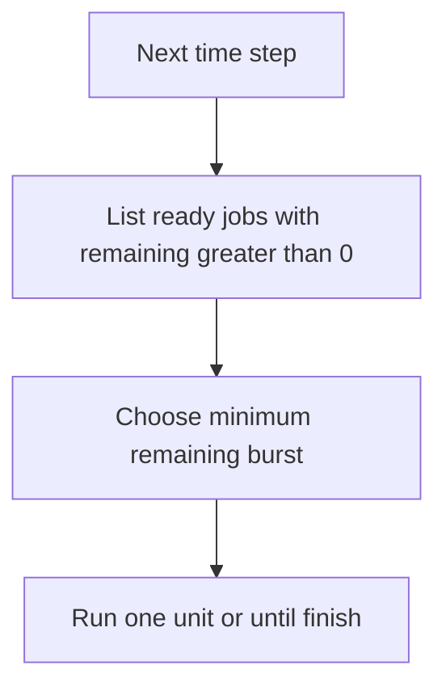

## Practical 6: Shortest Job First (SJF) — Non-Preemptive and Preemptive (SRTF)

**Topic:** Implementation of **Shortest Job First** scheduling (non-preemptive) and **Shortest Remaining Time First** (preemptive SJF, also called **SRTF**).

> **Note:** The source sheet title mentions *Round Robin* in one place; the practical content is **SJF / SRTF** only.

### How to run (gcc — Windows MinGW, Linux, or WSL)

- Standard **C99** (`stdio` only). From **`Misc/os_pr6_code/`**:

```bash
gcc -Wall -o sjf_nonpreemptive sjf_nonpreemptive.c
gcc -Wall -o sjf_srtf sjf_srtf.c
```

- Windows: `.\sjf_nonpreemptive.exe` and `.\sjf_srtf.exe`
- Enter **number of processes**, then **arrival** and **burst** for each process in order.

**Quick test (same numbers as the worked example below):** enter `4` then  
`0 7` `2 4` `4 1` `5 4` for P1–P4.

---

### 1. Theory: Shortest Job First (SJF)

- **Aim:** Describe **SJF**, compare **non-preemptive** and **preemptive** variants, and relate them to **waiting time** and **turnaround time**.

- **Theory:**
  - **Shortest Job First (SJF)** picks the process with the **smallest burst time** among those that are **ready** (have arrived and are not finished).
  - **Non-preemptive SJF:** Once a process starts, it runs until it **ends** its burst (no preemption).
  - **Preemptive SJF (SRTF — Shortest Remaining Time First):** The CPU always serves the job with the **smallest remaining burst** among arrived jobs; if a new arrival has **shorter remaining work** than the current job, the scheduler **preempts** and switches.
  - **Pros:** Often **lower average waiting time** than FCFS.
  - **Cons:** **Starvation** for long jobs if short jobs keep arriving; needs **future burst** (or estimates) — common in **batch** settings where run times are known.

**Formulas**

| Quantity | Formula |
|:---------|:--------|
| Waiting time | Turnaround time minus burst time (after scheduling) |
| Turnaround time | Completion time minus arrival time |

**Infographic — non-preemptive vs preemptive (idea)**



---

### 2. Example scenario (solved) — non-preemptive SJF

**Problem data**

| Process | Arrival time | Burst time |
|:--------|:-------------|:-----------|
| P1 | 0 | 7 |
| P2 | 2 | 4 |
| P3 | 4 | 1 |
| P4 | 5 | 4 |

**Non-preemptive SJF (shortest burst among jobs that have arrived and are not done)**

1. **t = 0:** Only P1 has arrived → P1 runs **0–7**.
2. **t = 7:** P2, P3, P4 have arrived. Shortest burst is **P3 (1)** → P3 runs **7–8**.
3. **t = 8:** P2 and P4 left; both burst **4**. Tie — take **P2** first (e.g. lower PID or FCFS among ties) → P2 runs **8–12**.
4. **t = 12:** P4 runs **12–16**.

**Gantt (non-preemptive)**



**Results**

| Process | Waiting time | Turnaround time |
|:--------|:-------------|:----------------|
| P1 | 0 | 7 |
| P2 | 6 | 10 |
| P3 | 3 | 4 |
| P4 | 7 | 11 |

**Average waiting time:** (0 + 6 + 3 + 7) / 4 = **4.00**  
**Average turnaround time:** (7 + 10 + 4 + 11) / 4 = **8.00**

---

### 3. Preemptive SJF (SRTF) — concept and program output

**Idea:** At every time unit, among all **arrived** processes with **work left**, run the one with the **smallest remaining burst**. This can preempt the running job.

The source PDF contains a **step-by-step narrative** for the same four processes; some printed lines mix **remaining times** in a way that does not match a strict **shortest-remaining-first** trace. Your **program** implements **standard SRTF** (always minimum remaining time among ready jobs). For the input **P1(0,7) P2(2,4) P3(4,1) P4(5,4)**, a correct machine trace matches the **order of execution** printed by **`sjf_srtf`** (including **P4** before **P1** when both are ready and P4 has smaller remaining time).

**Infographic — preemption (logical)**



**Sample output (from `sjf_srtf.c` with the four processes above)**

- Execution segments (see program output): P1 runs **0–2**, then P2, P3, P2 again, then **P4** (remaining **4** vs P1 **5** at that point), then P1 completes.
- **Average waiting time** and **turnaround time** are printed at the end — compare with your hand trace using the same rule.

---

### 4. C implementation — non-preemptive SJF

**File:** `Misc/os_pr6_code/sjf_nonpreemptive.c`

- At each time `t`, if no job can start, **idle** (`time++`).
- Otherwise pick the **ready** job with **minimum burst** among not completed; run it to completion; update **WT** and **TAT**.

```c
/*
 * Save as: sjf_nonpreemptive.c
 * Build: gcc -Wall -o sjf_nonpreemptive sjf_nonpreemptive.c
 */
#include <limits.h>
#include <stdio.h>

#define MAX 10

struct Process {
    int pid;
    int arrival;
    int burst;
    int waiting;
    int turnaround;
    int completed;
};

static void input_processes(struct Process p[], int n)
{
    for (int i = 0; i < n; i++) {
        p[i].pid = i + 1;
        printf("P%d Arrival: ", i + 1);
        scanf("%d", &p[i].arrival);
        printf("P%d Burst: ", i + 1);
        scanf("%d", &p[i].burst);
        p[i].completed = 0;
    }
}

static void calculate_sjf_non_preemptive(struct Process p[], int n)
{
    int completed = 0;
    int time = 0;

    printf("\nOrder of Execution:\nprocess_name\tstart\tend\n");

    while (completed < n) {
        int idx = -1;
        int min_burst = INT_MAX;

        for (int i = 0; i < n; i++) {
            if (!p[i].completed && p[i].arrival <= time
                && p[i].burst < min_burst) {
                min_burst = p[i].burst;
                idx = i;
            }
        }

        if (idx == -1) {
            time++;
            continue;
        }

        printf(
            "P%d\t\t%d\t%d\n",
            p[idx].pid,
            time,
            time + p[idx].burst
        );

        p[idx].waiting = time - p[idx].arrival;
        if (p[idx].waiting < 0) {
            p[idx].waiting = 0;
        }
        time += p[idx].burst;
        p[idx].turnaround = p[idx].waiting + p[idx].burst;
        p[idx].completed = 1;
        completed++;
    }
}

static void print_table(struct Process p[], int n)
{
    float avg_wt = 0.0f;
    float avg_tat = 0.0f;

    printf("\nPID\tAT\tBT\tWT\tTAT\n");
    for (int i = 0; i < n; i++) {
        printf(
            "P%d\t%d\t%d\t%d\t%d\n",
            p[i].pid,
            p[i].arrival,
            p[i].burst,
            p[i].waiting,
            p[i].turnaround
        );
        avg_wt += (float)p[i].waiting;
        avg_tat += (float)p[i].turnaround;
    }
    printf("\nAverage Waiting Time: %.2f", avg_wt / (float)n);
    printf("\nAverage Turnaround Time: %.2f\n", avg_tat / (float)n);
}

int main(void)
{
    struct Process p[MAX];
    int n;

    printf("Non-Preemptive SJF\nEnter number of processes: ");
    scanf("%d", &n);
    input_processes(p, n);
    calculate_sjf_non_preemptive(p, n);
    print_table(p, n);
    return 0;
}
```

**Output (screenshot placeholder):** Run the program and attach a screenshot for your file submission.

**Remark:** `INT_MAX` from `limits.h` replaces `1e9` so comparisons stay **integer-only** and portable.

**Conclusion:** Non-preemptive SJF minimizes average wait among **non-preemptive** policies under the usual assumptions, but needs burst estimates.

---

### 5. C implementation — preemptive SJF (SRTF)

**File:** `Misc/os_pr6_code/sjf_srtf.c`

- Each time slice: choose **minimum remaining** burst among **arrived** incomplete jobs; decrement; print **Gantt** segments when the running job **changes**.

```c
/*
 * Save as: sjf_srtf.c
 * Build: gcc -Wall -o sjf_srtf sjf_srtf.c
 */
#include <limits.h>
#include <stdio.h>

#define MAX 10

struct Process {
    int pid;
    int arrival;
    int burst;
    int remaining;
    int waiting;
    int turnaround;
    int completed;
};

static void input_processes(struct Process p[], int n)
{
    for (int i = 0; i < n; i++) {
        p[i].pid = i + 1;
        printf("P%d Arrival: ", i + 1);
        scanf("%d", &p[i].arrival);
        printf("P%d Burst: ", i + 1);
        scanf("%d", &p[i].burst);
        p[i].remaining = p[i].burst;
        p[i].completed = 0;
    }
}

static void calculate_srtf(struct Process p[], int n)
{
    int completed = 0;
    int time = 0;
    int last_idx = -1;
    int start_time = 0;

    printf("\nOrder of Execution:\nprocess_name\tstart\tend\n");

    while (completed < n) {
        int idx = -1;
        int min_rem = INT_MAX;

        for (int i = 0; i < n; i++) {
            if (!p[i].completed && p[i].arrival <= time
                && p[i].remaining < min_rem) {
                min_rem = p[i].remaining;
                idx = i;
            }
        }

        if (idx != last_idx) {
            if (last_idx != -1) {
                printf(
                    "P%d\t\t%d\t%d\n",
                    p[last_idx].pid,
                    start_time,
                    time
                );
            }
            start_time = time;
            last_idx = idx;
        }

        if (idx == -1) {
            time++;
            continue;
        }

        p[idx].remaining--;
        time++;

        if (p[idx].remaining == 0) {
            p[idx].completed = 1;
            completed++;
            p[idx].turnaround = time - p[idx].arrival;
            p[idx].waiting = p[idx].turnaround - p[idx].burst;
        }
    }

    if (last_idx != -1) {
        printf(
            "P%d\t\t%d\t%d\n",
            p[last_idx].pid,
            start_time,
            time
        );
    }
}

static void print_table(struct Process p[], int n)
{
    float avg_wt = 0.0f;
    float avg_tat = 0.0f;

    printf("\nPID\tAT\tBT\tWT\tTAT\n");
    for (int i = 0; i < n; i++) {
        printf(
            "P%d\t%d\t%d\t%d\t%d\n",
            p[i].pid,
            p[i].arrival,
            p[i].burst,
            p[i].waiting,
            p[i].turnaround
        );
        avg_wt += (float)p[i].waiting;
        avg_tat += (float)p[i].turnaround;
    }
    printf("\nAverage Waiting Time: %.2f", avg_wt / (float)n);
    printf("\nAverage Turnaround Time: %.2f\n", avg_tat / (float)n);
}

int main(void)
{
    struct Process p[MAX];
    int n;

    printf("Preemptive SJF (SRTF)\nEnter number of processes: ");
    scanf("%d", &n);
    input_processes(p, n);
    calculate_srtf(p, n);
    print_table(p, n);
    return 0;
}
```

**Output (screenshot placeholder):** Run with the same test data and attach screenshots for your submission.

**Conclusion:** SRTF can give **lower average waiting time** than non-preemptive SJF but is more complex and still assumes known bursts (or estimates).

---

### 6. Remark and overall conclusion

- **Remark:** Tie-breaking when **two bursts are equal** can follow **FCFS** or **smaller PID**; state your rule in the viva. The program uses **first minimum found** in index order (document if you change it).
- **Overall conclusion:** This practical ties **theory**, a **hand-solved** non-preemptive example, and **C** implementations for **non-preemptive SJF** and **SRTF**, with averages for **waiting** and **turnaround** time.

> **Export note:** Diagrams use ` ```mermaid ` fences for SVG in this app's PDF/Word export. If a diagram fails to render, check syntax at [mermaid.live](https://mermaid.live/).
