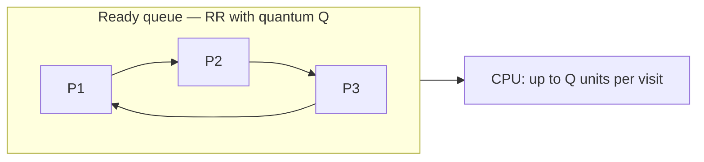
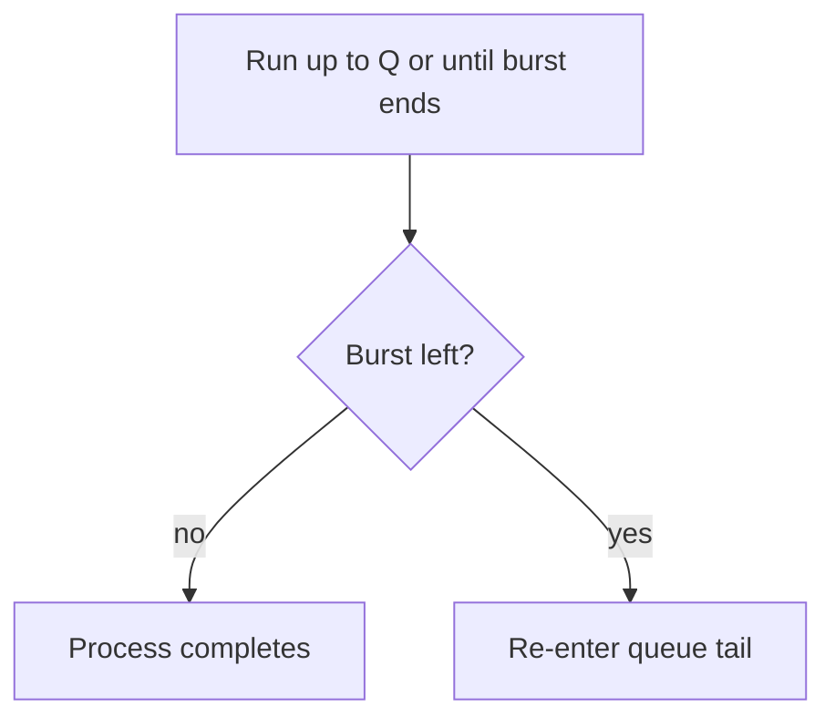
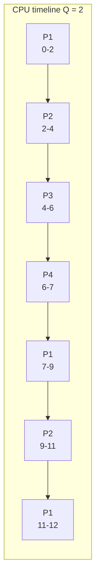

# {{SUBJECT}}
**Session:** {{SESSION}}

**{{INSTITUTION}}**
**{{FACULTY}}**
**{{DEGREE}}**
**{{DEPARTMENT}}**

| Submitted To | Submitted By |
|:-------------|:-------------|
| {{TEACHER_NAME}} | {{STUDENT_NAME}} |
| {{TEACHER_TITLE}} | {{YEAR}} |
| {{TEACHER_DEPT}} | {{DEGREE}} |
| | {{SECTION}} |
| | Roll No. {{ROLL_NO}} |

---

## Practical 7: Round Robin (RR) CPU Scheduling

**Topic:** Implementation of **Round Robin** scheduling with a **time quantum**.

### How to run (gcc — Windows MinGW, Linux, or WSL)

- Standard **C** (`stdio` only). From **`Misc/os_pr7_code/`**:

```bash
gcc -Wall -o round_robin round_robin.c
```

- Windows: `.\round_robin.exe` — Linux/WSL: `./round_robin`
- Enter **number of processes**, **arrival** and **burst** for each, then **time quantum** `Q`.

**Quick check (same as Section 2 below):** `4` processes, bursts **P1: 0,5** **P2: 1,4** **P3: 2,2** **P4: 3,1**, quantum **`2`**.

---

### 1. Theory: Round Robin (RR)

- **Aim:** Explain **Round Robin** scheduling, the role of the **quantum**, and trade-offs versus other algorithms.

- **Theory:**
  - **Round Robin (RR)** is a **preemptive** policy: the CPU visits processes in **turn**, each for at most **one time slice** of length **Q** (the **time quantum**).
  - If a process **finishes** before `Q` expires, the scheduler moves on **immediately** (no idle quantum wasted on that slice).
  - If **burst left** after a slice, the process goes to the **back** of the **ready queue** (in a **queue-based** description). Lab implementations often **scan** processes in a fixed order **P1 … Pn** each **round**; behaviour matches the **worked example** below when that order is used.
  - **Parameter:** **Q** — small **Q** improves response time but raises **context-switch** cost; large **Q** approaches **FCFS**.
  - **Fairness:** Every ready process gets CPU regularly — good for **time-sharing**.
  - **Used in:** Interactive and **time-sharing** systems.

**Formulas (after scheduling)**

| Quantity | Formula |
|:---------|:--------|
| Turnaround time | Completion time minus arrival time |
| Waiting time | Turnaround time minus burst time |

**Infographic — cyclic service (idea)**



**Infographic — one slice**



---

### 2. Example scenario (solved)

**Problem data**

| Process | Arrival time | Burst time |
|:--------|:-------------|:-----------|
| P1 | 0 | 5 |
| P2 | 1 | 4 |
| P3 | 2 | 2 |
| P4 | 3 | 1 |

**Time quantum:** `Q = 2`

**Gantt (step-by-step from syllabus)**

| Time | Process | Remaining burst (after slice) |
|:-----|:--------|:-------------------------------|
| 0–2 | P1 | 3 |
| 2–4 | P2 | 2 |
| 4–6 | P3 | 0 (finishes) |
| 6–7 | P4 | 0 (finishes) |
| 7–9 | P1 | 1 |
| 9–11 | P2 | 0 (finishes) |
| 11–12 | P1 | 0 (finishes) |

**Completion times:** P3 = 6, P4 = 7, P2 = 11, P1 = 12

**Gantt (visual)**



**Final metrics**

| Process | Arrival | Burst | Waiting | Turnaround |
|:--------|:--------|:------|:--------|:-----------|
| P1 | 0 | 5 | 7 | 12 |
| P2 | 1 | 4 | 6 | 10 |
| P3 | 2 | 2 | 2 | 4 |
| P4 | 3 | 1 | 3 | 4 |

**Average waiting time:** (7 + 6 + 2 + 3) / 4 = **4.50**  
**Average turnaround time:** (12 + 10 + 4 + 4) / 4 = **7.50**

---

### 3. C implementation

**File:** `Misc/os_pr7_code/round_robin.c`

- **Outer loop:** Until all processes complete.
- **Inner loop:** Scan **P1 … Pn**; if a process has **remaining burst** and has **arrived**, run it for **`min(remaining, Q)`** time units, print the segment, update **time** and **remaining**.
- If **no** process can run at current **time**, **`time++`** (CPU idle).

```c
/*
 * Save as: round_robin.c
 * Build: gcc -Wall -o round_robin round_robin.c
 */
#include <stdio.h>

#define MAX 10

struct Process {
    int pid;
    int arrival;
    int burst;
    int remaining;
    int waiting;
    int turnaround;
};

static void input_processes(struct Process p[], int n)
{
    for (int i = 0; i < n; i++) {
        p[i].pid = i + 1;
        printf("P%d Arrival: ", i + 1);
        scanf("%d", &p[i].arrival);
        printf("P%d Burst: ", i + 1);
        scanf("%d", &p[i].burst);
        p[i].remaining = p[i].burst;
    }
}

static void calculate_round_robin(struct Process p[], int n, int quantum)
{
    int time = 0;
    int completed = 0;

    printf("\nOrder of Execution:\nprocess_name\tstart\tend\n");

    while (completed < n) {
        int found = 0;

        for (int i = 0; i < n; i++) {
            if (p[i].remaining > 0 && p[i].arrival <= time) {
                found = 1;
                int exec = (p[i].remaining < quantum)
                    ? p[i].remaining
                    : quantum;
                printf(
                    "P%d\t\t%d\t%d\n",
                    p[i].pid,
                    time,
                    time + exec
                );
                p[i].remaining -= exec;
                time += exec;
                if (p[i].remaining == 0) {
                    p[i].turnaround = time - p[i].arrival;
                    p[i].waiting = p[i].turnaround - p[i].burst;
                    completed++;
                }
            }
        }

        if (!found) {
            time++;
        }
    }
}

static void print_table(struct Process p[], int n)
{
    float avg_wt = 0.0f;
    float avg_tat = 0.0f;

    printf("\nPID\tAT\tBT\tWT\tTAT\n");
    for (int i = 0; i < n; i++) {
        printf(
            "P%d\t%d\t%d\t%d\t%d\n",
            p[i].pid,
            p[i].arrival,
            p[i].burst,
            p[i].waiting,
            p[i].turnaround
        );
        avg_wt += (float)p[i].waiting;
        avg_tat += (float)p[i].turnaround;
    }
    printf("\nAverage Waiting Time: %.2f", avg_wt / (float)n);
    printf("\nAverage Turnaround Time: %.2f\n", avg_tat / (float)n);
}

int main(void)
{
    struct Process p[MAX];
    int n;
    int q;

    printf("Round Robin\nEnter number of processes: ");
    scanf("%d", &n);
    input_processes(p, n);
    printf("Enter Time Quantum: ");
    scanf("%d", &q);
    calculate_round_robin(p, n, q);
    print_table(p, n);
    return 0;
}
```

**Output:** For the sample input, the **order of execution** and **PID / AT / BT / WT / TAT** table should match **Section 2**. Attach **screenshots** for your practical file.

**Remark:** Waiting time is **not** `(completion - arrival - burst)` in one step only — it equals **turnaround minus burst** after the schedule is known. Line lengths in code are kept short for **PDF export** (see project formatting rules).

**Conclusion:** Round Robin gives **predictable sharing** of the CPU; choosing **Q** balances **responsiveness** and **overhead**.

---

### 4. Overall conclusion

This practical covers **Round Robin theory**, a **fully worked** quantum **2** example, and a **C program** that prints **Gantt segments** and **average waiting and turnaround times**, matching the lab-style algorithm in the source sheet.

> **Export note:** Diagrams use ` ```mermaid ` fences so they render as SVG in this app's preview, PDF, and Word. If a diagram shows raw code with a red border, validate at [mermaid.live](https://mermaid.live/).
