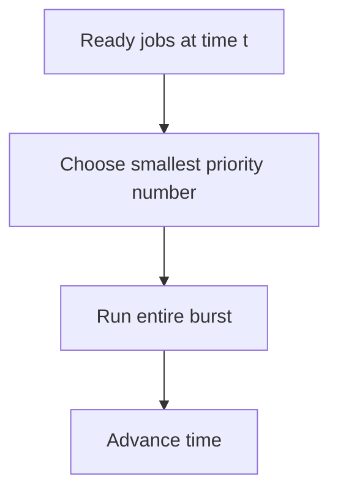
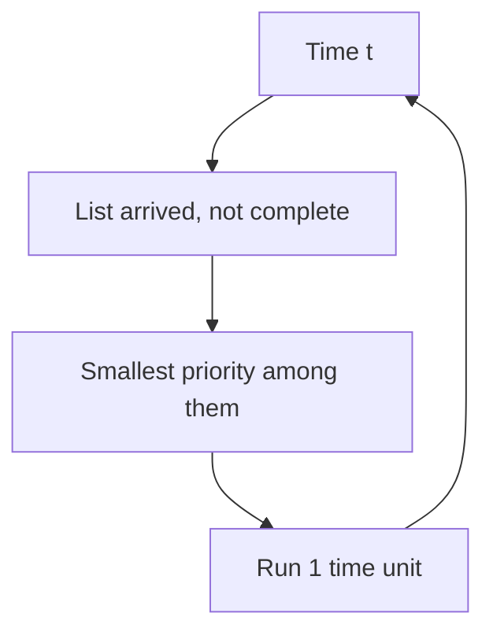

# {{SUBJECT}}
**Session:** {{SESSION}}

**{{INSTITUTION}}**
**{{FACULTY}}**
**{{DEGREE}}**
**{{DEPARTMENT}}**

| Submitted To | Submitted By |
|:-------------|:-------------|
| {{TEACHER_NAME}} | {{STUDENT_NAME}} |
| {{TEACHER_TITLE}} | {{YEAR}} |
| {{TEACHER_DEPT}} | {{DEGREE}} |
| | {{SECTION}} |
| | Roll No. {{ROLL_NO}} |

---

## Practical 8: Priority Scheduling (Non-Preemptive and Preemptive)

**Topic:** Implementation of **priority-based** CPU scheduling — **non-preemptive** and **preemptive** variants.

> **Note:** The source sheet uses *lower priority number = higher priority* (common textbook convention). The title line has a typo (*Priotity*); content uses **Priority**.

### How to run (gcc — Windows MinGW, Linux, or WSL)

- Standard **C** (`stdio`, `limits.h`). From **`Misc/os_pr8_code/`**:

```bash
gcc -Wall -o priority_nonpreemptive priority_nonpreemptive.c
gcc -Wall -o priority_preemptive priority_preemptive.c
```

- Windows: `.\priority_nonpreemptive.exe` / `.\priority_preemptive.exe`

---

### 1. Theory: Priority scheduling

- **Aim:** Explain **priority scheduling**, **preemption**, and the meaning of **priority values**.

- **Theory:**
  - Each process has a **priority** (integer). Here **smaller number = more important** (higher priority).
  - **Non-preemptive priority:** Among processes that have **arrived** and are not finished, pick the **highest priority** (smallest number). Run that process for its **full remaining burst** (no preemption).
  - **Preemptive priority (lab model):** At **each time unit**, among **arrived** processes with **work left**, pick the **highest priority** (smallest number). If that is **different** from who ran last instant, the CPU **switches** (preemption). Execute **one** unit of burst, then repeat.
  - **Starvation:** Low-priority jobs may wait a long time if high-priority work keeps arriving (mitigated in real OSs by **aging** — not in this basic code).
  - **Tie-breaking:** If two ready processes share the **same** priority, the **first** in the scan order (`P1` … `Pn`) wins — document this in your viva.

**Formulas**

| Quantity | Formula |
|:---------|:--------|
| Turnaround time | Completion time minus arrival time |
| Waiting time | Turnaround time minus burst time |

**Infographic — non-preemptive (pick, then run to end)**



**Infographic — preemptive (re-decide every tick)**



---

### 2. Illustrative example (non-preemptive only)

**Data:** smaller priority number = higher priority.

| Process | Arrival | Burst | Priority |
|:--------|:--------|:------|:---------|
| P1 | 0 | 5 | 3 |
| P2 | 1 | 3 | 1 |
| P3 | 2 | 2 | 2 |

**Non-preemptive trace**

1. **t = 0:** Only **P1** has arrived → run P1 **0–5** (P2 and P3 wait).
2. **t = 5:** P2 (prio **1**) beats P3 (prio **2**) → P2 runs **5–8**.
3. **t = 8:** P3 runs **8–10**.

**Waiting / turnaround**

| Process | Waiting | Turnaround |
|:--------|:--------|:------------|
| P1 | 0 | 5 |
| P2 | 4 | 7 |
| P3 | 6 | 8 |

Use the **program** to confirm and to explore **preemptive** behaviour on the same or other inputs.

---

### 3. C implementation — non-preemptive priority

**File:** `Misc/os_pr8_code/priority_nonpreemptive.c`

- While jobs remain: if **no** job is ready, **`time++`** (idle CPU).
- Else choose **minimum `priority`** among **arrived** incomplete jobs; schedule **start–end**; set **WT** and **TAT**.

```c
/*
 * Save as: priority_nonpreemptive.c
 * Build: gcc -Wall -o priority_nonpreemptive priority_nonpreemptive.c
 */
#include <limits.h>
#include <stdio.h>

#define MAX 10

struct Process {
    int pid;
    int arrival;
    int burst;
    int priority;
    int waiting;
    int turnaround;
    int completed;
};

static void input_processes(struct Process p[], int n)
{
    for (int i = 0; i < n; i++) {
        p[i].pid = i + 1;
        printf("P%d Arrival: ", i + 1);
        scanf("%d", &p[i].arrival);
        printf("P%d Burst: ", i + 1);
        scanf("%d", &p[i].burst);
        printf("P%d Priority: ", i + 1);
        scanf("%d", &p[i].priority);
        p[i].completed = 0;
    }
}

static void calculate_priority_np(struct Process p[], int n)
{
    int completed = 0;
    int time = 0;

    printf("\nOrder of Execution:\nprocess_name\tstart\tend\n");

    while (completed < n) {
        int idx = -1;
        int min_prio = INT_MAX;

        for (int i = 0; i < n; i++) {
            if (!p[i].completed && p[i].arrival <= time
                && p[i].priority < min_prio) {
                min_prio = p[i].priority;
                idx = i;
            }
        }

        if (idx == -1) {
            time++;
            continue;
        }

        printf(
            "P%d\t\t%d\t%d\n",
            p[idx].pid,
            time,
            time + p[idx].burst
        );
        p[idx].waiting = time - p[idx].arrival;
        time += p[idx].burst;
        p[idx].turnaround = p[idx].waiting + p[idx].burst;
        p[idx].completed = 1;
        completed++;
    }
}

static void print_table(struct Process p[], int n)
{
    float avg_wt = 0.0f;
    float avg_tat = 0.0f;

    printf("\nPID\tAT\tBT\tWT\tTAT\n");
    for (int i = 0; i < n; i++) {
        printf(
            "P%d\t%d\t%d\t%d\t%d\n",
            p[i].pid,
            p[i].arrival,
            p[i].burst,
            p[i].waiting,
            p[i].turnaround
        );
        avg_wt += (float)p[i].waiting;
        avg_tat += (float)p[i].turnaround;
    }
    printf("\nAverage Waiting Time: %.2f", avg_wt / (float)n);
    printf("\nAverage Turnaround Time: %.2f\n", avg_tat / (float)n);
}

int main(void)
{
    struct Process p[MAX];
    int n;

    printf("Non-Preemptive Priority\nEnter number of processes: ");
    scanf("%d", &n);
    input_processes(p, n);
    calculate_priority_np(p, n);
    print_table(p, n);
    return 0;
}
```

**Output:** Attach **screenshots** for your submission.

**Remark:** `INT_MAX` replaces `1e9` so comparisons stay **integer-only** and portable.

---

### 4. C implementation — preemptive priority

**File:** `Misc/os_pr8_code/priority_preemptive.c`

- Same outer loop as the **SRTF**-style simulator in other practicals: each **time step**, select **best priority** among ready jobs; print **Gantt** segments when the **running process changes**.

```c
/*
 * Save as: priority_preemptive.c
 * Build: gcc -Wall -o priority_preemptive priority_preemptive.c
 */
#include <limits.h>
#include <stdio.h>

#define MAX 10

struct Process {
    int pid;
    int arrival;
    int burst;
    int remaining;
    int priority;
    int waiting;
    int turnaround;
    int completed;
};

static void input_processes(struct Process p[], int n)
{
    for (int i = 0; i < n; i++) {
        p[i].pid = i + 1;
        printf("P%d Arrival: ", i + 1);
        scanf("%d", &p[i].arrival);
        printf("P%d Burst: ", i + 1);
        scanf("%d", &p[i].burst);
        printf("P%d Priority: ", i + 1);
        scanf("%d", &p[i].priority);
        p[i].remaining = p[i].burst;
        p[i].completed = 0;
    }
}

static void calculate_priority_preemptive(struct Process p[], int n)
{
    int completed = 0;
    int time = 0;
    int last_idx = -1;
    int start_time = 0;

    printf("\nOrder of Execution:\nprocess_name\tstart\tend\n");

    while (completed < n) {
        int idx = -1;
        int min_prio = INT_MAX;

        for (int i = 0; i < n; i++) {
            if (!p[i].completed && p[i].arrival <= time
                && p[i].priority < min_prio) {
                min_prio = p[i].priority;
                idx = i;
            }
        }

        if (idx != last_idx) {
            if (last_idx != -1) {
                printf(
                    "P%d\t\t%d\t%d\n",
                    p[last_idx].pid,
                    start_time,
                    time
                );
            }
            start_time = time;
            last_idx = idx;
        }

        if (idx == -1) {
            time++;
            continue;
        }

        p[idx].remaining--;
        time++;

        if (p[idx].remaining == 0) {
            p[idx].completed = 1;
            completed++;
            p[idx].turnaround = time - p[idx].arrival;
            p[idx].waiting = p[idx].turnaround - p[idx].burst;
        }
    }

    if (last_idx != -1) {
        printf(
            "P%d\t\t%d\t%d\n",
            p[last_idx].pid,
            start_time,
            time
        );
    }
}

static void print_table(struct Process p[], int n)
{
    float avg_wt = 0.0f;
    float avg_tat = 0.0f;

    printf("\nPID\tAT\tBT\tWT\tTAT\n");
    for (int i = 0; i < n; i++) {
        printf(
            "P%d\t%d\t%d\t%d\t%d\n",
            p[i].pid,
            p[i].arrival,
            p[i].burst,
            p[i].waiting,
            p[i].turnaround
        );
        avg_wt += (float)p[i].waiting;
        avg_tat += (float)p[i].turnaround;
    }
    printf("\nAverage Waiting Time: %.2f", avg_wt / (float)n);
    printf("\nAverage Turnaround Time: %.2f\n", avg_tat / (float)n);
}

int main(void)
{
    struct Process p[MAX];
    int n;

    printf("Preemptive Priority\nEnter number of processes: ");
    scanf("%d", &n);
    input_processes(p, n);
    calculate_priority_preemptive(p, n);
    print_table(p, n);
    return 0;
}
```

**Output:** Attach **screenshots**.

**Conclusion:** Priority scheduling favours **important** jobs; **preemptive** mode reacts when **new** work has **better** priority than the current job.

---

### 5. Overall conclusion

This practical implements **non-preemptive** and **preemptive** **priority** scheduling with **lower number = higher priority**, prints **Gantt-style** intervals, and reports **average waiting** and **turnaround** times.

> **Export note:** Diagrams use ` ```mermaid ` fences for SVG in preview, PDF, and Word. If a diagram fails, check at [mermaid.live](https://mermaid.live/).
