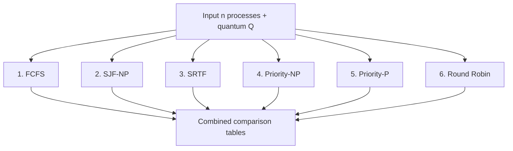
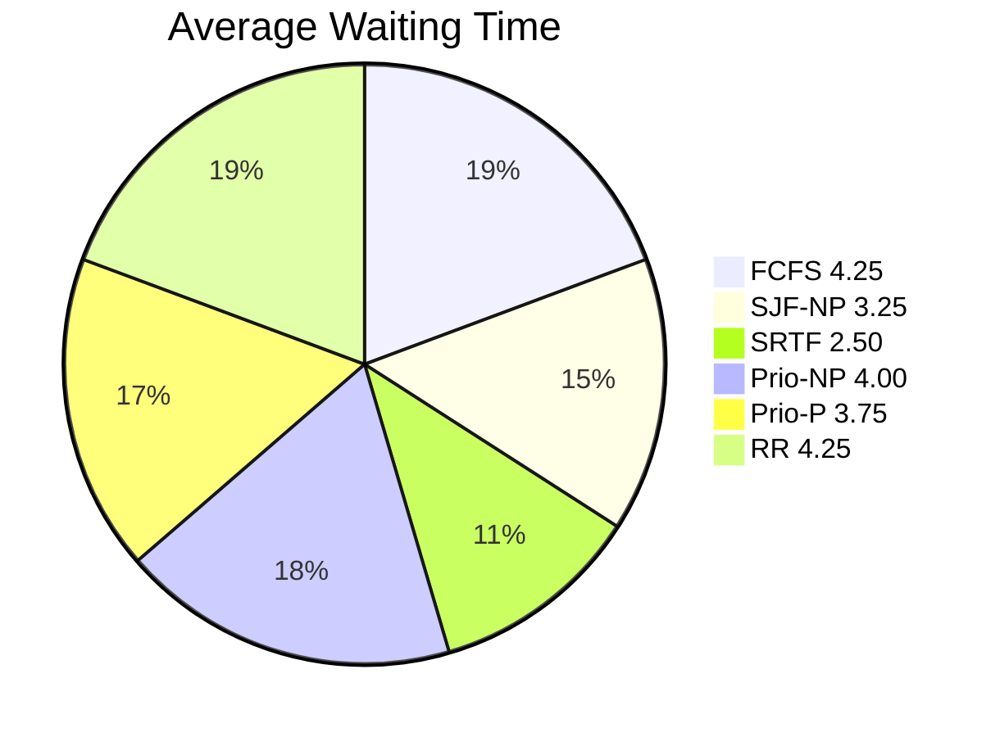

# {{SUBJECT}}
**Session:** {{SESSION}}

**{{INSTITUTION}}**
**{{FACULTY}}**
**{{DEGREE}}**
**{{DEPARTMENT}}**

| Submitted To | Submitted By |
|:-------------|:-------------|
| {{TEACHER_NAME}} | {{STUDENT_NAME}} |
| {{TEACHER_TITLE}} | {{YEAR}} |
| {{TEACHER_DEPT}} | {{DEGREE}} |
| | {{SECTION}} |
| | Roll No. {{ROLL_NO}} |

---

## Practical 9: All Scheduling Algorithms Combined

**Topic:** Single program that takes process data **once**, runs **all six** scheduling algorithms automatically, prints individual results, and ends with a **combined comparison table**.

### How to run (gcc — Windows MinGW, Linux, or WSL)

- Standard **C** (`stdio`, `limits.h`, `string.h`). From **`Misc/os_pr9_code/`**:

```bash
gcc -Wall -o all_scheduling all_scheduling.c
```

- Windows: `.\all_scheduling.exe` — Linux/WSL: `./all_scheduling`
- Enter **number of processes**, then **arrival, burst, priority** for each (one line per process), and finally the **time quantum** for Round Robin.
- The program runs **FCFS, SJF-NP, SJF-P (SRTF), Priority-NP, Priority-P, Round Robin** in sequence and finishes with three comparison tables.

**Quick test:** `4` processes, `0 5 2` / `1 3 1` / `2 2 3` / `3 1 2`, quantum `2`.

---

### 1. Theory: why combine and compare?

- **Aim:** Run **identical** input through every studied scheduling policy and observe differences in **waiting time**, **turnaround time**, and **execution order** side by side.

- **Theory:**
  - **FCFS** (Practical 5): arrival order, non-preemptive.
  - **SJF Non-Preemptive** (Practical 6): shortest burst first; no preemption.
  - **SJF Preemptive / SRTF** (Practical 6): smallest remaining burst at every tick.
  - **Priority Non-Preemptive** (Practical 8): highest priority (lowest number) first; no preemption.
  - **Priority Preemptive** (Practical 8): re-evaluate priority at every tick.
  - **Round Robin** (Practical 7): cyclic with quantum **Q**.

Comparing all on one data set reveals **convoy effects** (FCFS), **starvation** (priority), **responsiveness** (RR), and how **SJF** minimizes average wait under ideal conditions.

**Infographic — program flow**



---

### 2. Example scenario (verified program output)

**Common input**

| Process | Arrival | Burst | Priority |
|:--------|:--------|:------|:---------|
| P1 | 0 | 5 | 2 |
| P2 | 1 | 3 | 1 |
| P3 | 2 | 2 | 3 |
| P4 | 3 | 1 | 2 |

**Time quantum:** `Q = 2`

---

#### Individual Gantt charts (printed by the program)

**FCFS:** P1 0–5, P2 5–8, P3 8–10, P4 10–11

**SJF-NP:** P1 0–5, P4 5–6, P3 6–8, P2 8–11

**SRTF:** P1 0–1, P2 1–4, P4 4–5, P3 5–7, P1 7–11

**Priority-NP:** P1 0–5, P2 5–8, P4 8–9, P3 9–11

**Priority-P:** P1 0–1, P2 1–4, P1 4–8, P4 8–9, P3 9–11

**RR (Q=2):** P1 0–2, P2 2–4, P3 4–6, P4 6–7, P1 7–9, P2 9–10, P1 10–11

---

#### Combined comparison — waiting time

| Process | FCFS | SJF-NP | SRTF | Prio-NP | Prio-P | RR |
|:--------|:-----|:-------|:-----|:--------|:-------|:---|
| P1 | 0 | 0 | 6 | 0 | 3 | 6 |
| P2 | 4 | 7 | 0 | 4 | 0 | 6 |
| P3 | 6 | 4 | 3 | 7 | 7 | 2 |
| P4 | 7 | 2 | 1 | 5 | 5 | 3 |
| **Avg** | **4.25** | **3.25** | **2.50** | **4.00** | **3.75** | **4.25** |

---

#### Combined comparison — turnaround time

| Process | FCFS | SJF-NP | SRTF | Prio-NP | Prio-P | RR |
|:--------|:-----|:-------|:-----|:--------|:-------|:---|
| P1 | 5 | 5 | 11 | 5 | 8 | 11 |
| P2 | 7 | 10 | 3 | 7 | 3 | 9 |
| P3 | 8 | 6 | 5 | 9 | 9 | 4 |
| P4 | 8 | 3 | 2 | 6 | 6 | 4 |
| **Avg** | **7.00** | **6.00** | **5.25** | **6.75** | **6.50** | **7.00** |

---

#### Summary — averages

| Algorithm | Avg WT | Avg TAT |
|:----------|:-------|:--------|
| FCFS | 4.25 | 7.00 |
| SJF-NP | 3.25 | 6.00 |
| SRTF | **2.50** | **5.25** |
| Priority-NP | 4.00 | 6.75 |
| Priority-P | 3.75 | 6.50 |
| RR (Q=2) | 4.25 | 7.00 |

**Infographic — average WT comparison**



**Observation:** For this input, **SRTF** gives the **lowest average waiting time** and **turnaround time**, at the cost of more context switches.

---

### 3. C implementation

**File:** `Misc/os_pr9_code/all_scheduling.c`

- **Input once:** `main` collects **n** processes (arrival, burst, priority) and quantum **Q**.
- **Run all:** Each algorithm receives a **fresh copy** of the input array (via `copy_procs`) so results are independent.
- **Store results:** After each algorithm, `store_result` saves per-process **WT** / **TAT** and averages into a `struct AlgoResult`.
- **`print_combined`:** Prints three final tables — **WT comparison**, **TAT comparison**, and **averages summary**.

```c
/*
 * Save as: all_scheduling.c
 * Build: gcc -Wall -o all_scheduling all_scheduling.c
 */
#include <limits.h>
#include <stdio.h>
#include <string.h>

#define MAX 10
#define NUM_ALGOS 6

struct Process {
    int pid;
    int arrival;
    int burst;
    int priority;
    int waiting;
    int turnaround;
    int remaining;
    int completed;
};

struct AlgoResult {
    const char *name;
    int wt[MAX];
    int tat[MAX];
    float avg_wt;
    float avg_tat;
};

static void copy_procs(
    struct Process dst[],
    const struct Process src[],
    int n)
{
    memcpy(dst, src, (size_t)n * sizeof(struct Process));
}

static void store_result(
    struct AlgoResult *r,
    const char *name,
    struct Process p[],
    int n)
{
    float sum_wt = 0.0f;
    float sum_tat = 0.0f;

    r->name = name;
    for (int i = 0; i < n; i++) {
        r->wt[i]  = p[i].waiting;
        r->tat[i] = p[i].turnaround;
        sum_wt  += (float)p[i].waiting;
        sum_tat += (float)p[i].turnaround;
    }
    r->avg_wt  = sum_wt  / (float)n;
    r->avg_tat = sum_tat / (float)n;
}

static void print_result(
    struct Process p[], int n, const char *name)
{
    float avg_wt = 0.0f;
    float avg_tat = 0.0f;

    printf("\n%s\nPID\tAT\tBT\tWT\tTAT\n", name);
    for (int i = 0; i < n; i++) {
        printf(
            "P%d\t%d\t%d\t%d\t%d\n",
            p[i].pid,
            p[i].arrival,
            p[i].burst,
            p[i].waiting,
            p[i].turnaround
        );
        avg_wt  += (float)p[i].waiting;
        avg_tat += (float)p[i].turnaround;
    }
    printf(
        "\nAverage WT: %.2f  |  Average TAT: %.2f\n",
        avg_wt / (float)n,
        avg_tat / (float)n
    );
}

/* ---- FCFS ---- */
static void fcfs(struct Process p[], int n)
{
    int time = 0;

    printf("\nGantt:\nprocess\tstart\tend\n");
    for (int i = 0; i < n; i++) {
        if (time < p[i].arrival)
            time = p[i].arrival;
        printf(
            "P%d\t%d\t%d\n",
            p[i].pid, time, time + p[i].burst
        );
        p[i].waiting = time - p[i].arrival;
        time += p[i].burst;
        p[i].turnaround = p[i].waiting + p[i].burst;
    }
    print_result(p, n, "FCFS");
}

/* ---- SJF Non-Preemptive ---- */
static void sjf_np(struct Process p[], int n)
{
    int completed = 0;
    int time = 0;

    for (int i = 0; i < n; i++) p[i].completed = 0;
    printf("\nGantt:\nprocess\tstart\tend\n");

    while (completed < n) {
        int idx = -1;
        int min_bt = INT_MAX;

        for (int i = 0; i < n; i++) {
            if (!p[i].completed && p[i].arrival <= time
                && p[i].burst < min_bt) {
                min_bt = p[i].burst;
                idx = i;
            }
        }
        if (idx == -1) { time++; continue; }

        printf(
            "P%d\t%d\t%d\n",
            p[idx].pid, time, time + p[idx].burst
        );
        p[idx].waiting = time - p[idx].arrival;
        time += p[idx].burst;
        p[idx].turnaround = p[idx].waiting + p[idx].burst;
        p[idx].completed = 1;
        completed++;
    }
    print_result(p, n, "SJF Non-Preemptive");
}

/* ---- SJF Preemptive (SRTF) ---- */
static void sjf_p(struct Process p[], int n)
{
    int time = 0;
    int completed = 0;
    int last_idx = -1;
    int start_time = 0;

    for (int i = 0; i < n; i++) {
        p[i].remaining = p[i].burst;
        p[i].completed = 0;
    }
    printf("\nGantt:\nprocess\tstart\tend\n");

    while (completed < n) {
        int idx = -1;
        int min_rem = INT_MAX;

        for (int i = 0; i < n; i++) {
            if (!p[i].completed && p[i].arrival <= time
                && p[i].remaining < min_rem) {
                min_rem = p[i].remaining;
                idx = i;
            }
        }
        if (idx != last_idx) {
            if (last_idx != -1)
                printf(
                    "P%d\t%d\t%d\n",
                    p[last_idx].pid, start_time, time
                );
            start_time = time;
            last_idx = idx;
        }
        if (idx == -1) { time++; continue; }

        p[idx].remaining--;
        time++;
        if (p[idx].remaining == 0) {
            p[idx].completed = 1;
            completed++;
            p[idx].turnaround = time - p[idx].arrival;
            p[idx].waiting =
                p[idx].turnaround - p[idx].burst;
        }
    }
    if (last_idx != -1)
        printf(
            "P%d\t%d\t%d\n",
            p[last_idx].pid, start_time, time
        );
    print_result(p, n, "SJF Preemptive (SRTF)");
}

/* ---- Priority Non-Preemptive ---- */
static void priority_np(struct Process p[], int n)
{
    int completed = 0;
    int time = 0;

    for (int i = 0; i < n; i++) p[i].completed = 0;
    printf("\nGantt:\nprocess\tstart\tend\n");

    while (completed < n) {
        int idx = -1;
        int min_prio = INT_MAX;

        for (int i = 0; i < n; i++) {
            if (!p[i].completed && p[i].arrival <= time
                && p[i].priority < min_prio) {
                min_prio = p[i].priority;
                idx = i;
            }
        }
        if (idx == -1) { time++; continue; }

        printf(
            "P%d\t%d\t%d\n",
            p[idx].pid, time, time + p[idx].burst
        );
        p[idx].waiting = time - p[idx].arrival;
        time += p[idx].burst;
        p[idx].turnaround = p[idx].waiting + p[idx].burst;
        p[idx].completed = 1;
        completed++;
    }
    print_result(p, n, "Priority Non-Preemptive");
}

/* ---- Priority Preemptive ---- */
static void priority_p(struct Process p[], int n)
{
    int time = 0;
    int completed = 0;
    int last_idx = -1;
    int start_time = 0;

    for (int i = 0; i < n; i++) {
        p[i].remaining = p[i].burst;
        p[i].completed = 0;
    }
    printf("\nGantt:\nprocess\tstart\tend\n");

    while (completed < n) {
        int idx = -1;
        int min_prio = INT_MAX;

        for (int i = 0; i < n; i++) {
            if (!p[i].completed && p[i].arrival <= time
                && p[i].priority < min_prio) {
                min_prio = p[i].priority;
                idx = i;
            }
        }
        if (idx != last_idx) {
            if (last_idx != -1)
                printf(
                    "P%d\t%d\t%d\n",
                    p[last_idx].pid, start_time, time
                );
            start_time = time;
            last_idx = idx;
        }
        if (idx == -1) { time++; continue; }

        p[idx].remaining--;
        time++;
        if (p[idx].remaining == 0) {
            p[idx].completed = 1;
            completed++;
            p[idx].turnaround = time - p[idx].arrival;
            p[idx].waiting =
                p[idx].turnaround - p[idx].burst;
        }
    }
    if (last_idx != -1)
        printf(
            "P%d\t%d\t%d\n",
            p[last_idx].pid, start_time, time
        );
    print_result(p, n, "Priority Preemptive");
}

/* ---- Round Robin ---- */
static void round_robin(
    struct Process p[], int n, int quantum)
{
    int time = 0;
    int completed = 0;

    for (int i = 0; i < n; i++)
        p[i].remaining = p[i].burst;
    printf("\nGantt:\nprocess\tstart\tend\n");

    while (completed < n) {
        int found = 0;

        for (int i = 0; i < n; i++) {
            if (p[i].remaining > 0
                && p[i].arrival <= time) {
                found = 1;
                int exec = (p[i].remaining < quantum)
                    ? p[i].remaining
                    : quantum;
                printf(
                    "P%d\t%d\t%d\n",
                    p[i].pid, time, time + exec
                );
                p[i].remaining -= exec;
                time += exec;
                if (p[i].remaining == 0) {
                    p[i].turnaround =
                        time - p[i].arrival;
                    p[i].waiting =
                        p[i].turnaround - p[i].burst;
                    completed++;
                }
            }
        }
        if (!found) time++;
    }
    print_result(p, n, "Round Robin");
}

/* ---- Combined comparison tables ---- */
static void print_combined(
    struct AlgoResult res[],
    int n_algos,
    int n_procs)
{
    printf("\n");
    printf("============================================");
    printf("========================================\n");
    printf("  COMBINED — WAITING TIME (WT)\n");
    printf("============================================");
    printf("========================================\n");

    printf("Process");
    for (int a = 0; a < n_algos; a++)
        printf("\t%s", res[a].name);
    printf("\n");
    for (int i = 0; i < n_procs; i++) {
        printf("P%d", i + 1);
        for (int a = 0; a < n_algos; a++)
            printf("\t%d", res[a].wt[i]);
        printf("\n");
    }
    printf("Avg");
    for (int a = 0; a < n_algos; a++)
        printf("\t%.2f", res[a].avg_wt);
    printf("\n");

    printf("\n");
    printf("============================================");
    printf("========================================\n");
    printf("  COMBINED — TURNAROUND TIME (TAT)\n");
    printf("============================================");
    printf("========================================\n");

    printf("Process");
    for (int a = 0; a < n_algos; a++)
        printf("\t%s", res[a].name);
    printf("\n");
    for (int i = 0; i < n_procs; i++) {
        printf("P%d", i + 1);
        for (int a = 0; a < n_algos; a++)
            printf("\t%d", res[a].tat[i]);
        printf("\n");
    }
    printf("Avg");
    for (int a = 0; a < n_algos; a++)
        printf("\t%.2f", res[a].avg_tat);
    printf("\n");

    printf("\n");
    printf("============================================");
    printf("========================================\n");
    printf("  SUMMARY — AVERAGES\n");
    printf("============================================");
    printf("========================================\n");

    printf("Algorithm\t\tAvg WT\tAvg TAT\n");
    for (int a = 0; a < n_algos; a++)
        printf(
            "%-24s%.2f\t%.2f\n",
            res[a].name,
            res[a].avg_wt,
            res[a].avg_tat
        );
}

/* ---- Main ---- */
int main(void)
{
    struct Process orig[MAX];
    struct Process work[MAX];
    struct AlgoResult res[NUM_ALGOS];
    int n;
    int q;

    printf("=== All Scheduling Algorithms ===\n");
    printf("Enter number of processes: ");
    scanf("%d", &n);

    for (int i = 0; i < n; i++) {
        orig[i].pid = i + 1;
        printf("P%d Arrival, Burst, Priority: ", i + 1);
        scanf(
            "%d %d %d",
            &orig[i].arrival,
            &orig[i].burst,
            &orig[i].priority
        );
    }
    printf("Enter Time Quantum (for Round Robin): ");
    scanf("%d", &q);

    printf("\n========== 1. FCFS ==========");
    copy_procs(work, orig, n);
    fcfs(work, n);
    store_result(&res[0], "FCFS", work, n);

    printf("\n========== 2. SJF-NP ==========");
    copy_procs(work, orig, n);
    sjf_np(work, n);
    store_result(&res[1], "SJF-NP", work, n);

    printf("\n========== 3. SJF-P (SRTF) ==========");
    copy_procs(work, orig, n);
    sjf_p(work, n);
    store_result(&res[2], "SJF-P", work, n);

    printf("\n========== 4. Priority-NP ==========");
    copy_procs(work, orig, n);
    priority_np(work, n);
    store_result(&res[3], "Prio-NP", work, n);

    printf("\n========== 5. Priority-P ==========");
    copy_procs(work, orig, n);
    priority_p(work, n);
    store_result(&res[4], "Prio-P", work, n);

    printf(
        "\n========== 6. Round Robin (Q=%d) "
        "==========",
        q
    );
    copy_procs(work, orig, n);
    round_robin(work, n, q);
    store_result(&res[5], "RR", work, n);

    print_combined(res, NUM_ALGOS, n);

    return 0;
}
```

**Output:** Run once with your process data and quantum; all six algorithms execute automatically. **Screenshots** of the combined tables at the bottom are the key submission artefact.

**Remark:** Each algorithm works on a **fresh copy** (`copy_procs`) of the original input so scheduling fields (`remaining`, `completed`, `waiting`, `turnaround`) do not leak between algorithms. The final comparison tables are **tab-aligned** — they render cleanly in a terminal of standard width.

---

### 4. Overall conclusion

Entering data **once** and comparing **all** algorithms side by side shows that **SRTF** often gives the **lowest average WT/TAT** but at the cost of the most **context switches**; **FCFS** and **RR** can produce higher waits but offer **simplicity** (FCFS) or **fairness** (RR); **priority** scheduling can **starve** low-priority jobs.

> **Export note:** Diagrams use ` ```mermaid ` fences for SVG in preview, PDF, and Word. If a diagram fails, check at [mermaid.live](https://mermaid.live/).
