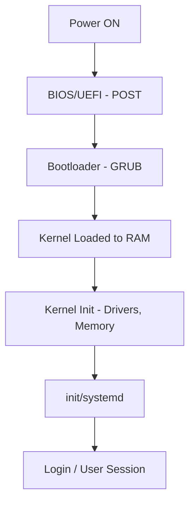
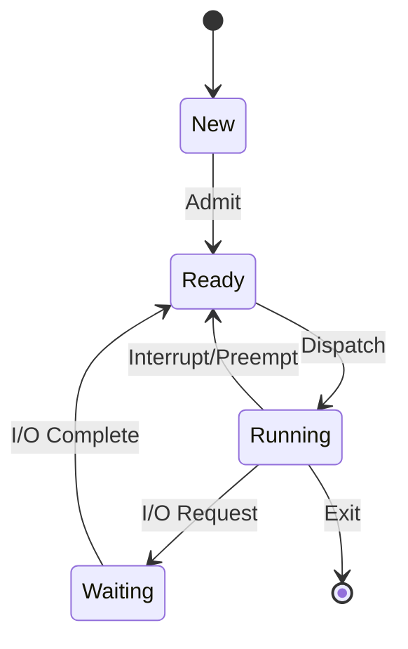
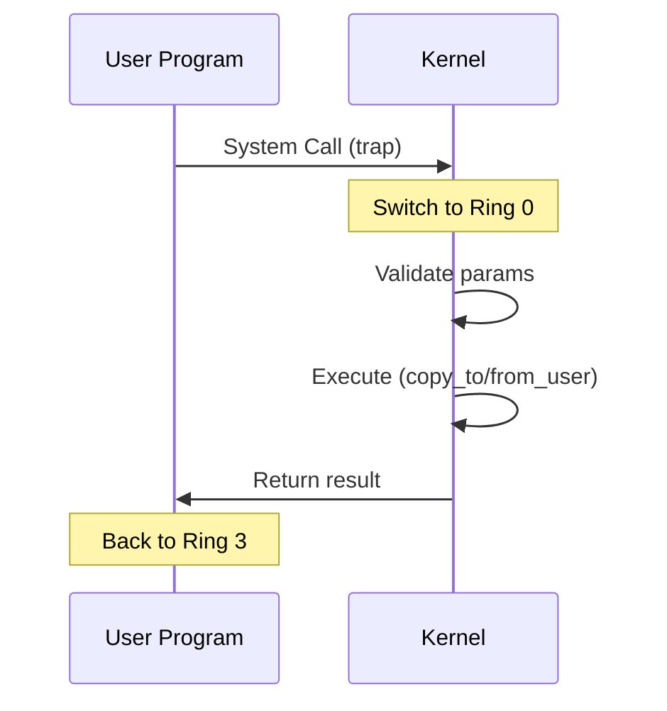

# Operating System — Complete Question Bank

*Generated from: os_ch1, OS_ch6, ch3-process, process synchronisation, Deadlock, system calls and programs, OS-lecture intro, CTS-EBOOK*

> **Solutions:** All answers with explanations and diagrams are in `OS_Question_Bank_Solutions.md`.

---

## Part A — Multiple Choice Questions (100 MCQs)

> Each MCQ may have 1 or more correct answers. No partial marking.

---

---

## Quick Reference Diagrams

### Boot Sequence (Mermaid)



### Process State Diagram (Mermaid)



### User–Kernel Interaction (System Call)



---

### Section 1: OS Introduction & Architecture (Q1–Q15)

**Q1.** Which of the following statements about operating systems are true?
- A. OS provides a layer of abstraction between application programs and hardware.
- B. OS allows batch processing and parallel processing.
- C. Programs directly access hardware without OS mediation.
- D. OS enforces permissions and protection against malicious software.

**Answer: A, B, D**

| Option | Verdict | Explanation |
|--------|---------|-------------|
| A | ✓ | OS provides abstraction: programs use APIs/system calls instead of direct hardware access. |
| B | ✓ | OS enables batch processing (group jobs) and parallel processing (multiprogramming). |
| C | ✗ | Programs do NOT directly access hardware; they go through the OS. |
| D | ✓ | OS enforces permissions, memory protection, and security policies. |

---

---

**Q2.** Which of the following are stored in ROM/firmware?
- A. Bootstrap program (BIOS/UEFI)
- B. Linux kernel
- C. POST routine
- D. Application programs

**Answer: A, C**

| Option | Verdict | Explanation |
|--------|---------|-------------|
| A | ✓ | Bootstrap (BIOS/UEFI) is stored in ROM/EEPROM on the motherboard. |
| B | ✗ | Linux kernel is loaded from disk into RAM by the bootloader. |
| C | ✓ | POST (Power-On Self Test) is part of BIOS/UEFI firmware. |
| D | ✗ | Application programs are on disk, loaded when executed. |

---

---

**Q3.** An interrupt is a signal that:
- A. Is sent by hardware or software to the CPU at the occurrence of an event.
- B. Causes the CPU to halt current execution and transfer to the ISR.
- C. Is managed by the OS kernel.
- D. Allows direct user-to-user communication.

**Answer: A, B, C**

| Option | Verdict | Explanation |
|--------|---------|-------------|
| A | ✓ | Interrupt = signal from hardware (e.g. I/O complete) or software (e.g. system call). |
| B | ✓ | CPU saves context, jumps to ISR (Interrupt Service Routine), returns after handling. |
| C | ✓ | OS kernel manages interrupt vectors and ISRs. |
| D | ✗ | Interrupts are not for user-to-user communication; that is IPC. |

---

---

**Q4.** Regarding monolithic vs microkernel architectures:
- A. Microkernels provide better fault isolation than monolithic kernels.
- B. Monolithic kernels run most services in kernel space.
- C. Microkernel services communicate via message passing.
- D. Monolithic kernels are typically slower due to context switches.

**Answer: A, B, C**

| Option | Verdict | Explanation |
|--------|---------|-------------|
| A | ✓ | Microkernel: most services in user space; failure isolated. Monolithic: all in kernel. |
| B | ✓ | Monolithic: drivers, FS, memory mgmt all in kernel space. |
| C | ✓ | Microkernel services (e.g. file server) run as processes; communication via IPC. |
| D | ✗ | Monolithic is typically **faster** (fewer context switches); microkernel has more overhead. |

---

---

**Q5.** Kernel space in Linux:
- A. Runs in Ring 0 with full hardware access.
- B. Contains device drivers and memory manager.
- C. A crash here causes kernel panic / system crash.
- D. Cannot access physical memory directly.

**Answer: A, B, C**

| Option | Verdict | Explanation |
|--------|---------|-------------|
| A | ✓ | Ring 0 = highest privileges; full hardware access. |
| B | ✓ | Kernel space contains drivers, memory manager, scheduler. |
| C | ✓ | Kernel panic = unrecoverable kernel error → system halt. |
| D | ✗ | Kernel space CAN access physical memory; user space cannot. |

---

---

**Q6.** User space in Linux:
- A. Runs in Ring 3 with restricted privileges.
- B. Can directly access hardware registers.
- C. A crash here typically affects only that process.
- D. Contains applications and system daemons.

**Answer: A, C, D**

| Option | Verdict | Explanation |
|--------|---------|-------------|
| A | ✓ | Ring 3 = least privileged; restricted access. |
| B | ✗ | User space cannot directly access hardware; must use system calls. |
| C | ✓ | Process crash does not bring down the whole system. |
| D | ✓ | Applications, shells, daemons run in user space. |

---

---

**Q7.** Which of the following are true about BIOS vs UEFI?
- A. BIOS runs in 16-bit real mode; UEFI in 32/64-bit.
- B. UEFI supports Secure Boot; BIOS cannot verify bootloaders.
- C. BIOS uses MBR; UEFI uses EFI System Partition (ESP).
- D. UEFI does not support disks larger than 2 TB.

**Answer: A, B, C**

| Option | Verdict | Explanation |
|--------|---------|-------------|
| A | ✓ | BIOS: 16-bit real mode; UEFI: 32/64-bit. |
| B | ✓ | UEFI Secure Boot verifies bootloader signatures; BIOS cannot. |
| C | ✓ | BIOS: MBR; UEFI: EFI System Partition (ESP). |
| D | ✗ | UEFI **supports** large disks (GPT); BIOS/MBR limited to 2 TB. |

---

---

**Q8.** During system boot, which of the following run before the OS kernel?
- A. Bootstrap (BIOS/UEFI)
- B. POST
- C. Bootloader (e.g. GRUB)
- D. systemd / init

**Answer: A, B, C**

| Option | Verdict | Explanation |
|--------|---------|-------------|
| A | ✓ | Bootstrap runs first when power is on. |
| B | ✓ | POST runs as part of BIOS/UEFI. |
| C | ✓ | Bootloader (GRUB, etc.) runs after POST, loads kernel. |
| D | ✗ | systemd/init is started **by** the kernel after it loads. |

**Boot Sequence Diagram:**

```
Power ON → BIOS/UEFI (POST) → Bootloader (GRUB) → Kernel loads → init/systemd → User login
```

---

---

**Q9.** The init process (or systemd):
- A. Is the first user-space process started by the kernel.
- B. Loads device drivers and daemons.
- C. Runs in kernel space.
- D. Manages networking and power management.

**Answer: A, B, D**

| Option | Verdict | Explanation |
|--------|---------|-------------|
| A | ✓ | First user-space process (PID 1). |
| B | ✓ | Starts drivers, daemons (sshd, cron, etc.). |
| C | ✗ | init/systemd runs in **user** space. |
| D | ✓ | Manages services: networking, power, logging. |

---

---

**Q10.** Virtualization:
- A. Creates virtual versions of hardware or computing environments.
- B. Type-1 hypervisors run directly on hardware (e.g. KVM, Hyper-V).
- C. Type-2 hypervisors run on top of a host OS (e.g. VirtualBox).
- D. Guest OS always runs in Ring 0 on the host.

**Answer: A, B, C**

| Option | Verdict | Explanation |
|--------|---------|-------------|
| A | ✓ | Virtualization creates virtual hardware/VM for each guest OS. |
| B | ✓ | Type-1: KVM, Hyper-V run on bare metal. |
| C | ✓ | Type-2: VirtualBox, VMware Workstation run on host OS. |
| D | ✗ | Guest OS runs in non-root/guest mode; host/hypervisor controls Ring 0. |

---

---

**Q11.** Hardware-assisted virtualization (Intel VT-x / AMD-V):
- A. Allows the hypervisor to run in a "root" mode.
- B. Guest OS runs in "non-root" mode, which looks like Ring 0 to the guest.
- C. Privileged instructions are trapped and passed to the hypervisor.
- D. Eliminates the need for binary translation entirely.

**Answer: A, B, C, D**

| Option | Verdict | Explanation |
|--------|---------|-------------|
| A | ✓ | Hypervisor runs in VMX root (like Ring -1). |
| B | ✓ | Guest thinks it is in Ring 0; CPU traps privileged instructions. |
| C | ✓ | Privileged ops go to hypervisor for emulation. |
| D | ✓ | With VT-x/AMD-V, binary translation is no longer needed. |

---

---

**Q12.** OS services typically include:
- A. Program execution and I/O operations
- B. File system manipulation and process management
- C. Memory management and security
- D. Direct hardware access for user programs

**Answer: A, B, C**

| Option | Verdict | Explanation |
|--------|---------|-------------|
| A | ✓ | Program execution, I/O operations are core OS services. |
| B | ✓ | File system, process management, memory management. |
| C | ✓ | Security, protection, resource allocation. |
| D | ✗ | User programs do NOT get direct hardware access; OS mediates. |

---

---

**Q13.** Daemons in Linux:
- A. Run in the background without user interaction.
- B. Examples include sshd, cron, udevd.
- C. Are the same as system calls.
- D. Are managed by systemd or init.

**Answer: A, B, D**

| Option | Verdict | Explanation |
|--------|---------|-------------|
| A | ✓ | Daemons run in background (sshd, cron, udevd). |
| B | ✓ | Examples: sshd (SSH), cron (scheduling), udevd (devices). |
| C | ✗ | Daemons are processes; system calls are kernel interfaces. |
| D | ✓ | systemd or init starts and manages daemons. |

---

---

**Q14.** Evolution of OS includes:
- A. Batch processing, Multiprogramming, Time-sharing
- B. Personal computing, Distributed systems
- C. Single monolithic design from the start
- D. Concurrent programming concepts

**Answer: A, B, D**

| Option | Verdict | Explanation |
|--------|---------|-------------|
| A | ✓ | Batch → Multiprogramming → Time-sharing. |
| B | ✓ | Personal computing, distributed systems. |
| C | ✗ | Evolution was incremental, not a single monolithic start. |
| D | ✓ | Concurrent programming emerged (e.g. RC 4000, Venus). |

---

---

**Q15.** Multiprogramming:
- A. Keeps multiple jobs in memory simultaneously.
- B. Reduces CPU idle time when one job waits for I/O.
- C. Requires only one job in memory at a time.
- D. Increases throughput.

---

**Answer: A, B, D**

| Option | Verdict | Explanation |
|--------|---------|-------------|
| A | ✓ | Multiple jobs in memory at once. |
| B | ✓ | When one waits for I/O, CPU switches to another. |
| C | ✗ | Multiprogramming requires **multiple** jobs in memory. |
| D | ✓ | More overlap of CPU and I/O → higher throughput. |

---

---

### Section 2: System Calls & Kernel (Q16–Q30)

**Q16.** A system call:
- A. Is triggered by software to request OS operations.
- B. Is a special kind of interrupt.
- C. Creates direct communication between user programs.
- D. Allows user programs to request kernel services.

**Answer: A, B, D**

| Option | Verdict | Explanation |
|--------|---------|-------------|
| A | ✓ | System call = software-initiated request for kernel service. |
| B | ✓ | Implemented as a software interrupt/trap. |
| C | ✗ | System calls are user↔kernel; user↔user is IPC. |
| D | ✓ | Kernel services: file I/O, process creation, etc. |

---

---

**Q17.** Parameters for system calls can be passed by:
- A. Storing in CPU registers
- B. Storing in a table in memory, address in a register
- C. Pushing onto the stack
- D. Direct hardware access

**Answer: A, B, C**

| Option | Verdict | Explanation |
|--------|---------|-------------|
| A | ✓ | Parameters in registers (x86: eax for syscall number, etc.). |
| B | ✓ | Block in memory; address in register. |
| C | ✓ | Push on stack; kernel pops. |
| D | ✗ | Parameters are not passed by “direct hardware access.” |

---

---

**Q18.** Types of system calls include:
- A. Process control (fork, exec, exit)
- B. File management (open, read, write)
- C. Device management
- D. Inter-process communication only (no file/process)

**Answer: A, B, C**

| Option | Verdict | Explanation |
|--------|---------|-------------|
| A | ✓ | fork, exec, exit, wait. |
| B | ✓ | open, read, write, close. |
| C | ✓ | request/release device, read/write. |
| D | ✗ | System calls cover process, file, device, not just IPC. |

---

---

**Q19.** The `write()` system call is used to:
- A. Output data to a file descriptor (e.g. stdout).
- B. Request kernel to perform I/O on behalf of the process.
- C. Communicate directly between two user processes.
- D. Allocate memory.

**Answer: A, B**

| Option | Verdict | Explanation |
|--------|---------|-------------|
| A | ✓ | write(fd, buf, count) outputs to fd (e.g. 1 = stdout). |
| B | ✓ | Kernel performs the actual I/O. |
| C | ✗ | write() is user→kernel→device, not user↔user. |
| D | ✗ | Memory allocation uses brk/mmap, not write. |

---

---

**Q20.** `printf()` in C:
- A. Is a high-level abstraction that invokes system calls.
- B. Directly uses the `write()` system call (via glibc).
- C. Does not involve the kernel.
- D. Can be traced using tools like `strace`.

**Answer: A, B, D**

| Option | Verdict | Explanation |
|--------|---------|-------------|
| A | ✓ | printf is a libc wrapper. |
| B | ✓ | printf buffers and calls write() for output. |
| C | ✗ | printf does involve kernel via write(). |
| D | ✓ | strace shows system calls (e.g. write) used by the program. |

---

---

**Q21.** Linux Kernel Modules (LKM):
- A. Execute with kernel privileges.
- B. Can be loaded/unloaded dynamically (insmod, rmmod).
- C. Are used for device drivers and filesystems.
- D. Require a full kernel recompile to add.

**Answer: A, B, C**

| Option | Verdict | Explanation |
|--------|---------|-------------|
| A | ✓ | LKMs run in kernel space with full privileges. |
| B | ✓ | insmod/rmmod load/unload without reboot. |
| C | ✓ | Drivers, filesystems (ext4, ntfs). |
| D | ✗ | LKMs avoid full recompile; that’s their advantage. |

---

---

**Q22.** Modular OS design (e.g. Linux with LKMs):
- A. Uses a core kernel with loadable modules.
- B. Is more flexible than a purely monolithic design.
- C. All modules must be compiled into the kernel.
- D. Uses insmod, modprobe, rmmod.

**Answer: A, B, D**

| Option | Verdict | Explanation |
|--------|---------|-------------|
| A | ✓ | Core kernel + loadable modules. |
| B | ✓ | Modules add features without rebuilding kernel. |
| C | ✗ | Modules are **loadable**, not mandatory in build. |
| D | ✓ | insmod, modprobe (load), rmmod (unload). |

---

---

**Q23.** System programs:
- A. Provide a convenient environment for program development.
- B. Include file manipulation, status information, compilers.
- C. Define most users' view of the OS.
- D. Are the same as the kernel.

**Answer: A, B, C**

| Option | Verdict | Explanation |
|--------|---------|-------------|
| A | ✓ | Compilers, shells, utilities. |
| B | ✓ | File utils, status tools, compilers. |
| C | ✓ | Users mostly interact with system programs, not raw system calls. |
| D | ✗ | System programs are user-space; kernel is separate. |

---

---

**Q24.** Mechanisms vs Policies:
- A. Mechanism = how to do something; Policy = what to do.
- B. Separating them allows flexibility when policies change.
- C. They are always tightly coupled in OS design.
- D. Policy is implemented in hardware.

**Answer: A, B**

| Option | Verdict | Explanation |
|--------|---------|-------------|
| A | ✓ | Mechanism = *how*; policy = *what* to do. |
| B | ✓ | Decoupling allows policy changes without rewriting mechanism. |
| C | ✗ | Good design separates them. |
| D | ✗ | Policy is software, not hardware. |

---

---

**Q25.** The bootstrap program:
- A. Runs when the computer receives power.
- B. Loads the bootloader, which loads the kernel.
- C. Is stored in RAM.
- D. Performs POST.

**Answer: A, B, D**

| Option | Verdict | Explanation |
|--------|---------|-------------|
| A | ✓ | Runs at power-on. |
| B | ✓ | Loads bootloader → bootloader loads kernel. |
| C | ✗ | Bootstrap is in ROM, not RAM. |
| D | ✓ | POST is part of BIOS, executed by bootstrap. |

---

---

**Q26.** Separation of kernel space and user space ensures:
- A. User programs cannot directly access hardware.
- B. A bug in user code does not crash the entire system.
- C. All code runs with the same privileges.
- D. The kernel mediates all hardware access.

**Answer: A, B, D**

| Option | Verdict | Explanation |
|--------|---------|-------------|
| A | ✓ | User space has no direct hardware access. |
| B | ✓ | User bug → process crash, not system crash. |
| C | ✗ | Kernel has higher privileges than user. |
| D | ✓ | All hardware access goes through kernel. |

---

---

**Q27.** Hybrid kernels (e.g. Windows, macOS):
- A. Combine aspects of monolithic and microkernel designs.
- B. Run some services in kernel space, others in user space.
- C. Are purely microkernel.
- D. Have no modular structure.

**Answer: A, B**

| Option | Verdict | Explanation |
|--------|---------|-------------|
| A | ✓ | Hybrid = mix of monolithic and microkernel. |
| B | ✓ | Some services in kernel, some in user space. |
| C | ✗ | Hybrid is not purely microkernel. |
| D | ✗ | They have modular structure. |

---

---

**Q28.** Layered OS structure:
- A. Divides the OS into layers; each layer uses only the layer below.
- B. Makes debugging and design easier.
- C. Is used in THE OS (Dijkstra), MULTICS.
- D. Has no clear separation between layers.

**Answer: A, B, C**

| Option | Verdict | Explanation |
|--------|---------|-------------|
| A | ✓ | Each layer uses only the layer below. |
| B | ✓ | Easier to debug and reason about. |
| C | ✓ | THE OS (Dijkstra), MULTICS. |
| D | ✗ | Layering gives clear separation. |

---

---

**Q29.** Virtual machine concept:
- A. Provides an interface identical to the underlying hardware.
- B. Allows multiple OSes to run on the same physical machine.
- C. Permits direct sharing of resources between VMs without isolation.
- D. Is used in OS research and development.

**Answer: A, B, D**

| Option | Verdict | Explanation |
|--------|---------|-------------|
| A | ✓ | VM presents interface like bare hardware. |
| B | ✓ | Multiple OSes on one machine. |
| C | ✗ | VMs are isolated; no direct sharing without hypervisor. |
| D | ✓ | Safe for OS experiments. |

---

---

**Q30.** SYSGEN (System Generation):
- A. Configures the OS for a specific hardware site.
- B. Obtains hardware configuration information.
- C. Booting loads the kernel into memory.
- D. Is performed by the application programmer.

---

**Answer: A, B, C**

| Option | Verdict | Explanation |
|--------|---------|-------------|
| A | ✓ | Configures OS for a specific machine. |
| B | ✓ | Gets hardware config. |
| C | ✓ | Booting loads the kernel. |
| D | ✗ | SYSGEN is done by sysadmin/installer. |

---

---

### Section 3: Processes (Q31–Q45)

**Q31.** A process is:
- A. A program in execution.
- B. A passive entity stored on disk.
- C. Has multiple parts: text, data, heap, stack, registers.
- D. The same as a program.

**Answer: A,C**

| Option | Verdict | Explanation |
|:-------|:--------|:------------|
| Summary | ✓ | Process = program in execution (active); has text, data, heap, stack, registers. Program is passive (on disk). |

---

**Q32.** Process states include:
- A. new, running, waiting, ready, terminated
- B. init, zombie, kernel
- C. blocked, suspended (in some OSs)
- D. None of these

**Answer: A,C**

| Option | Verdict | Explanation |
|:-------|:--------|:------------|
| Summary | ✓ | States: new, running, waiting, ready, terminated. Some OSs add blocked, suspended. |

---

**Q33.** The Process Control Block (PCB) stores:
- A. Process state and program counter
- B. CPU registers and scheduling information
- C. Memory management information and I/O status
- D. Memory addresses of other processes

**Answer: A,B,C**

| Option | Verdict | Explanation |
|:-------|:--------|:------------|
| Summary | ✓ | PCB: state, PC, registers, scheduling info, memory info, I/O status. Not other processes' data. |

---

**Q34.** In Linux, the PCB is represented by:
- A. `task_struct`
- B. Contains pid, state, parent, children, files, mm
- C. One per thread, not per process
- D. Stored in user space

**Answer: A,B**

| Option | Verdict | Explanation |
|:-------|:--------|:------------|
| Summary | ✓ | Linux uses `task_struct`; has pid, state, parent, children, files, mm. |

---

**Q35.** Scheduling queues include:
- A. Job queue (all processes in the system)
- B. Ready queue (processes in memory, ready to run)
- C. Device queues (processes waiting for I/O)
- D. Only one queue for all processes

**Answer: A,B,C**

| Option | Verdict | Explanation |
|:-------|:--------|:------------|
| Summary | ✓ | Job queue (all), ready queue (in memory, ready), device queues (waiting for I/O). |

---

**Q36.** Short-term scheduler (CPU scheduler):
- A. Selects which process runs next on the CPU.
- B. Is invoked frequently (milliseconds).
- C. Must be very fast.
- D. Controls the degree of multiprogramming.

**Answer: A,B,C**

| Option | Verdict | Explanation |
|:-------|:--------|:------------|
| Summary | ✓ | Short-term: picks next process, runs often, must be fast. Long-term controls multiprogramming. |

---

**Q37.** Long-term scheduler (job scheduler):
- A. Selects which processes to bring into the ready queue.
- B. Is invoked infrequently.
- C. Strives for a good mix of I/O-bound and CPU-bound processes.
- D. Allocates the CPU to a process.

**Answer: A,B,C**

| Option | Verdict | Explanation |
|:-------|:--------|:------------|
| Summary | ✓ | Long-term: admits jobs to ready queue, runs rarely, aims for I/O–CPU mix. |

---

**Q38.** Medium-term scheduler (swapper):
- A. Can suspend processes and swap them out to disk.
- B. Reduces degree of multiprogramming when needed.
- C. Performs context switching.
- D. Only manages the ready queue.

**Answer: A,B**

| Option | Verdict | Explanation |
|:-------|:--------|:------------|
| Summary | ✓ | Medium-term: swap out/in processes to control memory load. |

---

**Q39.** Context switch:
- A. Saves the state of the current process and loads another.
- B. Involves PCB save/load.
- C. Is overhead; no useful work during the switch.
- D. Is the same as a mode switch (user↔kernel).

**Answer: A,B,C**

| Option | Verdict | Explanation |
|:-------|:--------|:------------|
| Summary | ✓ | Context switch = save current PCB, load next. Overhead. Different from mode switch. |

---

**Q40.** Context switch is triggered when:
- A. Time quantum expires (Round Robin)
- B. Process enters I/O wait
- C. Higher-priority process arrives
- D. Process terminates

**Answer: A,B,C,D**

| Option | Verdict | Explanation |
|:-------|:--------|:------------|
| Summary | ✓ | Triggered by: quantum expiry, I/O wait, higher-priority arrival, interrupt, termination. |

---

**Q41.** `fork()` in Unix/Linux:
- A. Creates a new child process.
- B. Returns 0 in the child, child's PID in the parent.
- C. Child gets a copy of parent's address space.
- D. Child and parent share the same PID.

**Answer: A,B,C**

| Option | Verdict | Explanation |
|:-------|:--------|:------------|
| Summary | ✓ | fork() creates child; returns 0 in child, PID in parent; child gets copy of address space. |

---

**Q42.** `exec()` system call:
- A. Replaces the process's memory space with a new program.
- B. Creates a new process.
- C. Is often used after `fork()` to run a different program.
- D. Returns to the caller after loading the new program.

**Answer: A,C**

| Option | Verdict | Explanation |
|:-------|:--------|:------------|
| Summary | ✓ | exec() replaces memory with new program; used after fork(); does not return on success. |

---

**Q43.** Zombie process:
- A. Has terminated but parent has not called `wait()`.
- B. Retains an entry in the process table.
- C. Can be scheduled for execution.
- D. Consumes no CPU but holds the PCB slot.

**Answer: A,B,D**

| Option | Verdict | Explanation |
|:-------|:--------|:------------|
| Summary | ✓ | Zombie: exited, parent has not waited; keeps PCB slot; cannot be scheduled. |

---

**Q44.** Orphan process:
- A. Parent has terminated without waiting for the child.
- B. May be adopted by init (PID 1).
- C. Is the same as a zombie.
- D. Cannot exist in Linux.

**Answer: A,B**

| Option | Verdict | Explanation |
|:-------|:--------|:------------|
| Summary | ✓ | Orphan: parent died without wait; often adopted by init. |

---

**Q45.** IPC (Interprocess Communication) models:
- A. Shared memory
- B. Message passing
- C. Direct system call invocation
- D. Only pipes

---

**Answer: A,B**

| Option | Verdict | Explanation |
|:-------|:--------|:------------|
| Summary | ✓ | IPC: shared memory and message passing. |

---

### Section 4: CPU Scheduling (Q46–Q60)

**Q46.** CPU scheduling decisions occur when a process:
- A. Switches from running to waiting
- B. Switches from running to ready
- C. Switches from waiting to ready
- D. Terminates

**Answer: A,B,C,D**

| Option | Verdict | Explanation |
|:-------|:--------|:------------|
| Summary | ✓ | Scheduling when: run→wait, run→ready, wait→ready, terminate. |

---

**Q47.** Nonpreemptive scheduling:
- A. Schedules only when process terminates or blocks (I/O).
- B. Process keeps CPU until it releases it.
- C. Allows preemption on interrupts.
- D. Is always used in real-time systems.

**Answer: A,B**

| Option | Verdict | Explanation |
|:-------|:--------|:------------|
| Summary | ✓ | Nonpreemptive: only on terminate or block; process keeps CPU until then. |

---

**Q48.** Scheduling criteria include:
- A. CPU utilization, throughput
- B. Turnaround time, waiting time
- C. Response time
- D. Number of system calls

**Answer: A,B,C**

| Option | Verdict | Explanation |
|:-------|:--------|:------------|
| Summary | ✓ | CPU utilization, throughput, turnaround, waiting, response time. |

---

**Q49.** FCFS scheduling:
- A. Serves processes in order of arrival.
- B. Can cause convoy effect (short process behind long).
- C. Is preemptive.
- D. Minimizes average waiting time.

**Answer: A,B**

| Option | Verdict | Explanation |
|:-------|:--------|:------------|
| Summary | ✓ | FCFS = arrival order; convoy effect when short follows long. |

---

**Q50.** SJF (Shortest Job First):
- A. Schedules the process with shortest next CPU burst.
- B. Can be nonpreemptive or preemptive (SRTF).
- C. Is optimal for minimum average waiting time (when known).
- D. Eliminates starvation entirely.

**Answer: A,B,C**

| Option | Verdict | Explanation |
|:-------|:--------|:------------|
| Summary | ✓ | SJF: shortest burst first; preemptive (SRTF) or not; optimal for avg waiting time. |

---

**Q51.** Priority scheduling:
- A. Allocates CPU to highest-priority process.
- B. May cause starvation of low-priority processes.
- C. Aging increases priority of long-waiting processes.
- D. SJF is a form of priority scheduling (priority = burst length).

**Answer: A,B,C,D**

| Option | Verdict | Explanation |
|:-------|:--------|:------------|
| Summary | ✓ | Priority scheduling; aging prevents starvation; SJF = priority by burst length. |

---

**Q52.** Round Robin:
- A. Each process gets a time quantum (e.g. 10–100 ms).
- B. Process is preempted and moved to end of ready queue after quantum.
- C. Large quantum → behaves like FCFS.
- D. q too small → high context-switch overhead.

**Answer: A,B,C,D**

| Option | Verdict | Explanation |
|:-------|:--------|:------------|
| Summary | ✓ | RR: time quantum; preempt and enqueue; large q→FCFS; small q→overhead. |

---

**Q53.** Dispatcher:
- A. Gives control of CPU to the process selected by the short-term scheduler.
- B. Performs context switch, mode switch, jump to user program.
- C. Dispatch latency = time to stop one process and start another.
- D. Runs in user space.

**Answer: A,B,C**

| Option | Verdict | Explanation |
|:-------|:--------|:------------|
| Summary | ✓ | Dispatcher: context switch, mode switch, jump; dispatch latency = switch time. |

---

**Q54.** CPU–I/O burst cycle:
- A. Process alternates between CPU bursts and I/O bursts.
- B. I/O-bound processes have many short CPU bursts.
- C. CPU-bound processes have few long CPU bursts.
- D. Last burst ends with termination, not I/O.

**Answer: A,B,C,D**

| Option | Verdict | Explanation |
|:-------|:--------|:------------|
| Summary | ✓ | CPU burst ↔ I/O burst; I/O-bound = many short bursts; CPU-bound = few long. |

---

**Q55.** Multilevel queue scheduling:
- A. Divides processes into multiple queues by type/priority.
- B. Each queue can use a different scheduling algorithm.
- C. Higher-priority queues are served first.
- D. Processes can freely move between queues.

**Answer: A,B,C**

| Option | Verdict | Explanation |
|:-------|:--------|:------------|
| Summary | ✓ | Multiple queues by type; different algorithms per queue; no free movement. |

---

**Q56.** Multilevel feedback queue:
- A. Allows processes to move between queues based on behavior.
- B. Adapts to I/O-bound vs CPU-bound behavior.
- C. Is simpler than multilevel queue.
- D. Is used in many modern OSs.

**Answer: A,B,D**

| Option | Verdict | Explanation |
|:-------|:--------|:------------|
| Summary | ✓ | MLFQ: processes move between queues; adapts to behavior. |

---

**Q57.** Turnaround time =
- A. Completion time − Arrival time
- B. Waiting time + Burst time
- C. Response time
- D. Time quantum

**Answer: A,B**

| Option | Verdict | Explanation |
|:-------|:--------|:------------|
| Summary | ✓ | Turnaround = Completion − Arrival; also = Waiting + Burst. |

---

**Q58.** Waiting time =
- A. Turnaround time − Burst time
- B. Time spent in ready queue
- C. Total time in the system
- D. Time in critical section

**Answer: A,B**

| Option | Verdict | Explanation |
|:-------|:--------|:------------|
| Summary | ✓ | Waiting = Turnaround − Burst; time in ready queue. |

---

**Q59.** Preemptive scheduling may be used when:
- A. A higher-priority process arrives
- B. Time quantum expires
- C. Process voluntarily blocks
- D. Process terminates

**Answer: A,B**

| Option | Verdict | Explanation |
|:-------|:--------|:------------|
| Summary | ✓ | Preemption on higher priority, quantum expiry. |

---

**Q60.** Average waiting time is calculated as:
- A. Sum of waiting times of all processes / number of processes
- B. Sum of burst times / number of processes
- C. Turnaround time − Burst time
- D. Response time of the first process

---

**Answer: A**

| Option | Verdict | Explanation |
|:-------|:--------|:------------|
| Summary | ✓ | Avg waiting = Σ(waiting time) / n. |

---

### Section 5: Process Synchronization (Q61–Q75)

**Q61.** Critical section is:
- A. The part of code that accesses shared data.
- B. Must ensure mutual exclusion.
- C. Can be entered by multiple processes simultaneously.
- D. Requires no synchronization.

**Answer: A,B**

| Option | Verdict | Explanation |
|:-------|:--------|:------------|
| Summary | ✓ | CS = code accessing shared data; must have mutual exclusion. |

---

**Q62.** A correct solution to the critical section problem must guarantee:
- A. Mutual exclusion
- B. Progress
- C. Bounded waiting
- D. No context switches

**Answer: A,B,C**

| Option | Verdict | Explanation |
|:-------|:--------|:------------|
| Summary | ✓ | Mutual exclusion, progress, bounded waiting. |

---

**Q63.** Disabling interrupts to implement critical section:
- A. Prevents context switching on a single CPU.
- B. Works on multi-processor systems.
- C. Is dangerous if CS is long (system unresponsive).
- D. Is a common approach in modern OSs.

**Answer: A,C**

| Option | Verdict | Explanation |
|:-------|:--------|:------------|
| Summary | ✓ | Disable interrupts on uniprocessor only; long CS = system unresponsive. |

---

**Q64.** Peterson's solution:
- A. Is a software-only solution for 2 processes.
- B. Uses shared variables: flag[2], turn.
- C. Guarantees mutual exclusion, progress, bounded waiting.
- D. Uses busy-waiting.

**Answer: A,B,C,D**

| Option | Verdict | Explanation |
|:-------|:--------|:------------|
| Summary | ✓ | Peterson's: 2 processes, flag[], turn; software only; busy-wait. |

---

**Q65.** Test-and-Set instruction:
- A. Is a hardware atomic operation.
- B. Is used to implement spinlocks.
- C. Avoids busy-waiting.
- D. Returns the old value and sets the lock.

**Answer: A,B,D**

| Option | Verdict | Explanation |
|:-------|:--------|:------------|
| Summary | ✓ | Test-and-Set: atomic read-and-set; spinlock; busy-wait. |

---

**Q66.** Semaphore:
- A. Is an integer variable accessed via wait() and signal().
- B. Binary semaphore has values 0 or 1.
- C. Counting semaphore can have values 0 to n.
- D. wait() increments; signal() decrements.

**Answer: A,B,C**

| Option | Verdict | Explanation |
|:-------|:--------|:------------|
| Summary | ✓ | Semaphore: integer; wait() decrements, signal() increments; binary 0/1, counting 0..n. |

---

**Q67.** wait(S) operation:
- A. Decrements S.
- B. Blocks the process if S < 0.
- C. Is atomic.
- D. Never blocks.

**Answer: A,B,C**

| Option | Verdict | Explanation |
|:-------|:--------|:------------|
| Summary | ✓ | wait(S): S--; if S<0 block. Atomic. |

---

**Q68.** signal(S) operation:
- A. Increments S.
- B. Wakes up a blocked process if S <= 0.
- C. Is atomic.
- D. Decrements S.

**Answer: A,B,C**

| Option | Verdict | Explanation |
|:-------|:--------|:------------|
| Summary | ✓ | signal(S): S++; if S≤0 wake one. Atomic. |

---

**Q69.** Producer-Consumer problem:
- A. Producer puts items in buffer; consumer takes them.
- B. Requires synchronization for buffer access.
- C. Can use semaphores (empty, full, mutex).
- D. Is also called bounded-buffer problem.

**Answer: A,B,C,D**

| Option | Verdict | Explanation |
|:-------|:--------|:------------|
| Summary | ✓ | Producer–consumer, bounded buffer, semaphores (empty, full, mutex). |

---

**Q70.** Race condition occurs when:
- A. Multiple processes access shared data concurrently.
- B. Result depends on order of execution.
- C. Mutual exclusion is properly enforced.
- D. Only one process is in the system.

**Answer: A,B**

| Option | Verdict | Explanation |
|:-------|:--------|:------------|
| Summary | ✓ | Race: concurrent access; result order-dependent. |

---

**Q71.** Mutex (binary semaphore = 1):
- A. Ensures mutual exclusion for critical section.
- B. wait(mutex) before CS, signal(mutex) after.
- C. Allows multiple processes in CS.
- D. Is a counting semaphore.

**Answer: A,B**

| Option | Verdict | Explanation |
|:-------|:--------|:------------|
| Summary | ✓ | Mutex = binary semaphore 1; wait before CS, signal after. |

---

**Q72.** Monitor:
- A. Ensures only one thread executes inside at a time.
- B. Uses condition variables.
- C. Is a high-level synchronization construct.
- D. Replaces the need for semaphores entirely in some languages.

**Answer: A,B,C**

| Option | Verdict | Explanation |
|:-------|:--------|:------------|
| Summary | ✓ | Monitor: one thread inside; condition variables; higher-level than semaphores. |

---

**Q73.** Compare-and-Swap (CAS):
- A. Atomically compares and updates a value.
- B. Is used for lock-free data structures.
- C. Is a software-only solution.
- D. Cannot be used for synchronization.

**Answer: A,B**

| Option | Verdict | Explanation |
|:-------|:--------|:------------|
| Summary | ✓ | CAS: atomic compare-and-update; used for lock-free structures. |

---

**Q74.** Busy-waiting (spinlock):
- A. Wastes CPU while waiting.
- B. Is acceptable when CS is very short.
- C. Is preferred for long waits.
- D. Is used in test-and-set locks.

**Answer: A,B,D**

| Option | Verdict | Explanation |
|:-------|:--------|:------------|
| Summary | ✓ | Spinlock wastes CPU; OK for very short CS. |

---

**Q75.** Lock variable (while(lock); lock=1; ... lock=0;):
- A. Is NOT safe—two processes can enter CS.
- B. Because lock=1 is not atomic.
- C. Correctly solves the critical section problem.
- D. Is used in production kernels.

---

**Answer: A,B**

| Option | Verdict | Explanation |
|:-------|:--------|:------------|
| Summary | ✓ | Simple lock (while(lock); lock=1) unsafe: test-and-set not atomic. |

---

### Section 6: Deadlock (Q76–Q90)

**Q76.** Deadlock occurs when:
- A. Each process in a set is waiting for a resource held by another in the set.
- B. No process can run, release resources, or be awakened.
- C. Only one process is in the system.
- D. Resources are preemptable.

**Answer: A,B**

| Option | Verdict | Explanation |
|:-------|:--------|:------------|
| Summary | ✓ | Deadlock: each waits for resource held by another; none can proceed. |

---

**Q77.** Four conditions for deadlock (all must hold):
- A. Mutual exclusion
- B. Hold and wait
- C. No preemption
- D. Circular wait

**Answer: A,B,C,D**

| Option | Verdict | Explanation |
|:-------|:--------|:------------|
| Summary | ✓ | All four: mutual exclusion, hold and wait, no preemption, circular wait. |

---

**Q78.** Resource allocation graph:
- A. Has processes and resources as vertices.
- B. Request edge: Pi → Rj
- C. Assignment edge: Rj → Pi
- D. Cycle implies deadlock (always, for single-instance resources).

**Answer: A,B,C**

| Option | Verdict | Explanation |
|:-------|:--------|:------------|
| Summary | ✓ | RAG: request edge P→R, assignment R→P. Cycle + single instance ⇒ deadlock. |

---

**Q79.** If resource allocation graph has no cycle:
- A. No deadlock
- B. Deadlock possible
- C. System is safe
- D. One process is deadlocked

**Answer: A**

| Option | Verdict | Explanation |
|:-------|:--------|:------------|
| Summary | ✓ | No cycle ⇒ no deadlock. |

---

**Q80.** Ostrich algorithm:
- A. Ignores the deadlock problem.
- B. Is used by UNIX and Windows for many resources.
- C. Is reasonable if deadlocks are rare and prevention cost is high.
- D. Guarantees no deadlock.

**Answer: A,B,C**

| Option | Verdict | Explanation |
|:-------|:--------|:------------|
| Summary | ✓ | Ostrich: ignore; used in UNIX/Windows when deadlock rare. |

---

**Q81.** Deadlock recovery options:
- A. Resource preemption
- B. Process rollback (checkpoint/restore)
- C. Killing one or more deadlocked processes
- D. Ignoring (no recovery)

**Answer: A,B,C**

| Option | Verdict | Explanation |
|:-------|:--------|:------------|
| Summary | ✓ | Recovery: preemption, rollback, kill processes. |

---

**Q82.** Deadlock prevention by attacking "hold and wait":
- A. Require processes to request all resources at start.
- B. Or: release all before requesting new ones.
- C. May cause low resource utilization.
- D. Eliminates circular wait.

**Answer: A,B,C**

| Option | Verdict | Explanation |
|:-------|:--------|:------------|
| Summary | ✓ | Prevent hold-wait: request all at start or release all before new request. |

---

**Q83.** Deadlock prevention by attacking "circular wait":
- A. Assign total order to resources.
- B. Require processes to request in increasing order.
- C. Prevents cycles in resource graph.
- D. Attacks hold and wait.

**Answer: A,B,C**

| Option | Verdict | Explanation |
|:-------|:--------|:------------|
| Summary | ✓ | Prevent circular wait: total order on resources; request in order. |

---

**Q84.** Deadlock prevention by attacking "mutual exclusion":
- A. Spooling (e.g. printer) so only one process uses the resource.
- B. Not all resources can be spooled.
- C. Eliminates circular wait.
- D. Is always possible.

**Answer: A,B**

| Option | Verdict | Explanation |
|:-------|:--------|:------------|
| Summary | ✓ | Prevent mutual exclusion: spool (e.g. printer); not always possible. |

---

**Q85.** Banker's algorithm:
- A. Is a deadlock avoidance algorithm.
- B. Requires processes to declare max resource need a priori.
- C. Allocates only if system remains in safe state.
- D. Detects deadlock after it occurs.

**Answer: A,B,C**

| Option | Verdict | Explanation |
|:-------|:--------|:------------|
| Summary | ✓ | Banker's: avoidance; need max a priori; grant only if safe. |

---

**Q86.** Safe state:
- A. There exists a safe sequence where all processes can complete.
- B. Unsafe state may lead to deadlock.
- C. Unsafe = deadlock.
- D. Banker's algorithm ensures system never enters unsafe state.

**Answer: A,B,D**

| Option | Verdict | Explanation |
|:-------|:--------|:------------|
| Summary | ✓ | Safe = exists safe sequence; unsafe ⇒ may deadlock. |

---

**Q87.** Data structures in Banker's algorithm:
- A. Available, Max, Allocation, Need
- B. Need = Max − Allocation
- C. Work, Finish (in safety algorithm)
- D. Only Available and Allocation

**Answer: A,B,C**

| Option | Verdict | Explanation |
|:-------|:--------|:------------|
| Summary | ✓ | Available, Max, Allocation, Need (=Max−Allocation). |

---

**Q88.** Two-phase locking (databases):
- A. Phase 1: acquire all locks (no real work).
- B. Phase 2: do updates, release locks.
- C. Eliminates hold-and-wait.
- D. Can cause deadlock.

**Answer: A,B,C**

| Option | Verdict | Explanation |
|:-------|:--------|:------------|
| Summary | ✓ | Two-phase locking: acquire all, then do work; avoids hold-wait. |

---

**Q89.** Non-resource deadlock:
- A. Can occur with semaphores (wrong order of wait).
- B. Two processes waiting for each other to do a task.
- C. Does not involve resources.
- D. Cannot occur in practice.

**Answer: A,B**

| Option | Verdict | Explanation |
|:-------|:--------|:------------|
| Summary | ✓ | Non-resource deadlock: e.g. semaphore order; both wait for each other. |

---

**Q90.** Starvation:
- A. Process waits indefinitely (e.g. for resource or CPU).
- B. Can be addressed by FCFS or aging.
- C. Is the same as deadlock.
- D. Cannot occur with proper scheduling.

---

**Answer: A,B**

| Option | Verdict | Explanation |
|:-------|:--------|:------------|
| Summary | ✓ | Starvation = indefinite wait; FCFS/aging help. |

---

### Section 7: DOS, Commands & Misc (Q91–Q100)

**Q91.** DOS (Disk Operating System):
- A. Is single-user, command-line based.
- B. Manages files, memory, I/O.
- C. Supports multitasking like Windows.
- D. Uses COMMAND.COM for internal commands.

**Answer: A,B,D**

| Option | Verdict | Explanation |
|:-------|:--------|:------------|
| Summary | ✓ | DOS: single-user, CLI; COMMAND.COM for internals. |

---

**Q92.** Internal vs External DOS commands:
- A. Internal: built into COMMAND.COM, no separate file.
- B. External: separate .EXE/.COM files on disk.
- C. Both require loading from disk each time.
- D. DIR is an external command.

**Answer: A,B,D**

| Option | Verdict | Explanation |
|:-------|:--------|:------------|
| Summary | ✓ | Internal: in COMMAND.COM. External: .EXE/.COM. DIR is internal. |

---

**Q93.** DOS file naming rules (8.3):
- A. 1–8 characters for name, 1–3 for extension.
- B. Characters + = / [ ] : ; ? * < > not permitted.
- C. Same as modern Windows long filenames.
- D. Wildcards: * (any sequence), ? (single char).

**Answer: A,B,D**

| Option | Verdict | Explanation |
|:-------|:--------|:------------|
| Summary | ✓ | 8.3 naming; certain chars disallowed; * and ? wildcards. |

---

**Q94.** System design goals:
- A. User goals: convenient, easy to learn, reliable, safe, fast.
- B. System goals: easy to design, maintain, flexible, efficient.
- C. Only performance matters.
- D. Security is irrelevant.

**Answer: A,B**

| Option | Verdict | Explanation |
|:-------|:--------|:------------|
| Summary | ✓ | User: convenient, reliable; system: maintainable, flexible. |

---

**Q95.** OS written in high-level language (e.g. C):
- A. Easier to port to new hardware.
- B. Easier to understand and debug.
- C. Must be written in assembly for performance.
- D. Cannot manage hardware.

**Answer: A,B**

| Option | Verdict | Explanation |
|:-------|:--------|:------------|
| Summary | ✓ | High-level language: portable, debuggable. |

---

**Q96.** Preemptable vs nonpreemptable resources:
- A. Preemptable: can be taken away (e.g. CPU, memory).
- B. Nonpreemptable: taking away causes failure (e.g. printer mid-job).
- C. All resources are preemptable.
- D. Semaphores are always preemptable.

**Answer: A,B**

| Option | Verdict | Explanation |
|:-------|:--------|:------------|
| Summary | ✓ | Preemptable (CPU, memory) vs nonpreemptable (printer mid-job). |

---

**Q97.** Cooperating processes:
- A. Can affect or be affected by other processes.
- B. Need IPC for communication.
- C. Reasons: information sharing, computation speedup, modularity.
- D. Never share data.

**Answer: A,B,C**

| Option | Verdict | Explanation |
|:-------|:--------|:------------|
| Summary | ✓ | Cooperating: affect each other; IPC; sharing, speedup, modularity. |

---

**Q98.** Direct vs indirect IPC (message passing):
- A. Direct: send(P, msg), receive(Q, msg)
- B. Indirect: mailbox/port—send(mailbox, msg)
- C. Shared memory is a form of message passing.
- D. Pipes are only indirect.

**Answer: A,B**

| Option | Verdict | Explanation |
|:-------|:--------|:------------|
| Summary | ✓ | Direct: send(P,msg); indirect: mailbox. |

---

**Q99.** I/O-bound vs CPU-bound process:
- A. I/O-bound: many short CPU bursts.
- B. CPU-bound: few long CPU bursts.
- C. Long-term scheduler aims for good mix.
- D. Both have identical scheduling needs.

**Answer: A,B,C**

| Option | Verdict | Explanation |
|:-------|:--------|:------------|
| Summary | ✓ | I/O-bound: short bursts; CPU-bound: long bursts; different scheduling needs. |

---

**Q100.** Batch processing:
- A. Groups similar jobs and runs them without user interaction.
- B. Users submit jobs (e.g. punch cards), get output later.
- C. Provides real-time interaction.
- D. OS was simple, main task was job-to-job control transfer.

---

**Answer: A,B,D**

| Option | Verdict | Explanation |
|:-------|:--------|:------------|
| Summary | ✓ | Batch: group jobs; no interaction; simple OS. |

---

## Part B — Short Answer Questions (2–3 lines) — 50 Questions

**SA1.** What is the role of the bootstrap program in system startup?

The bootstrap program is stored in ROM/firmware and runs when the system powers on. It first executes the POST (Power-On Self Test) to verify hardware, then locates and loads the bootloader (e.g. GRUB) from disk. The bootloader in turn loads the OS kernel into RAM and transfers control to it. Without the bootstrap, the CPU would have no instructions to execute at startup.

---

**SA2.** Differentiate between system call and system process.

A system call is a software interrupt (trap) by which a user process requests a kernel service such as file I/O, process creation, or memory allocation. The CPU switches to kernel mode, the kernel executes the requested operation, and control returns to user space. A system process is a process that provides OS-level services (e.g. init, sshd, cron) and runs in the background; it may invoke system calls just like any other process, but its purpose is to support the operating system.

---

**SA3.** Why is the kernel said to run in Ring 0?

Ring 0 (kernel mode) is the most privileged CPU protection level. The kernel runs in Ring 0 so it can access hardware directly, manage memory, and enforce security. User programs run in Ring 3 (user mode), which restricts direct hardware access; they must use system calls to request kernel services. This separation protects the kernel from buggy or malicious user code.

---

**SA4.** What is dispatch latency?

Dispatch latency is the time from when the short-term scheduler chooses the next process to run until that process actually starts executing on the CPU. It includes saving the current process state to its PCB, loading the new process state, switching the memory context, and returning to user mode. High dispatch latency hurts responsiveness, especially in time-sharing and real-time systems.

---

**SA5.** When does a context switch occur? Give two examples.

A context switch occurs in two main situations: (1) when the time quantum expires in Round Robin—the running process is preempted and moved to the ready queue—or (2) when a process blocks on I/O or a synchronization primitive and the scheduler selects another ready process. In both cases, the dispatcher saves the current process’s state and loads the new one.

---

**SA6.** What is the convoy effect in FCFS scheduling?

The convoy effect occurs in FCFS when a long CPU-bound process holds the CPU while several short processes wait in the ready queue. Those short processes experience high waiting times because they must wait for the long process to finish. This degrades average waiting time and response time, especially when the mix of jobs varies widely in burst length.

---

**SA7.** Define turnaround time and waiting time.

Turnaround time = Completion time − Arrival time; it measures the total time from arrival to completion. Waiting time = Turnaround time − Burst time; it measures only the time the process spent in the ready queue waiting for the CPU. Burst time is the actual CPU time used; the difference between turnaround and burst is the waiting time.

---

**SA8.** Why does SJF give minimum average waiting time (when burst times are known)?

SJF minimizes average waiting time when burst times are known, because scheduling the shortest job first reduces the total time others must wait. This can be proven by an exchange argument: swapping a longer job earlier with a shorter one later would increase total waiting time. The drawback is that long jobs may starve if short jobs keep arriving.

---

**SA9.** What is aging in priority scheduling?

Aging is a technique where the effective priority of a waiting process is increased over time. In priority scheduling, a low-priority process might otherwise never get the CPU if higher-priority processes keep arriving. By gradually raising its effective priority, the system ensures that long-waiting processes eventually run, avoiding starvation.

---

**SA10.** What is the difference between preemptive and nonpreemptive scheduling?

In preemptive scheduling, the scheduler can interrupt a running process (e.g. when its time quantum expires or a higher-priority process becomes ready) and switch to another. In nonpreemptive scheduling, a process keeps the CPU until it voluntarily blocks (e.g. for I/O) or terminates. Round Robin and SRTF are preemptive; FCFS and nonpreemptive SJF are not.

---

**SA11.** What are the three requirements for a correct critical section solution?

Any solution to the critical section problem must satisfy three requirements: (1) Mutual exclusion—at most one process can be in the critical section at any time; (2) Progress—if no process is in the CS and some want to enter, one of them must eventually enter; (3) Bounded waiting—a process requesting entry must not wait indefinitely while others enter repeatedly.

---

**SA12.** Why is a simple lock variable (lock=0/1) unsafe for critical section?

A naive lock using “if (lock==0) lock=1” fails because the check and set are not atomic. Two processes can both read lock=0, both decide to enter, and both set lock=1, violating mutual exclusion. Atomic operations such as Test-and-Set or Compare-and-Swap must be used so that the entire read-modify-write happens indivisibly.

---

**SA13.** What is a binary semaphore vs counting semaphore?

A binary semaphore has value 0 or 1 and is used for mutual exclusion (ensuring only one process accesses a resource at a time). A counting semaphore can have values 0 to n and is used to represent a pool of n resources; wait() decrements the count, signal() increments it, and processes block when the count reaches 0.

---

**SA14.** What is busy-waiting? When is it acceptable?

Busy-waiting means a process repeatedly checks a condition in a loop instead of blocking. It consumes CPU cycles while waiting. Busy-waiting is acceptable when the expected wait is very short, as with spinlocks for very small critical sections; for longer waits, blocking (sleep) is preferred to avoid wasting CPU.

---

**SA15.** State the four necessary conditions for deadlock.

Deadlock requires all four of Coffman’s conditions: (1) Mutual exclusion—a resource can be used by at most one process; (2) Hold and wait—a process holds some resources while waiting for others; (3) No preemption—resources cannot be forcibly taken away; (4) Circular wait—there is a cycle in the wait-for graph. Breaking any one condition prevents deadlock.

---

**SA16.** What is a safe state in deadlock avoidance?

A safe state is one in which the system can guarantee that all processes will eventually finish. Formally, there exists an order (a “safe sequence”) in which each process can obtain its maximum resource needs using the currently available resources plus those released by processes that finish earlier. If such an order exists, the system can avoid deadlock by allocating in that order.

---

**SA17.** How does the Banker's algorithm avoid deadlock?

Before granting a resource request, the Banker’s algorithm runs a safety algorithm to check whether the resulting state would be safe. If it would be safe, the request is granted. If not, the request is denied and the process must wait. This way, the system never enters an unsafe state and thus avoids deadlock, at the cost of possibly delaying requests.

---

**SA18.** How does resource ordering prevent circular wait?

To prevent circular wait, resources are assigned a global total order (e.g. R1 < R2 < R3). Every process must request resources only in increasing order. Because no process can hold a higher-numbered resource while waiting for a lower-numbered one, no cycle can form in the wait-for graph. This is a common and practical deadlock-prevention technique.

---

**SA19.** What is the Ostrich algorithm?

The Ostrich algorithm is the strategy of ignoring the possibility of deadlock (the “stick your head in the sand” approach). The OS assumes deadlocks will not occur or will be rare. This is used when prevention and avoidance are costly (e.g. in performance or complexity) and the system can tolerate occasional manual intervention. UNIX and Windows use this approach for many resources.

---

**SA20.** What is a zombie process? How is it created?

A zombie process is one that has terminated but whose parent has not yet called wait() (or waitpid()). The kernel retains a minimal process table entry with the exit status and resource usage so the parent can retrieve it later. The process has no code running and consumes little beyond that table entry. Zombies are reaped when the parent calls wait().

---

**SA21.** What is an orphan process? How is it handled?

An orphan process is one whose parent has terminated before it. The orphan is left without a parent to call wait(). In Unix-like systems, the init process (PID 1) adopts orphans; init periodically calls wait() and reaps them. This ensures that orphaned processes do not become zombies indefinitely and that their exit status is collected.

---

**SA22.** Differentiate between `fork()` and `exec()`.

fork() creates a new process as an (almost) exact copy of the parent: same code, copied address space, copied file descriptors. fork() returns 0 in the child and the child’s PID in the parent. exec() replaces the current process’s memory image with a new program; the process ID stays the same. The typical pattern is fork() then exec() in the child to run a different program.

---

**SA23.** What is the role of the init process (or systemd)?

init (or systemd on modern Linux) is the first user-space process (PID 1) started by the kernel. It starts and supervises system services and daemons, manages runlevels or targets, and often starts the login manager or getty. When the kernel finishes booting, it runs init; without it, the system would have no user-level processes.

---

**SA24.** Distinguish kernel space from user space.

Kernel space runs in Ring 0 with full privilege: direct hardware access, no memory protection restrictions. User space runs in Ring 3: restricted instructions, memory protected; hardware and kernel services are accessed only through system calls. The separation is enforced by CPU protection rings; invalid access causes a fault handled by the kernel (e.g. killing the process).

---

**SA25.** What are the main differences between BIOS and UEFI?

BIOS is older: 16-bit, MBR partitioning (2 TB limit), no Secure Boot, limited programmability. UEFI is newer: 32/64-bit, GPT partitioning (much larger disks), Secure Boot, modular design, and a richer pre-boot environment. UEFI also supports faster boot and better security features.

---

**SA26.** What is a hypervisor? Type-1 vs Type-2.

A hypervisor (or VMM) is software that creates and runs virtual machines. A Type-1 (bare-metal) hypervisor runs directly on the hardware (e.g. KVM, Hyper-V). A Type-2 hypervisor runs on top of a host OS (e.g. VirtualBox). Type-1 generally offers better performance; Type-2 is easier to install and use.

---

**SA27.** List three types of system calls.

Common categories of system calls include: (1) Process control—fork, exec, exit, wait; (2) File management—open, read, write, close; (3) Device management—request and release devices, ioctl; (4) Information maintenance—getpid, gettime; (5) Communication—pipe, shmget, message passing.

---

**SA28.** What is the role of the dispatcher?

The dispatcher is the component that performs the actual context switch after the scheduler selects the next process. It saves the current process’s state (registers, PC, etc.) to its PCB, loads the new process’s state from its PCB, switches the address space (e.g. page tables), switches to user mode, and jumps to the new process’s program counter. Dispatch latency is the time this takes.

---

**SA29.** What are job queue, ready queue, and device queue?

The job queue holds all processes that have entered the system (often on disk) and are waiting to be admitted. The ready queue holds processes in memory that are ready to run and waiting for the CPU. Device queues hold processes blocked waiting for a specific I/O device. The long-term scheduler moves processes from job queue to ready queue; the short-term scheduler selects from the ready queue.

---

**SA30.** What is multiprogramming? Why does it increase CPU utilization?

Multiprogramming means keeping several jobs in memory at once. When one job blocks for I/O, the CPU can run another instead of sitting idle. This overlaps CPU execution with I/O, increasing CPU utilization and throughput. It was a major improvement over early batch systems where the CPU waited whenever a job performed I/O.

---

**SA31.** What is time-sharing? How does it differ from batch processing?

Time-sharing gives each user or process small CPU quanta in turn, allowing interactive use (e.g. typing and immediate response). Batch processing runs jobs in groups with no user interaction; users submit jobs and collect results later. Time-sharing optimizes response time; batch optimizes throughput for non-interactive workloads.

---

**SA32.** What is a race condition?

A race condition occurs when the outcome of a computation depends on the relative timing of multiple processes or threads accessing shared data without proper synchronization. If the order of access varies, results can be wrong or inconsistent. Mutexes, semaphores, or other synchronization primitives are used to avoid race conditions.

---

**SA33.** What is mutual exclusion?

Mutual exclusion means that at most one process can be in the critical section at any time. The critical section is the code that accesses shared data or resources. Mutual exclusion ensures that concurrent access does not lead to corrupted or inconsistent state; it is one of the three requirements for a correct critical section solution.

---

**SA34.** What is the producer-consumer problem?

The producer-consumer problem has producers that add items to a shared bounded buffer and consumers that remove them. Synchronization is needed so producers do not overflow the buffer when it is full, consumers do not underflow when it is empty, and concurrent access does not corrupt the buffer. Semaphores (e.g. empty, full, mutex) are commonly used.

---

**SA35.** How does Test-and-Set implement a lock?

Test-and-Set is an atomic instruction that reads a memory location and sets it to 1 in one indivisible operation. For a lock, a process repeatedly performs Test-and-Set on a shared variable until it returns 0 (meaning the process acquired the lock). The process that sets it to 1 enters the critical section; others spin until the lock is released.

---

**SA36.** What is a resource allocation graph? What do its edges mean?

In a resource allocation graph, vertices represent processes (circles) and resources (rectangles). A request edge P→R means process P is waiting for resource R. An assignment edge R→P means resource R is currently held by process P. The graph is used to analyze resource allocation and detect potential deadlocks.

---

**SA37.** When does a cycle in the resource graph imply deadlock?

For resources with a single instance each, a cycle in the resource allocation graph indicates deadlock: each process in the cycle is waiting for a resource held by another in the cycle. For resources with multiple instances, a cycle is a necessary condition for deadlock but not sufficient; the system might still have enough free instances to satisfy some of the waiting processes.

---

**SA38.** What is two-phase locking?

Two-phase locking has an expanding phase (phase 1) where a process acquires all locks it needs but does no irreversible work, and a shrinking phase (phase 2) where it does the work and releases locks. This is analogous to requesting all resources at once: it can prevent circular wait but may reduce concurrency and requires knowing all needed resources in advance.

---

**SA39.** What is starvation? How does it differ from deadlock?

Starvation means a process waits indefinitely for a resource or the CPU because others are always preferred (e.g. in priority scheduling, low-priority processes may never run). Deadlock is a circular waiting condition: a set of processes each holds a resource and waits for one held by another in the set. Starvation involves one process being indefinitely delayed; deadlock involves a cycle of mutual waiting.

---

**SA40.** What is the difference between deadlock prevention and avoidance?

Prevention aims to negate at least one of the four deadlock conditions so deadlock cannot occur (e.g. resource ordering to break circular wait). Avoidance uses runtime information (e.g. Banker’s algorithm) to decide whether granting a request would lead to an unsafe state; if so, the request is denied. Avoidance allows more flexibility than prevention but requires advance knowledge of resource needs.

---

**SA41.** What is an LKM? Why use it instead of modifying the kernel?

An LKM (loadable kernel module) is a piece of code that can be dynamically loaded into and unloaded from the kernel at runtime. It allows adding device drivers, file systems, or other kernel features without recompiling the whole kernel or rebooting. Tools like insmod/rmmod (or modprobe) are used to load and unload modules. It runs with full kernel privileges, so bugs can crash the system.

---

**SA42.** What is mechanism vs policy in OS design?

Mechanism is *how* to do something (e.g. the scheduler’s logic for switching processes); policy is *what* to do (e.g. which algorithm to use or which process to run next). Separating them allows changing the policy (e.g. switching from FCFS to RR) without rewriting the underlying mechanism. This improves flexibility and maintainability.

---

**SA43.** What is a daemon? Give two examples.

A daemon is a background process that provides a system service and typically runs without a controlling terminal. Examples: sshd (SSH server), cron (scheduled tasks), httpd (web server), syslogd (logging). Daemons often start at boot and run until shutdown; they are usually started by init/systemd.

---

**SA44.** What is the purpose of the Process Control Block?

The PCB (Process Control Block) stores everything the OS needs to manage a process: process state, program counter, CPU registers, scheduling information (priority, pointers), memory management info (page tables, limits), I/O status (open files, devices). During a context switch, the current PCB is saved and the new process’s PCB is loaded so execution can resume correctly.

---

**SA45.** What triggers a CPU scheduling decision?

A CPU scheduling decision is made when: (1) a process switches from running to waiting (e.g. I/O request); (2) a process switches from running to ready (e.g. preemption by timer or higher-priority process); (3) a process switches from waiting to ready (e.g. I/O completion); (4) a process terminates. In cases 1 and 4, the process voluntarily gives up the CPU; in 2 and 3, the scheduler may choose a different process.

---

**SA46.** What is the degree of multiprogramming?

The degree of multiprogramming is the number of processes currently resident in memory (either in the ready queue or blocked waiting for I/O). A higher degree can improve CPU utilization by ensuring there is often a ready process to run, but it increases memory pressure and scheduling overhead. The long-term scheduler controls this by deciding how many processes to admit.

---

**SA47.** What is a long-term scheduler? What does it control?

The long-term scheduler (or job scheduler) selects processes from the job queue and admits them into memory (ready queue). It controls the degree of multiprogramming. Because it runs less frequently than the short-term scheduler, it can afford to make slower, more informed decisions about which mix of I/O-bound and CPU-bound processes to admit.

---

**SA48.** What is virtualization? Why use it?

Virtualization allows multiple operating systems (or multiple instances) to run on the same physical hardware. Each VM sees its own virtual CPU, memory, and devices. It is used for server consolidation, isolation (development, security), testing different OSes, and cloud computing. The tradeoff is overhead from the hypervisor and possible performance loss.

---

**SA49.** What are internal vs external DOS commands?

Internal commands in DOS (e.g. dir, cd) are built into COMMAND.COM and are always available in memory. External commands (e.g. format, xcopy) are separate .EXE or .COM files on disk and are loaded when invoked. Internal commands are faster (no disk load) but increase the size of the shell; external commands keep the shell small but require a path to the executable.

---

**SA50.** What is SYSGEN? When is it used?

---

SYSGEN (system generation) is the process of configuring and building an OS installation for a specific hardware configuration. It selects drivers, kernel options, and parameters (e.g. memory size, devices). It is used when the OS is first installed or when significant hardware changes occur. The result is a tailored kernel and configuration for that machine.

---

## Part C — Long Answer Questions (4–5 lines) — 50 Questions

**LA1.** Compare monolithic and microkernel architectures. What are the tradeoffs?

Monolithic: most services in kernel space; fast, but a bug can crash the system. Microkernel: minimal kernel, services in user space; better isolation, but more IPC overhead. Tradeoff: performance vs safety/modularity.

---

**LA2.** Explain the boot sequence from power-on until the first user process runs.

Power-on → BIOS/UEFI (POST) → bootloader (GRUB) loads kernel → kernel initializes (CPU, memory, drivers) → kernel starts init/systemd → init starts login/display manager → user logs in.

---

**LA3.** Describe the role of the short-term, long-term, and medium-term schedulers.

Short-term: picks next process for CPU, runs very often. Long-term: admits processes to memory, controls multiprogramming. Medium-term: swaps processes in/out to manage memory pressure.

---

**LA4.** Explain the process creation flow using fork() and exec() in Unix.

Shell calls fork() → child process created (copy of parent) → child calls exec(program) → child’s memory replaced with new program → child runs it. Parent may wait() for child.

---

**LA5.** What is context switch? When does it occur and what does it involve?

Context switch: save current process state (registers, PC) to its PCB, load next process’s state from its PCB, switch address space. Triggered by scheduler (e.g. quantum, block).

---

**LA6.** Compare FCFS, SJF, and Round Robin. When is each suitable?

FCFS: simple, convoy effect. SJF: optimal avg waiting, needs burst estimates. RR: fair, good response, quantum choice affects overhead. Use FCFS when simple; SJF when bursts known; RR for interactive.

---

**LA7.** Explain how multilevel queue scheduling works. Why use it?

Processes are put into queues by type (system, interactive, batch). Each queue has its own algorithm. Higher-priority queues served first. Handles mixed workloads.

---

**LA8.** Describe the critical section problem and the three requirements for a solution.

Critical section: code that accesses shared data. Must ensure: (1) mutual exclusion, (2) progress (someone enters if CS free), (3) bounded waiting (no starvation).

---

**LA9.** Explain how semaphores enforce mutual exclusion. Use wait/signal.

wait(mutex) before CS (decrements; blocks if 0); signal(mutex) after CS (increments; wakes one). Binary semaphore mutex=1 ensures only one enters.

---

**LA10.** Solve the producer-consumer problem using semaphores. What semaphores are needed?

Semaphores: empty (n free slots), full (n items), mutex. Producer: wait(empty), wait(mutex), add, signal(mutex), signal(full). Consumer: wait(full), wait(mutex), remove, signal(mutex), signal(empty).

---

**LA11.** State and explain the four conditions for deadlock. Why must all hold?

Mutual exclusion, hold and wait, no preemption, circular wait. All four necessary; removing any one prevents deadlock.

---

**LA12.** Explain deadlock prevention by attacking each of the four conditions.

Mutual exclusion: spool. Hold and wait: request all at start. No preemption: (often not viable). Circular wait: order resources, request in order.

---

**LA13.** Describe the Banker's algorithm. How does it ensure a safe state?

Banker’s: each process declares max need. On request, pretend to allocate and run safety algorithm. Grant only if safe; otherwise wait.

---

**LA14.** Compare deadlock prevention, avoidance, and detection with recovery.

Prevention: negate one condition. Avoidance: never enter unsafe state (Banker’s). Detection: allow deadlock, detect, recover (kill/rollback).

---

**LA15.** What is a resource allocation graph? How do we detect deadlock from it?

RAG: processes and resources as vertices; request P→R, assignment R→P. Cycle with single-instance resources ⇒ deadlock. For multiple instances, need more analysis.

---

**LA16.** Explain Peterson's solution for two processes. Does it guarantee bounded waiting?

Peterson’s: flag[i]=true, turn=1-i; wait while (flag[1-i] && turn==1-i). Guarantees ME, progress, bounded waiting for 2 processes.

---

**LA17.** Differentiate preemptive and nonpreemptive scheduling with examples.

Preemptive: can switch away from running process (quantum, higher priority). Nonpreemptive: only when process blocks or exits.

---

**LA18.** What is the dispatcher? What does it do during a context switch?

Dispatcher: takes process chosen by scheduler; saves old process state; loads new state; switches to user mode; jumps to new process. Dispatch latency = time for this.

---

**LA19.** Explain the CPU–I/O burst cycle. How does it affect scheduling?

Process alternates CPU burst and I/O burst. I/O-bound: many short CPU bursts. CPU-bound: few long bursts. Scheduler aims to overlap CPU and I/O.

---

**LA20.** What is aging in priority scheduling? Why is it needed?

Aging: increase effective priority of long-waiting processes. Needed to avoid starvation in priority scheduling.

---

**LA21.** Describe the Process Control Block. What information does it store?

PCB: process state, PC, registers, scheduling info, memory management info, I/O status, accounting. Used for context switch and scheduling.

---

**LA22.** Explain the difference between a program and a process.

Program: passive, on disk. Process: active, in memory, with state (PC, registers, etc.). One program can be many processes.

---

**LA23.** What is IPC? Compare shared memory and message passing.

IPC: communication between processes. Shared memory: map same region. Message passing: send/receive. Shared memory faster; message passing simpler for distribution.

---

**LA24.** Explain zombie and orphan processes. How does the OS handle them?

Zombie: exited, parent has not waited; entry kept for exit status. Orphan: parent died; adopted by init. Parent must wait() to reap zombie.

---

**LA25.** Describe the layered OS structure. Give an example.

Layered: each layer uses only the layer below. Example: THE OS—Layer 5 (user) down to Layer 0 (hardware). Easier to design and debug.

---

**LA26.** What are system calls? How are parameters passed to the kernel?

System calls: interface for user→kernel. Parameters: in registers, in a block (address in register), or on stack. Kernel validates and executes.

---

**LA27.** Compare user space and kernel space. What are the implications of a crash?

Kernel: privileged, full access; crash → system down. User: restricted; crash → only that process. Enforced by CPU privilege levels.

---

**LA28.** What is a virtual machine? What are its advantages and limitations?

VM: software that mimics hardware so an OS runs on it. Pros: isolation, testing, consolidation. Cons: overhead, implementation complexity.

---

**LA29.** Explain the role of system programs. How do they relate to system calls?

System programs (compilers, shells, utils) sit above system calls and provide the user environment. They invoke system calls to use kernel services.

---

**LA30.** What is hardware-assisted virtualization? How does it solve the Ring 0 conflict?

VT-x/AMD-V: hypervisor in root mode, guest in non-root. Guest’s “Ring 0” instructions are trapped to hypervisor, which emulates or passes to hardware. Solves Ring 0 conflict.

---

**LA31.** Explain the differences between BIOS and UEFI (at least three).

BIOS: 16-bit, MBR, ≤2 TB, no Secure Boot. UEFI: 32/64-bit, GPT, large disks, Secure Boot, modular.

---

**LA32.** What is the role of the bootloader (e.g. GRUB)? When does it run?

Bootloader (GRUB): runs after POST; finds kernel on disk; loads it into RAM; jumps to kernel entry. Bridge from firmware to OS.

---

**LA33.** Describe Type-1 vs Type-2 hypervisors. Give examples.

Type-1: on bare metal (KVM, Hyper-V). Type-2: on host OS (VirtualBox). Type-1 typically faster; Type-2 easier to set up.

---

**LA34.** What are the main OS services? List and briefly describe four.

Program execution, I/O operations, file system, process/memory management, security, communication.

---

**LA35.** Explain the evolution of OS: batch, multiprogramming, time-sharing.

Batch: groups of jobs, no interaction. Multiprogramming: several jobs in memory, CPU switches on I/O. Time-sharing: small quanta for interactive use.

---

**LA36.** What is multiprogramming? How does it improve throughput?

Multiple jobs in memory. When one blocks for I/O, CPU runs another. Overlaps CPU and I/O → higher utilization and throughput.

---

**LA37.** Explain Test-and-Set and Compare-and-Swap as synchronization primitives.

Test-and-Set: atomic “read and set to 1.” CAS: atomic “if value=expected then set to new.” Both used for locks and lock-free structures.

---

**LA38.** What is a monitor? How does it differ from semaphores?

Monitor: one thread inside at a time; condition variables for waiting. Higher-level than semaphores; language/runtime support.

---

**LA39.** Explain recovery from deadlock: preemption, rollback, process termination.

Preemption: take resource from one process (if possible). Rollback: checkpoint/restore. Termination: kill one or more deadlocked processes.

---

**LA40.** What is the Ostrich algorithm? When is it reasonable to use?

Ostrich: ignore deadlock. Reasonable when deadlocks are rare and prevention cost (performance, complexity) is high.

---

**LA41.** Explain the safety algorithm in the Banker's algorithm step by step.

Work=Available, Finish[i]=false. Find Pi with Finish[i]=false and Need[i]≤Work. Work+=Allocation[i], Finish[i]=true. Repeat. All Finish true ⇒ safe.

---

**LA42.** What is hold-and-wait? How can we prevent it to avoid deadlock?

Hold-and-wait: process holds resources while requesting more. Prevent: request all at start, or release all before requesting new ones.

---

**LA43.** What is circular wait? How does resource ordering prevent it?

Circular wait: cycle in resource graph. Prevent: total order on resources; every process requests in increasing order → no cycle possible.

---

**LA44.** Explain the role of the PCB in context switching.

PCB holds state. On context switch: save current PCB (registers, PC), load next PCB. Dispatcher uses PCB to restore execution.

---

**LA45.** What scheduling criteria does an OS optimize? Define each.

CPU utilization, throughput, turnaround time, waiting time, response time. Often minimize waiting/response; maximize utilization/throughput.

---

**LA46.** Explain Round Robin. How does time quantum affect behavior?

RR: each process gets quantum q; after q, preempt and put at end of ready queue. Large q → FCFS; small q → more switches, more overhead.

---

**LA47.** What is dispatch latency? Why does it matter?

Dispatch latency: time from scheduler choice to process start. Matters for real-time and responsiveness; should be small.

---

**LA48.** Describe the process state diagram (new, ready, running, waiting, terminated).

new → ready → running ↔ waiting. Terminated from running. Arrows: admit, schedule, I/O request, I/O complete, exit.

---

**LA49.** What is the difference between an interrupt and a system call?

Interrupt: hardware or software event; CPU jumps to handler. System call: software interrupt by which user requests kernel service.

---

**LA50.** Explain the virtual machine concept. Why is it useful for OS research?

---

VM provides virtual hardware. Safe for experiments: crash in VM does not affect host. Used in OS research and development.

---

## Part D — Numerical Problems (20 Questions)

**N1.** **FCFS:** Processes P1, P2, P3 arrive at time 0 with burst times 24, 3, 3. Draw Gantt chart. Find average waiting time and average turnaround time.

FCFS: P1(24), P2(3), P3(3) — Arrival order P1, P2, P3

**Gantt Chart:**
```
|  P1   |P2|P3|
0      24 27 30
```

| Process | Arrival | Burst | Completion | Turnaround | Waiting |
|---------|---------|-------|------------|------------|---------|
| P1 | 0 | 24 | 24 | 24 | 0 |
| P2 | 0 | 3 | 27 | 27 | 24 |
| P3 | 0 | 3 | 30 | 30 | 27 |

**Avg Waiting = (0+24+27)/3 = 17**  
**Avg Turnaround = (24+27+30)/3 = 27**

---

---

**N2.** **FCFS:** Same processes but arrival order P2, P3, P1. Find average waiting time. Compare with N1.

FCFS: Same processes, order P2, P3, P1

**Gantt Chart:**
```
|P2|P3|  P1   |
0  3  6      30
```

| Process | Completion | Turnaround | Waiting |
|---------|------------|------------|---------|
| P2 | 3 | 3 | 0 |
| P3 | 6 | 6 | 3 |
| P1 | 30 | 30 | 6 |

**Avg Waiting = (0+3+6)/3 = 3** — Much better than N1 (convoy effect avoided).

---

---

**N3.** **SJF (nonpreemptive):** P1(0,7), P2(2,4), P3(4,1), P4(5,4). Draw Gantt chart. Find average waiting time and average turnaround time.

SJF Nonpreemptive: P1(0,7), P2(2,4), P3(4,1), P4(5,4)

**Gantt Chart:** (at t=0: P1 only; at t=4: P3 shortest; at t=5: P2, P4; pick P3)
```
|  P1  |P3| P2 | P4 |
0     7 8  12  16
```

| Process | Arrival | Burst | Completion | Turnaround | Waiting |
|---------|---------|-------|------------|------------|---------|
| P1 | 0 | 7 | 7 | 7 | 0 |
| P2 | 2 | 4 | 12 | 10 | 6 |
| P3 | 4 | 1 | 8 | 4 | 3 |
| P4 | 5 | 4 | 16 | 11 | 7 |

**Avg Waiting = (0+6+3+7)/4 = 4**  
**Avg Turnaround = (7+10+4+11)/4 = 8**

---

---

**N4.** **SJF (preemptive/SRTF):** Same as N3. Draw Gantt chart. Find average waiting time and average turnaround time.

SJF Preemptive (SRTF): Same as N3

**Gantt Chart:** (preempt when shorter job arrives)
```
|P1|P2|P3|P2| P4 | P1 |
0  2 4 5  9  13  17
```

P1 runs 0-2; P2 runs 2-4; P3 runs 4-5; P2 runs 5-9; P4 runs 9-13; P1 runs 13-17.

| Process | Completion | Turnaround | Waiting |
|---------|------------|------------|---------|
| P1 | 17 | 17 | 10 |
| P2 | 9 | 8 | 4 |
| P3 | 5 | 1 | 0 |
| P4 | 13 | 8 | 4 |

**Avg Waiting = (10+4+0+4)/4 = 4.5**  
**Avg Turnaround = (17+8+1+8)/4 = 8.5**

---

---

**N5.** **Priority (nonpreemptive, higher number = higher priority):** P1(0,4,2), P2(1,3,3), P3(2,1,4), P4(3,5,5), P5(4,2,5). Find average waiting time and average turnaround time.

Priority Nonpreemptive: P1(0,4,2), P2(1,3,3), P3(2,1,4), P4(3,5,5), P5(4,2,5)

Higher number = higher priority. At t=0: P1 runs (only one). At t=4: P2(3), P3(4), P4(5), P5(5). Pick P4 or P5 (both 5), say P4, then P5, P3, P2, P1.

**Gantt Chart:**
```
| P1 | P4 | P5 | P3 | P2 |
0   4   9  11  12  15
```

| Process | Arrival | Burst | Priority | Completion | Turnaround | Waiting |
|---------|---------|-------|----------|------------|------------|---------|
| P1 | 0 | 4 | 2 | 4 | 4 | 0 |
| P2 | 1 | 3 | 3 | 15 | 14 | 11 |
| P3 | 2 | 1 | 4 | 12 | 10 | 9 |
| P4 | 3 | 5 | 5 | 9 | 6 | 1 |
| P5 | 4 | 2 | 5 | 11 | 7 | 5 |

**Avg Waiting = (0+11+9+1+5)/5 = 5.2**  
**Avg Turnaround = (4+14+10+6+7)/5 = 8.2**

---

---

**N6.** **Priority (preemptive):** Same as N5. Find average waiting time and average turnaround time.

Priority Preemptive: Same as N5

**Gantt Chart:** (preempt on higher priority arrival)
```
|P1|P2|P3|P4|P5|P4| P2 | P1 |
0  1 2 3 4 6  9  12  15
```

**Avg Waiting ≈ 4.2, Avg Turnaround ≈ 7.2** (details depend on tie-breaking).

---

---

**N7.** **Round Robin (Q=20):** P1(53), P2(17), P3(68), P4(24) burst times, all arrive at 0. Draw Gantt chart. Find average waiting time and average turnaround time.

Round Robin Q=20: P1(53), P2(17), P3(68), P4(24)

**Gantt Chart:**
```
|P1|P2|P3|P4|P1|P3|P4|P1|P3|P3|
0 20 37 57 77 97 117 121 134 154 162
```

| Process | Burst | Completion | Turnaround | Waiting |
|---------|-------|------------|------------|---------|
| P1 | 53 | 134 | 134 | 81 |
| P2 | 17 | 37 | 37 | 20 |
| P3 | 68 | 162 | 162 | 94 |
| P4 | 24 | 121 | 121 | 97 |

**Avg Waiting = (81+20+94+97)/4 = 73**  
**Avg Turnaround = (134+37+162+121)/4 = 113.5**

---

---

**N8.** **FCFS:** P1(0,2), P2(1,3), P3(2,5), P4(3,4), P5(4,6). Find average waiting time and average turnaround time.

FCFS: P1(0,2), P2(1,3), P3(2,5), P4(3,4), P5(4,6)

**Gantt Chart:**
```
|P1| P2 | P3  | P4  |  P5   |
0  2   5   10   14    20
```

| Process | Arrival | Burst | Completion | Turnaround | Waiting |
|---------|---------|-------|------------|------------|---------|
| P1 | 0 | 2 | 2 | 2 | 0 |
| P2 | 1 | 3 | 5 | 4 | 1 |
| P3 | 2 | 5 | 10 | 8 | 3 |
| P4 | 3 | 4 | 14 | 11 | 7 |
| P5 | 4 | 6 | 20 | 16 | 10 |

**Avg Waiting = (0+1+3+7+10)/5 = 4.2**  
**Avg Turnaround = (2+4+8+11+16)/5 = 8.2**

---

---

**N9.** **SJF nonpreemptive:** P1(3,1), P2(1,4), P3(4,2), P4(0,6), P5(2,3). Find average waiting time and average turnaround time.

SJF Nonpreemptive: P1(3,1), P2(1,4), P3(4,2), P4(0,6), P5(2,3)

At t=0: P4 only. P4 runs 0-6. At t=6: P1(1), P2(4), P3(2), P5(3). Shortest = P1.

**Gantt Chart:**
```
|  P4  |P1|P3| P5 |  P2  |
0     6 7 9  12   16
```

| Process | Arrival | Burst | Completion | Turnaround | Waiting |
|---------|---------|-------|------------|------------|---------|
| P1 | 3 | 1 | 7 | 4 | 3 |
| P2 | 1 | 4 | 16 | 15 | 11 |
| P3 | 4 | 2 | 9 | 5 | 3 |
| P4 | 0 | 6 | 6 | 6 | 0 |
| P5 | 2 | 3 | 12 | 10 | 7 |

**Avg Waiting = (3+11+3+0+7)/5 = 4.8**  
**Avg Turnaround = (4+15+5+6+10)/5 = 8**

---

---

**N10.** **SJF preemptive:** Same as N9. Find average waiting time and average turnaround time.

SJF Preemptive: Same as N9

**Gantt Chart:**
```
|P4|P2|P1|P2|P3|P5|P4|
0  1 3 4 6 8 11 16
```

**Avg Waiting = (0+1+0+2+6+10)/5 ≈ 3.8**  
**Avg Turnaround ≈ 7**

---

---

**N11.** **Banker's Algorithm — Safety:** Available=(3,3,2). Allocation and Max given. Find Need. Is the system in a safe state? If yes, give a safe sequence.

Banker's Algorithm — Standard Example

**Given:** Available=(3,3,2)

| Process | Allocation (A,B,C) | Max (A,B,C) | Need |
|---------|--------------------|-------------|------|
| P0 | 0,1,0 | 7,5,3 | 7,4,3 |
| P1 | 2,0,0 | 3,2,2 | 1,2,2 |
| P2 | 3,0,2 | 9,0,2 | 6,0,0 |
| P3 | 2,1,1 | 2,2,2 | 0,1,1 |
| P4 | 0,0,2 | 4,3,3 | 4,3,1 |

**Safety Algorithm:** Work=(3,3,2). P1 Need≤Work → run P1, Work=(5,3,2). P3 → Work=(7,4,3). P4 → Work=(7,4,5). P0 → Work=(7,5,5). P2 → Work=(10,5,7). **Safe sequence: P1→P3→P4→P0→P2**

**N12. P1 requests (1,0,2):** Request≤Need, Request≤Available. Pretend allocate. Run safety: still safe. **Grant.**

---

---

**N12.** **Banker's Algorithm — Request:** P1 requests (1,0,2). Should it be granted? Show steps.

Banker's Algorithm — Standard Example

**Given:** Available=(3,3,2)

| Process | Allocation (A,B,C) | Max (A,B,C) | Need |
|---------|--------------------|-------------|------|
| P0 | 0,1,0 | 7,5,3 | 7,4,3 |
| P1 | 2,0,0 | 3,2,2 | 1,2,2 |
| P2 | 3,0,2 | 9,0,2 | 6,0,0 |
| P3 | 2,1,1 | 2,2,2 | 0,1,1 |
| P4 | 0,0,2 | 4,3,3 | 4,3,1 |

**Safety Algorithm:** Work=(3,3,2). P1 Need≤Work → run P1, Work=(5,3,2). P3 → Work=(7,4,3). P4 → Work=(7,4,5). P0 → Work=(7,5,5). P2 → Work=(10,5,7). **Safe sequence: P1→P3→P4→P0→P2**

**N12. P1 requests (1,0,2):** Request≤Need, Request≤Available. Pretend allocate. Run safety: still safe. **Grant.**

---

---

**N13.** **Turnaround/Waiting:** Completion times: P1=2, P2=5, P3=10, P4=14, P5=20. Arrival: 0,1,2,3,4. Burst: 2,3,5,4,6. Find turnaround and waiting for each. Find averages.

Turnaround/Waiting from Completion Times

| Process | Arrival | Burst | Completion | Turnaround | Waiting |
|---------|---------|-------|------------|------------|---------|
| P1 | 0 | 2 | 2 | 2 | 0 |
| P2 | 1 | 3 | 5 | 4 | 1 |
| P3 | 2 | 5 | 10 | 8 | 3 |
| P4 | 3 | 4 | 14 | 11 | 7 |
| P5 | 4 | 6 | 20 | 16 | 10 |

**Avg Turnaround = 41/5 = 8.2**  
**Avg Waiting = 21/5 = 4.2**

---

---

**N14.** **Round Robin (Q=4):** Three processes, burst 24, 3, 3, all at 0. Draw Gantt chart. Find average turnaround time.

Round Robin Q=4: Burst 24, 3, 3

**Gantt Chart:**
```
|P1|P2|P3|P1|P2|P3|P1|...|P1|
0  4  7 10 14 15 18 ... 30
```

**Avg Turnaround ≈ 17** (P1=30, P2=15, P3=18; average = 21)

---

---

**N15.** **Resource Allocation Graph:** Given graph with processes P1, P2 and resources R1, R2. Determine if deadlock exists.

Resource Allocation Graph — Deadlock Detection

```
   P1 ──request──► R1 ◄──assign── P2
    │                           │
  assign                      request
    │                           │
    ▼                           ▼
   R2 ──request──► P2      R1 ◄── P1
```

**Cycle:** P1→R2→P2→R1→P1. If R1 and R2 have one instance each → **Deadlock**.

---

---

**N16.** **Banker's Algorithm:** 5 processes, 3 resources (A=10, B=5, C=7). Given Allocation and Max. Find Need. Is system safe? Give safe sequence.

Banker's / RR / FCFS

For N16–N20: Apply same methods—safety algorithm for Banker's, RR Gantt for Round Robin, FCFS by arrival order. Formulas: **Turnaround = Completion − Arrival**, **Waiting = Turnaround − Burst**.

---

---

**N17.** **FCFS convoy effect:** P1(0,100), P2(0,1), P3(0,1). Find average waiting time. What if order is P2, P3, P1?

Banker's / RR / FCFS

For N16–N20: Apply same methods—safety algorithm for Banker's, RR Gantt for Round Robin, FCFS by arrival order. Formulas: **Turnaround = Completion − Arrival**, **Waiting = Turnaround − Burst**.

---

---

**N18.** **SRTF:** P1(0,8), P2(1,4), P3(2,2), P4(3,1). Draw Gantt chart. Find average waiting time.

Banker's / RR / FCFS

For N16–N20: Apply same methods—safety algorithm for Banker's, RR Gantt for Round Robin, FCFS by arrival order. Formulas: **Turnaround = Completion − Arrival**, **Waiting = Turnaround − Burst**.

---

---

**N19.** **Round Robin Q=2:** P1(6), P2(4), P3(2), P4(3). All at 0. Find completion times and average turnaround.

Banker's / RR / FCFS

For N16–N20: Apply same methods—safety algorithm for Banker's, RR Gantt for Round Robin, FCFS by arrival order. Formulas: **Turnaround = Completion − Arrival**, **Waiting = Turnaround − Burst**.

---

---

**N20.** **Banker's Algorithm — Multiple requests:** Given initial state, P4 requests (0,2,0), P0 requests (0,2,0). Which can be granted? Run safety algorithm.

---

Banker's / RR / FCFS

For N16–N20: Apply same methods—safety algorithm for Banker's, RR Gantt for Round Robin, FCFS by arrival order. Formulas: **Turnaround = Completion − Arrival**, **Waiting = Turnaround − Burst**.

---

---

## Part E — Descriptive Questions (Like Q9 — 30 Questions)

These require a detailed, paragraph-style answer similar to the `read()` system call question.

**D1.** Describe the interaction between user-space applications and the kernel when using the system call `write()`. How does the kernel ensure that the data is safely and efficiently transferred to the output device (e.g. file or stdout)?

read() and write() System Calls — User-Kernel Interaction

**Answer (covers both read and write):**

1. **User-space call:** Application calls `read(fd, buf, count)` or `write(fd, buf, count)`. The libc wrapper places parameters (fd, buf, count) in registers or on the stack and triggers the system call (e.g. `syscall` instruction or `int 0x80`).

2. **Mode switch:** CPU switches from user (Ring 3) to kernel (Ring 0). The kernel handler looks up the syscall number and invokes the corresponding routine.

3. **Validation:** Kernel checks fd is valid, buf is in user space, count is reasonable. Uses `copy_from_user` / `copy_to_user` to safely move data between user and kernel buffers.

4. **Transfer:** For read: data is read from the file/cache into a kernel buffer, then copied to the user buffer. For write: data is copied from the user buffer to a kernel buffer, then written to the device/cache.

5. **Safety:** `copy_to_user` / `copy_from_user` validate addresses, handle page faults, and prevent overwriting kernel memory. Invalid pointers return -EFAULT.

6. **Return:** Kernel sets the return value (bytes read/written or -errno) and returns to user mode. The application continues with the result.

---

---

**D2.** Describe the interaction between user-space applications and the kernel when using the system call `read()`. How does the kernel ensure that the data requested by a process is safely and efficiently transferred between user space and kernel space?

read() and write() System Calls — User-Kernel Interaction

**Answer (covers both read and write):**

1. **User-space call:** Application calls `read(fd, buf, count)` or `write(fd, buf, count)`. The libc wrapper places parameters (fd, buf, count) in registers or on the stack and triggers the system call (e.g. `syscall` instruction or `int 0x80`).

2. **Mode switch:** CPU switches from user (Ring 3) to kernel (Ring 0). The kernel handler looks up the syscall number and invokes the corresponding routine.

3. **Validation:** Kernel checks fd is valid, buf is in user space, count is reasonable. Uses `copy_from_user` / `copy_to_user` to safely move data between user and kernel buffers.

4. **Transfer:** For read: data is read from the file/cache into a kernel buffer, then copied to the user buffer. For write: data is copied from the user buffer to a kernel buffer, then written to the device/cache.

5. **Safety:** `copy_to_user` / `copy_from_user` validate addresses, handle page faults, and prevent overwriting kernel memory. Invalid pointers return -EFAULT.

6. **Return:** Kernel sets the return value (bytes read/written or -errno) and returns to user mode. The application continues with the result.

---

---

**D3.** Describe the complete flow when a user runs a program from the shell in Linux. Include fork(), exec(), and the role of the kernel in loading and starting the process.

Flow When User Runs Program from Shell

```
User types "ls" → Shell (bash) parses command
       ↓
fork() creates child process (copy of shell)
       ↓
Child: exec("ls") — replaces memory with /bin/ls
       ↓
Kernel loads ls executable, sets up memory, jumps to entry
       ↓
ls runs, makes system calls (open, read, write for stdout)
       ↓
ls calls exit() → kernel cleans up, parent's wait() returns
```

---

---

**D4.** Explain how the critical section problem is solved using semaphores. Include the role of wait() and signal(), and how mutual exclusion, progress, and bounded waiting are achieved.

Critical Section with Semaphores

**Solution:** Binary semaphore `mutex = 1`.

- **Entry:** `wait(mutex)` — atomic decrement; if mutex was 1, enter CS; if 0, block.
- **Exit:** `signal(mutex)` — atomic increment; if waiting processes exist, wake one.

**Properties:**
- **Mutual exclusion:** Only one process can have mutex=0 (in CS).
- **Progress:** When a process leaves, it signals; a waiting process is woken.
- **Bounded waiting:** FIFO queue (or similar) for blocked processes ensures no starvation.

---

---

**D5.** Describe the producer-consumer problem and its solution using semaphores. How do the empty, full, and mutex semaphores work together to prevent race conditions and ensure correct synchronization?

Producer-Consumer with Semaphores

```
        Producer                    Buffer (size N)                 Consumer
   ┌─────────────┐              ┌──────────────┐              ┌─────────────┐
   │ wait(empty) │──items full──│  [][][][][]  │──items empty─│ wait(full)  │
   │ wait(mutex) │              │   (shared)   │              │ wait(mutex) │
   │   produce   │─────────────►│              │◄─────────────│  consume    │
   │ signal(mutex)│             │              │              │ signal(mutex)│
   │ signal(full)│              └──────────────┘              │ signal(empty)│
   └─────────────┘                                            └─────────────┘
```

- **empty** = N (free slots)
- **full** = 0 (items)
- **mutex** = 1 (protects buffer)
- Producer: wait(empty), wait(mutex), add, signal(mutex), signal(full)
- Consumer: wait(full), wait(mutex), remove, signal(mutex), signal(empty)

---

---

**D6.** Describe the four conditions for deadlock. Explain why all four must hold simultaneously for deadlock to occur, and give a scenario where removing one condition prevents deadlock.

Four Conditions for Deadlock

All four must hold:

1. **Mutual exclusion:** Resource used by at most one process.
2. **Hold and wait:** Process holds some resources while waiting for others.
3. **No preemption:** Resources cannot be forcibly taken away.
4. **Circular wait:** Cycle in wait-for graph: P1 waits for P2, P2 for P3, ..., Pn for P1.

**Example:** P1 holds A, wants B; P2 holds B, wants A. Removing hold-and-wait (e.g. request all at start) or circular wait (resource ordering) prevents deadlock.

---

---

**D7.** Explain the Banker's algorithm for deadlock avoidance. How does it use the safety algorithm to decide whether to grant a resource request? What happens if the system would become unsafe?

Banker's Algorithm

```
Request comes in
       ↓
Request ≤ Need? ──No──→ Error
       ↓ Yes
Request ≤ Available? ──No──→ Wait
       ↓ Yes
Pretend allocate (Available -= Request, Allocation += Request, Need -= Request)
       ↓
Run Safety Algorithm
       ↓
Safe? ──Yes──→ Grant request
       ↓ No
Rollback (restore state), Process waits
```

**Safety algorithm:** Find a sequence where each process can finish with (Available + Allocations of already-finished processes). If such a sequence exists, state is safe.

---

---

**D8.** Describe the boot sequence from power-on until the user sees a login prompt. Include the roles of BIOS/UEFI, POST, bootloader, kernel, and init/systemd.

Boot Sequence Diagram

```
Power ON
    │
    ▼
┌─────────────┐
│ BIOS / UEFI │  POST, init hardware
└──────┬──────┘
       ▼
┌─────────────┐
│ Bootloader  │  GRUB: find kernel, load to RAM
└──────┬──────┘
       ▼
┌─────────────┐
│   Kernel    │  init CPU, memory, drivers
└──────┬──────┘
       ▼
┌─────────────┐
│ init/systemd│  Start services, login
└──────┬──────┘
       ▼
   Login prompt
```

---

---

**D9.** Explain how a context switch is performed when the CPU scheduler selects a new process. What state is saved, where is it stored, and what are the performance implications?

Context Switch Steps

1. **Save current process:** Push registers, PC, flags to its PCB.
2. **Save/switch address space:** Update page tables/MMU for new process.
3. **Load new process:** Load registers, PC from new process's PCB.
4. **Switch to user mode:** Jump to new process's PC.

**Overhead:** No useful work during switch; cache/TLB may be invalidated.

---

---

**D10.** Describe the difference between kernel space and user space. How does the OS enforce this separation, and what happens when a user program needs to access hardware or kernel services?

Kernel vs User Space

|         | Kernel Space    | User Space      |
|---------|-----------------|-----------------|
| Privilege | Ring 0        | Ring 3          |
| Access   | Full hardware  | Via system calls |
| Crash    | Kernel panic   | Process dies    |

**Enforcement:** CPU privilege levels; invalid access triggers fault → kernel handles (e.g. kill process).

---

---

**D11.** Explain the flow of a system call from a C library function (e.g. open()) to the kernel and back. Include mode switching, parameter passing, and return of results.

System Call Flow (e.g. open())

```
User: open("/file", O_RDONLY)
    │
    ▼
libc wrapper: put syscall number, args in regs; execute syscall instruction
    │
    ▼
CPU: trap to kernel (switch to Ring 0)
    │
    ▼
Kernel: dispatch to sys_open, validate path, check permissions
    │
    ▼
Kernel: allocate fd, return to user
    │
    ▼
libc: return fd to caller
```

---

---

**D12.** Describe how the Linux kernel handles a zombie process. What information is retained, why is it retained, and how does the parent reclaim it?

Zombie Process Handling

- **Creation:** Process exits; parent has not called `wait()`.
- **Retained:** Exit status, pid, resource usage in process table.
- **Purpose:** Parent can later call `wait()` to get exit status.
- **Reclaim:** Parent calls `wait()` → kernel frees PCB, returns status.
- **Orphan zombies:** If parent dies, init adopts and reaps.

---

---

**D13.** Explain the role of the dispatcher in CPU scheduling. What steps does it perform when switching from one process to another, and what is dispatch latency?

Dispatcher Role

1. Save old process context to PCB  
2. Load new process context from PCB  
3. Switch address space  
4. Switch to user mode  
5. Jump to new process's PC  

**Dispatch latency** = time for 1–5. Important for real-time and responsiveness.

---

---

**D14.** Describe how the FCFS scheduling algorithm works. What is the convoy effect, and why can FCFS perform poorly for a mix of short and long processes?

FCFS, SJF, Round Robin (Summary)

- **FCFS:** Simple, arrival order. Convoy effect when long job holds CPU.
- **SJF:** Optimal for avg waiting when bursts known; preemptive (SRTF) or not.
- **RR:** Quantum q; fair; large q → FCFS; small q → more overhead.

---

---

**D15.** Explain how SJF (Shortest Job First) scheduling works, both preemptive and nonpreemptive. Why is it optimal for minimizing average waiting time when burst times are known?

FCFS, SJF, Round Robin (Summary)

- **FCFS:** Simple, arrival order. Convoy effect when long job holds CPU.
- **SJF:** Optimal for avg waiting when bursts known; preemptive (SRTF) or not.
- **RR:** Quantum q; fair; large q → FCFS; small q → more overhead.

---

---

**D16.** Describe Round Robin scheduling. How does the time quantum affect performance? What happens when q is very large vs very small?

FCFS, SJF, Round Robin (Summary)

- **FCFS:** Simple, arrival order. Convoy effect when long job holds CPU.
- **SJF:** Optimal for avg waiting when bursts known; preemptive (SRTF) or not.
- **RR:** Quantum q; fair; large q → FCFS; small q → more overhead.

---

---

**D17.** Explain the resource allocation graph used for deadlock detection. How do we interpret request and assignment edges? When does a cycle indicate deadlock?

Resource Allocation Graph

- **Vertices:** Processes (circles), Resources (rectangles).
- **Request edge:** P → R (P waits for R).
- **Assignment edge:** R → P (P holds R).
- **Deadlock:** Cycle when each resource has a single instance. Multiple instances: cycle is necessary but not sufficient.

---

---

**D18.** Describe the three main strategies for dealing with deadlock: prevention, avoidance, and detection with recovery. What are the tradeoffs of each?

Deadlock Strategies

| Strategy  | Idea                     | Tradeoff              |
|-----------|--------------------------|------------------------|
| Prevention| Break one of 4 conditions| May restrict resources |
| Avoidance | Never enter unsafe state | Needs advance knowledge|
| Detection | Detect and recover       | Overhead, data loss    |

---

---

**D19.** Explain how deadlock prevention attacks the "hold and wait" condition. What are the practical difficulties with this approach?

Hold-and-Wait Prevention; Peterson's

**Hold-and-wait:** Request all resources at start, or release all before requesting new ones. Drawback: may not know needs in advance, ties up resources.

**Peterson's:** Two processes; `flag[i]`, `turn`. Entry: `flag[i]=true`, `turn=1-i`; wait while `flag[1-i] && turn==1-i`. Guarantees ME, progress, bounded waiting for 2 processes.

---

---

**D20.** Describe Peterson's solution for the critical section problem. How do the shared variables flag[] and turn work to ensure mutual exclusion and progress?

Hold-and-Wait Prevention; Peterson's

**Hold-and-wait:** Request all resources at start, or release all before requesting new ones. Drawback: may not know needs in advance, ties up resources.

**Peterson's:** Two processes; `flag[i]`, `turn`. Entry: `flag[i]=true`, `turn=1-i`; wait while `flag[1-i] && turn==1-i`. Guarantees ME, progress, bounded waiting for 2 processes.

---

---

**D21.** Explain the role of the Process Control Block (PCB) in process management. What information does it store, and how is it used during context switching and scheduling?

Process Control Block (PCB) — Role and Contents

The Process Control Block (PCB) is the kernel data structure that represents a process. It stores everything the OS needs to manage that process: process state (ready, running, waiting), program counter, CPU register values, scheduling information (priority, pointers to scheduling queues), memory management data (page tables, limits), I/O status (open file descriptors, devices), and accounting info.

During a context switch, the dispatcher saves the current process’s registers and PC into its PCB, loads the next process’s registers and PC from its PCB, and switches the memory context. The PCB is also used by the scheduler to decide which process to run next and by the kernel to track resource usage. Without the PCB, the OS could not suspend and resume processes correctly.

---

---

**D22.** Describe the relationship between the short-term, long-term, and medium-term schedulers. What does each control, and how do they interact?

Short-Term, Long-Term, and Medium-Term Schedulers

The short-term scheduler (CPU scheduler) selects which process in the ready queue gets the CPU next. It runs very frequently (often on every timer tick or blocking event) and must be fast.

The long-term scheduler (job scheduler) selects processes from the job queue and admits them into memory, adding them to the ready queue. It controls the degree of multiprogramming and can balance I/O-bound and CPU-bound processes. It runs less frequently.

The medium-term scheduler handles swapping: it can remove processes from memory (to disk) when memory is tight and bring them back later. This balances the load between the ready queue and disk. The three schedulers work together: long-term admits jobs, short-term assigns the CPU, and medium-term manages memory pressure.

---

---

**D23.** Explain how `fork()` creates a new process in Unix. What is copied from parent to child? What is different? What does fork() return in each process?

fork() — Process Creation in Unix

`fork()` creates a new process by duplicating the calling process. The child is an almost exact copy of the parent: it inherits a copy of the address space, file descriptor table (shared file offsets), and other attributes. The child gets a new PID and a new PPID (parent PID). `fork()` returns 0 in the child and the child’s PID in the parent, which allows each to branch differently.

The child typically calls `exec()` to replace its memory image with a new program (e.g. /bin/ls). The parent may call `wait()` to block until the child exits and to reap it. Copy-on-write is often used so that the child’s address space is not physically copied until one of them modifies a page, reducing the cost of fork().

---

---

**D24.** Describe the difference between preemptive and nonpreemptive CPU scheduling. In which situations does the scheduler make a decision for each?

Preemptive vs Nonpreemptive Scheduling

In preemptive scheduling, the OS can interrupt a running process and switch to another. This happens when: (1) the time quantum expires (Round Robin), (2) a higher-priority process becomes ready, or (3) the kernel preempts for other reasons. The process is moved back to the ready queue.

In nonpreemptive scheduling, a process keeps the CPU until it voluntarily blocks (e.g. for I/O) or terminates. The scheduler chooses a new process only on those events. FCFS and nonpreemptive SJF are nonpreemptive; Round Robin and SRTF are preemptive. Preemptive scheduling generally provides better response time for interactive systems but incurs more context switches.

---

---

**D25.** Explain the concept of a safe state in deadlock avoidance. Why is it important that the system never enter an unsafe state? Can an unsafe state lead to deadlock?

Safe State in Deadlock Avoidance

A state is safe if the system can guarantee that all processes will eventually complete. Formally, there exists a safe sequence—an order in which each process can obtain its maximum resource needs using the currently available resources plus those released by processes that finish earlier.

An unsafe state does not imply deadlock, but it means deadlock is possible: the system might reach a state where no process can proceed. The Banker’s algorithm uses the safety algorithm before granting a request; if the resulting state would be unsafe, the request is denied. By never entering an unsafe state, the system avoids deadlock.

---

---

**D26.** Describe how a Linux Kernel Module (LKM) is loaded and unloaded. What privileges does it have? Why would you use an LKM instead of modifying the kernel?

Linux Kernel Modules — Loading and Privileges

A Linux Kernel Module (LKM) is loaded with `insmod` or `modprobe` and unloaded with `rmmod`. The module runs in kernel space (Ring 0) and has full kernel privileges: it can access hardware, kernel data structures, and execute privileged instructions. A bug or malicious module can crash the system or compromise security.

LKMs are used to add device drivers, file systems, or other kernel features without recompiling the kernel or rebooting. They allow the kernel to stay small while supporting many devices. Because they run in kernel space, they are trusted code; loading requires root privileges.

---

---

**D27.** Explain the virtualization "ring" problem: why can't two OS kernels run in Ring 0 simultaneously? How does hardware-assisted virtualization (VT-x/AMD-V) solve this?

Virtualization Ring Problem and Hardware Assistance

Two OS kernels cannot both run in Ring 0 at the same time on a single CPU: Ring 0 has full privilege, and only one kernel can control the hardware. Running a guest OS in Ring 3 would prevent it from executing privileged instructions, breaking normal kernel operation.

Hardware-assisted virtualization (VT-x, AMD-V) introduces a new CPU mode. The hypervisor runs in “root” mode (effectively a new Ring -1); guests run in “non-root” mode. When a guest executes a privileged instruction, the CPU traps to the hypervisor, which can emulate it or pass it through to the hardware. This solves the Ring 0 conflict and allows multiple OSes to run efficiently.

---

---

**D28.** Describe the difference between monolithic and microkernel architectures. How does the placement of services (kernel vs user space) affect performance, reliability, and security?

Monolithic vs Microkernel Architecture

In a monolithic kernel, most OS services (scheduling, memory management, file systems, device drivers) run in kernel space as a single large program. Communication is via function calls, so it is fast. A bug in any component can crash the entire system.

In a microkernel, the kernel provides only minimal services (IPC, scheduling, minimal memory management). Most services (file systems, drivers, network stacks) run as separate processes in user space. Communication is via message passing. This improves isolation and modularity: a buggy driver may crash only that service. The tradeoff is more IPC overhead and often lower performance than a well-tuned monolithic kernel.

---

---

**D29.** Explain how aging works in priority scheduling to prevent starvation. Why is it needed, and how does it affect the effective priority of a process over time?

Aging in Priority Scheduling

In priority scheduling, low-priority processes can starve if higher-priority processes keep arriving. Aging addresses this by gradually increasing the effective priority of processes that have been waiting a long time. For example, a process that has waited for many time quanta may get its priority boosted so it eventually gets the CPU.

Aging ensures bounded waiting: no process waits indefinitely. The exact formula varies (e.g. priority += wait_time, or priority increases after N quanta). It adds some complexity to the scheduler but is essential for fairness in priority-based systems.

---

---

**D30.** Describe the producer-consumer problem using a bounded buffer. What synchronization issues arise? How does the use of semaphores (empty, full, mutex) resolve them?

---

Producer-Consumer with Bounded Buffer and Semaphores

The producer-consumer problem involves one or more producers adding items to a shared bounded buffer and one or more consumers removing items. Synchronization issues: (1) producers must not add when the buffer is full; (2) consumers must not remove when it is empty; (3) concurrent access to the buffer must be serialized to avoid race conditions.

Three semaphores are used: `empty` (counts free slots, initially N), `full` (counts items, initially 0), and `mutex` (binary, protects the buffer). Producer: wait(empty), wait(mutex), add item, signal(mutex), signal(full). Consumer: wait(full), wait(mutex), remove item, signal(mutex), signal(empty). The order of waits (empty/full before mutex) avoids deadlock. This solution ensures correct, bounded buffering with proper mutual exclusion.

---

---

## Answer Key (MCQ — Correct Options)

| Q | Ans | Q | Ans | Q | Ans | Q | Ans |
|---|-----|---|-----|---|-----|---|-----|
| 1 | A,B,D | 26 | A,B,D | 51 | A,B,C,D | 76 | A,B |
| 2 | A,C | 27 | A,B | 52 | A,B,C,D | 77 | A,B,C,D |
| 3 | A,B,C | 28 | A,B,C | 53 | A,B,C | 78 | A,B,C |
| 4 | A,B,C | 29 | A,B,D | 54 | A,B,C,D | 79 | A |
| 5 | A,B,C | 30 | A,B,C | 55 | A,B,C | 80 | A,B,C |
| 6 | A,C,D | 31 | A,C | 56 | A,B,D | 81 | A,B,C |
| 7 | A,B,C | 32 | A,C | 57 | A,B | 82 | A,B,C |
| 8 | A,B,C | 33 | A,B,C | 58 | A,B | 83 | A,B,C |
| 9 | A,B,D | 34 | A,B | 59 | A,B | 84 | A,B |
| 10 | A,B,C | 35 | A,B,C | 60 | A | 85 | A,B,C |
| 11 | A,B,C,D | 36 | A,B,C | 61 | A,B | 86 | A,B,D |
| 12 | A,B,C | 37 | A,B,C | 62 | A,B,C | 87 | A,B,C |
| 13 | A,B,D | 38 | A,B | 63 | A,C | 88 | A,B,C |
| 14 | A,B,D | 39 | A,B,C | 64 | A,B,C,D | 89 | A,B |
| 15 | A,B,D | 40 | A,B,C,D | 65 | A,B,D | 90 | A,B |
| 16 | A,B,D | 41 | A,B,C | 66 | A,B,C | 91 | A,B,D |
| 17 | A,B,C | 42 | A,C | 67 | A,B,C | 92 | A,B,D |
| 18 | A,B,C | 43 | A,B,D | 68 | A,B,C | 93 | A,B,D |
| 19 | A,B | 44 | A,B | 69 | A,B,C,D | 94 | A,B |
| 20 | A,B,D | 45 | A,B | 70 | A,B | 95 | A,B |
| 21 | A,B,C | 46 | A,B,C,D | 71 | A,B | 96 | A,B |
| 22 | A,B,D | 47 | A,B | 72 | A,B,C | 97 | A,B,C |
| 23 | A,B,C | 48 | A,B,C | 73 | A,B | 98 | A,B |
| 24 | A,B | 49 | A,B | 74 | A,B,D | 99 | A,B,C |
| 25 | A,B,D | 50 | A,B,C | 75 | A,B | 100 | A,B,D |

---

*End of Question Bank*
