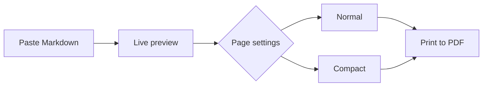
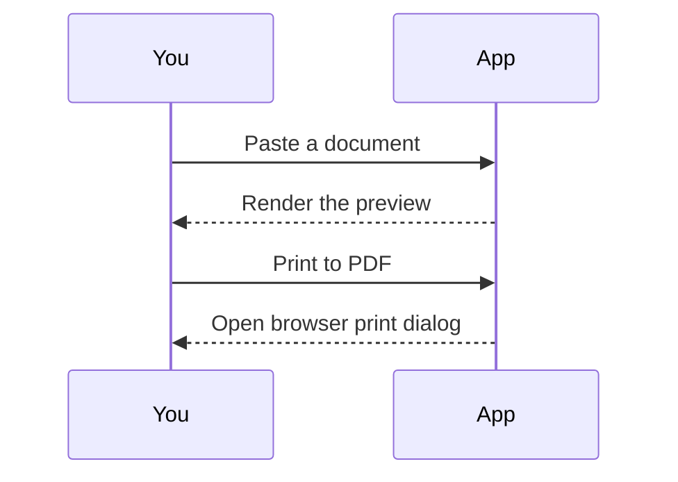

# Markdown to PDF

### Your words, ready for paper.

Paste your Markdown, check the preview, and choose **Print to PDF**. This sample shows what your document can include. Replace it with your own text whenever you are ready.

## Text & structure

Write **bold**, *italic*, ***bold italic***, ~~strikethrough~~ and `inline code`. Add [useful links](https://www.markdownguide.org/basic-syntax/), paragraphs and horizontal rules.

> A good document keeps the focus on the content.
> Everything you see here is editable Markdown.

- Notes, reports and study guides
  - Nested ideas stay grouped together
- [x] Paste or open a Markdown file
- [x] Preview tables, equations and diagrams
- [ ] Print and choose **Save as PDF**

1. Open **Page settings** if you want a different paper size.
2. Choose A4 or Letter, portrait or landscape, and your margins.
3. Try **Compact** for denser notes. The same styling is used in print.

## Tables

| Feature | Markdown | Result |
| :--- | :---: | ---: |
| Strong emphasis | `**bold**` | **Bold** |
| Inline equations | `$a^2+b^2=c^2$` | $a^2+b^2=c^2$ |
| Task lists | `- [x] Done` | Completed |

## Code

```javascript
function makeDocument(markdown) {
  const steps = ['Paste', 'Preview', 'Print'];
  return { markdown, steps };
}
```

Code stays selectable in your PDF. Long lines wrap to fit the page.

## Equations

Inline math fits naturally into a sentence: $E = mc^2$. Escaped currency stays literal: \$25 and \$50.

Display equations have space of their own:

$$
x = \frac{-b \pm \sqrt{b^2 - 4ac}}{2a}
$$

$$
\begin{aligned}
\nabla L(\mathbf{w}) &= \frac{1}{n}\mathbf{X}^{\mathsf{T}}(\mathbf{Xw}-\mathbf{y}) \\
\mathbf{w}_{t+1} &= \mathbf{w}_t - \eta\nabla L(\mathbf{w}_t)
\end{aligned}
$$

## Diagrams





## Images


Images scale to the document width. This example is bundled with the app; remote images need an internet connection.

---

### Small conveniences

Your draft is saved in this browser and restored when you return. **Clear** gives you a blank editor; **Undo replacement** restores the previous text after clearing, opening a file or loading this sample.

#### Printing tips

Turn off browser headers and footers for a clean document. The browser print preview shows the final pagination; its settings can override your selections here.

##### Explicit page breaks

The next section starts on a new printed page using this Markdown-compatible HTML:

```html
<div class="page-break-before"></div>
```

<div class="page-break-before"></div>

## A fresh page

This section demonstrates an explicit print page break. On screen, the preview remains one continuous document.

###### Ready to make it yours

Select the sample text, paste your own Markdown, and print.

## Links and screenshots

Jump to [Equations](#equations), [Diagrams](#diagrams), or [A fresh page](#a-fresh-page). External links, such as the [Markdown guide](https://www.markdownguide.org/), open separately.

Paste a screenshot directly into the editor to insert it. The image is saved locally in this browser, not uploaded. Local image references only work in the browser where you pasted them.

Fenced code with a language name is now highlighted:

```python
def greet(name):
    # A small, readable example
    return f"Hello, {name}!"

print(greet("reader"))
```

The print layout check flags wide content and large diagrams. Diagrams are reduced to fit one printable page; landscape can make large diagrams easier to read. Use the browser print preview to confirm final pagination.
