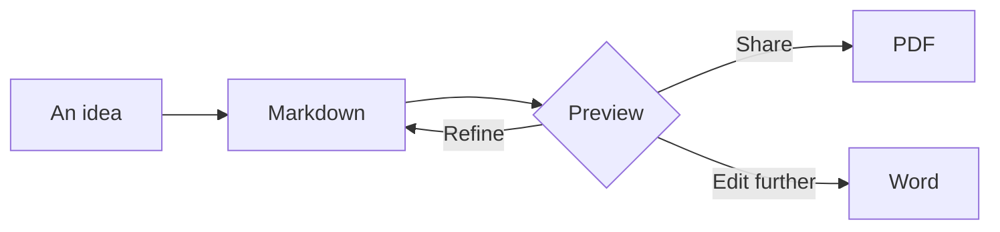
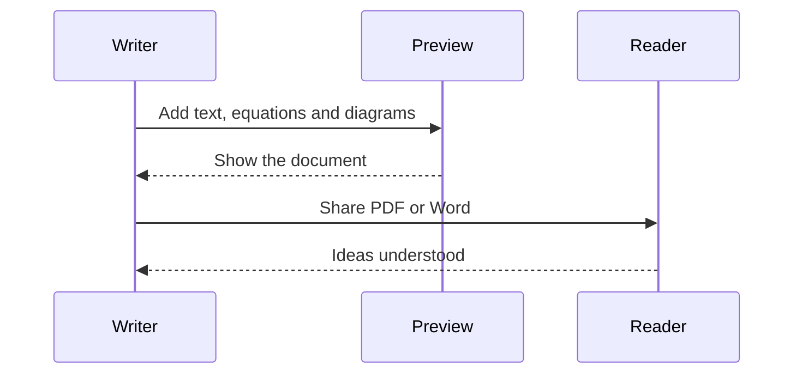
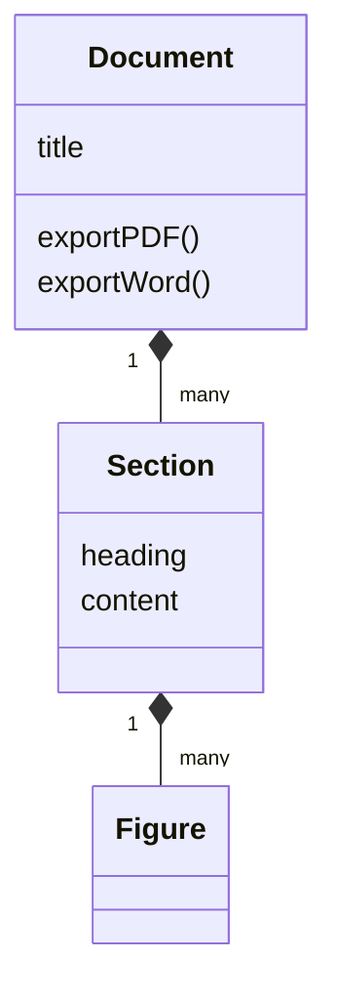
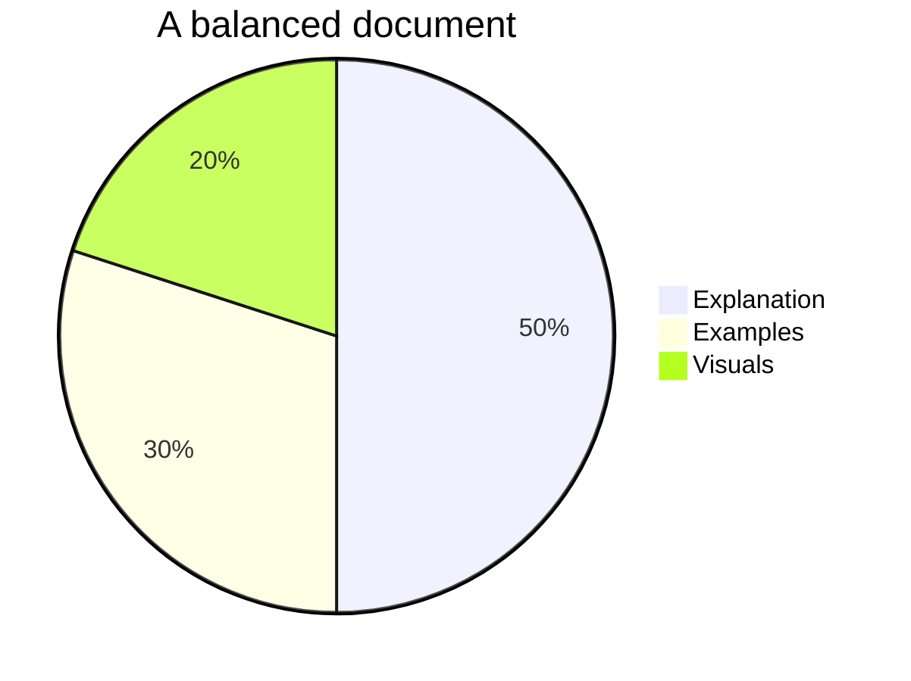

# Formatting reference

**Your words. A beautifully structured document.** Edit this sample or replace it with your Markdown, then choose **Print to PDF** or **Download Word**.

[Text](#text-styles) · [Tables](#tables) · [Code](#code) · [Equations](#equations) · [Diagrams](#diagrams) · [Images](#images) · [Export](#ready-to-export)

## Text styles

**Bold ideas**, *a little emphasis*, ***both together***, ~~a change of mind~~, and `inline code`. Unicode belongs here too: café, α, β, हिंदी. Literal prices stay literal: \$25.

> Good formatting makes an idea easier to understand.
>
> Separate paragraphs, clear headings and a little breathing room do the work.

### Lists with structure

1. Start with an idea.
2. Give it shape.
   - Group related details.
   - Add a supporting example.
     1. Explain the first step.
     2. Show the result.
3. Share a document worth reading.

- [x] Headings, lists and quotations
- [x] Tables, code and mathematics
- [x] Diagrams and images
- [ ] Your next great document

#### A smaller heading

Use headings to organize a report, practical file or study guide.

##### A supporting detail

Six heading levels let your structure stay consistent.

###### The finest detail

Keep the hierarchy meaningful rather than making every line a heading.

---

## Tables

Compare information with aligned columns, formatted cells and links.

| Capability | Example | Status |
|:---|:---:|---:|
| Emphasis | **Important** | Ready |
| Inline code | `print("Hello")` | Ready |
| Mathematics | $a^2+b^2=c^2$ | Ready |
| Navigation | [Jump to diagrams](#diagrams) | Ready |

## Code

Language-tagged blocks highlight syntax while preserving indentation and line breaks.

```python
def reading_time(words, words_per_minute=200):
    # A small estimate for your next article.
    minutes = words / words_per_minute
    return max(1, round(minutes))

print(f"About {reading_time(1200)} minutes to read")
```

```javascript
const document = {
  title: "Ideas worth sharing",
  formats: ["PDF", "Word"],
  ready: true,
};
```

Code remains selectable in PDF and editable in Word. Use short, readable lines when practical.

## Equations

Inline notation fits into prose: $E=mc^2$ and $P(A\mid B)=\frac{P(A\cap B)}{P(B)}$.

### A formula with room to breathe

$$
x = \frac{-b \pm \sqrt{b^2-4ac}}{2a}
$$

### Matrices and worked steps

$$
\begin{bmatrix}1 & 2 \\ 3 & 4\end{bmatrix}
\begin{bmatrix}5 \\ 6\end{bmatrix}
=
\begin{bmatrix}1(5)+2(6) \\ 3(5)+4(6)\end{bmatrix}
=
\begin{bmatrix}17 \\ 39\end{bmatrix}
$$

$$
\begin{aligned}
f(x) &= x^2 + 2x + 1 \\
     &= (x+1)^2 \\
\int_0^1 f(x)\,dx &= \left[\frac{x^3}{3}+x^2+x\right]_0^1
= \frac{7}{3}
\end{aligned}
$$

## Diagrams

### Turn a process into a picture



### Show a conversation



### Explain a system



### Make proportions visible

Illustrative breakdown of a document—not measured usage data.



Diagrams scale to the printable area. Keep labels concise; split a very large diagram if scaling makes it difficult to read.

## Images


*Figure 1 — From Markdown to a document you can share.*

Paste a screenshot straight into the editor. For an uploaded Markdown file with image paths, choose **Image folder** and select the folder containing its assets. Choose a parent folder to include its subfolders. Images stay local; reconnect the folder after reloading.

```markdown

```

## Links that go somewhere

Use [an external website](https://example.org), an [email link](mailto:reader@example.org), or [return to the top](#formatting-reference). Internal heading links let a reader navigate a longer document.

## A deliberate page break

The next section starts on a fresh exported page. On screen, this remains one continuous preview.

```html
<div class="page-break-before"></div>
```

<div class="page-break-before"></div>

## Ready to export

| Output | What you get |
|:---|:---|
| **Print to PDF** | Selectable text with rendered mathematics and diagrams |
| **Download Word** | Editable text, lists, code and tables; equations and diagrams as pictures |

Choose **Page settings** for A4/Letter, portrait/landscape and margins. **Compact** makes a denser document. PDF and editable Word share styling, but their page breaks can differ.

Check any layout warnings before exporting. Browser print preview is the final PDF layout; turn off browser headers and footers for clean pages.

Every visit opens this reference automatically. Your previous draft is available through **Restore draft**. **Load sample** returns here while editing, and **Undo replacement** restores the text it replaced.

**Make it yours:** select the Markdown, paste your own content, and export.
