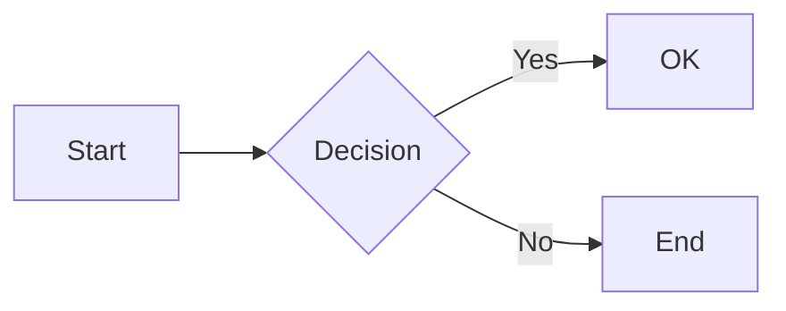
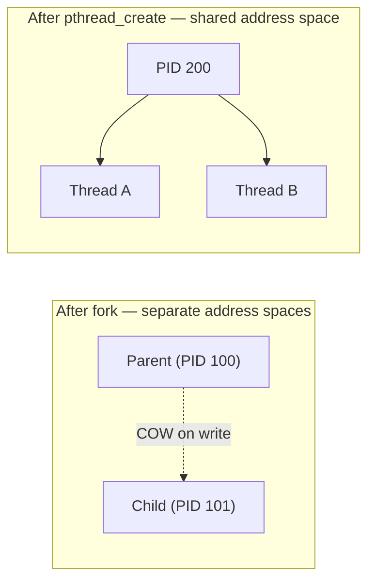
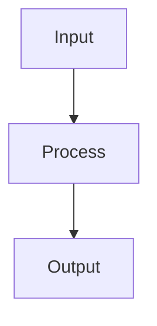

# Markdown to PDF and Editable Word — Formatting Rules

Updated 2026-09-12 against the local MD2PDF implementation. These conventions support GFM documents for Print to PDF and editable Download Word. Word export is implemented locally; verify the deployed UI before promising it is available online. Preserve source meaning and complete code when formatting.

---

## 1. Supported Markdown Syntax

Prefer these supported syntaxes:

| Element | Syntax | Notes |
|---------|--------|-------|
| **Headings** | `# H1` through `###### H6` | Use one space after `#`. Avoid headings inside tables. |
| **Bold** | `**text**` | Prefer `**` over `__`. |
| **Italic** | `*text*` | Prefer `*` over `_`. |
| **Strikethrough** | `~~text~~` | GFM only. |
| **Inline code** | `` `code` `` | Use a longer backtick delimiter when the content contains a backtick. |
| **Code block** | ` ``` ` with optional language | Fenced with triple backticks on their own line. |
| **Diagram** | ` ```mermaid ` | Mermaid diagram rendered as SVG. See Section 4. |
| **Bullet list** | `-` or `*` + space | Use consistent bullet style. |
| **Numbered list** | `1.` + space | Numbers can be `1.` for all (auto-numbering). |
| **Task list** | `- [ ]` and `- [x]` | Space inside brackets for unchecked; `x` for checked. |
| **Nested list** | Indent 2–4 spaces | Align with parent item. |
| **Blockquote** | `> ` at line start | Add space after `>`. |
| **Table** | `| col | col |` and `|---|` | See table rules below. |
| **Link** | `[text](url)` | URL in parentheses. |
| **Horizontal rule** | `---` (3+ hyphens) | On its own line, blank line before/after. |

---

## 2. Table Rules for Clean PDFs

### Structure
- Put a blank line **before** and **after** the table.
- Alignment row uses `:---` (left), `:---:` (center), `---:` (right).
- Keep column widths similar to avoid layout issues.

### Example

```markdown
| Left   | Center | Right  |
|:-------|:------:|-------:|
| A      | B      | C      |
| 1      | 2      | 3      |
```

### Avoid
- Very long cells without spaces (can break layout).
- Tables inside blockquotes or lists.
- More than ~8 columns.

---

## 3. Code Blocks

### Use fenced code blocks

````markdown
```language
// code
```
````

### Supported language tags
`c`, `cpp`, `python`, `javascript`, `bash`, `json`, etc. Recognized language tags enable syntax highlighting in preview, PDF, and Word. Unknown languages remain plain monospace.

### Long lines — break onto next line
Long lines in code blocks can be cut off or overflow in PDF. Keep lines under ~72–80 characters where practical.

**How to handle:**
- Break long statements onto the next line with proper indentation.
- Use parentheses or backslash for line continuation.
- Extract sub-expressions into named variables to shorten lines.
- Split list comprehensions, function args, and multi-part conditions across multiple lines.

**Example — before (long line, may be cut):**

```python
results.append((pid, arrival, burst, completion, completion - arrival, completion - arrival - burst, current_time - arrival))
```

**Example — after (split for readability and PDF-safe width):**

```python
tat = completion - arrival
wt = tat - burst
rt = current_time - arrival
results.append((pid, arrival, burst, completion, tat, wt, rt))
```

**Example — long list comprehension split:**

```python
ready = [
    (pid, procs[pid])
    for pid in procs
    if procs[pid][0] <= current_time and procs[pid][2] > 0
]
```

### Avoid
- Indented code blocks (4 spaces) for multi-line code — prefer fenced blocks.
- Tabs inside code — use spaces.
- Lines longer than ~80 characters — break them for PDF safety.

---

## 4. Diagrams and Infographics (Mermaid)

The app renders **Mermaid** fences as SVG in preview and browser PDF; Word embeds rendered diagrams as PNG pictures. Use ` ```mermaid ` fenced blocks instead of ASCII art for diagrams that need to look sharp at any zoom level and remain readable in exported PDFs.

### Basic syntax

````markdown

````

The diagram is centered. It remains a graphic in Word, not editable Word shapes.

### Supported diagram types

| Type | Opening keyword | Typical use |
|------|-----------------|-------------|
| Flowchart | `flowchart TD` or `flowchart LR` | Process flows, algorithms, decision trees |
| Sequence | `sequenceDiagram` | API calls, protocol exchanges |
| State | `stateDiagram-v2` | Process lifecycles, FSMs |
| Class | `classDiagram` | OOP structures, relationships |
| ER | `erDiagram` | Database schemas |
| Gantt | `gantt` | Timelines, project schedules |
| Pie | `pie` | Proportional data |
| Mindmap | `mindmap` | Topic exploration, brainstorming |
| Git graph | `gitGraph` | Branch workflows |

Full reference: [mermaid.js.org/intro](https://mermaid.js.org/intro/)

### Rules for clean Mermaid in PDF

1. **One diagram per fenced block.** Do not put two separate diagrams inside the same ` ```mermaid ` fence.
2. **Keep diagrams compact.** Very wide flowcharts may be clipped or scaled down in A4 PDF. Use `TD` (top-down) orientation for tall diagrams or split wide ones into subgraphs.
3. **No spaces in node IDs.** Use `camelCase` or `underscores` for identifiers; put display labels in brackets: `myNode[My Label]`.
4. **Quote edge labels with special characters.** Wrap in double quotes: `A -->|"O(n) time"| B`.
5. **Prefer the default theme.** Mermaid styling can work, but verify contrast and output. Raw HTML styles are sanitized; do not depend on them for page layout.
6. **Blank line before and after** the fenced block — same rule as code blocks and tables.
7. **Resolve syntax errors in the local preview.** The app preserves failed diagram source with an error border. External editors are optional; do not upload private documents without authorization.

### When to prefer ASCII art over Mermaid

- **Simple text boxes** shown in monospace (e.g. a single-column pipeline) are sometimes clearer as plain code blocks, especially when the viewer may not have Mermaid support (e.g. plain-text `README` files in terminals).
- You can keep **both** side by side: a ` ```mermaid ` block for the rendered diagram and an ASCII fallback inside a regular ` ``` ` code block, labelled accordingly. The rendered version will appear in preview/PDF; the ASCII version will appear in plain-text viewers.

### Example: process vs thread memory layout

````markdown

````

### Word export notes

Mermaid SVGs are automatically converted to inline PNG images when you choose **Download Word**. Colours and fonts may shift slightly versus the preview; use simple diagrams for best results.

---

## 5. Page Breaks and Page Settings

Use A4 or Letter, portrait or landscape, 10/15/20 mm margins, and Normal or Compact density. Start with A4 portrait/Normal unless the user requests otherwise.

For an intentional new page, use this separate block:

```html
<div class="page-break-before"></div>
```

It works in PDF and Word. `##` does not automatically start a page: the former Practical File mode is removed. Inline `style="page-break-before: always"` is stripped. Avoid breaks before every short section. Word attaches an explicit break to the following paragraph rather than adding a blank paragraph.

---

## 6. Spacing and Layout

- **Blank lines**: Use one blank line between blocks (paragraphs, lists, tables, headings).
- **No trailing spaces**: Remove spaces at end of lines.
- **Consistent newlines**: Use single line breaks; avoid multiple blank lines in a row.
- **Lists**: One blank line before and after lists.

---

## 7. Characters, Links, and Navigation

- Preserve meaningful Unicode and source notation. Typographic quotes in prose are valid; use straight quotes in code and Mermaid syntax. Avoid accidental zero-width characters and tabs.
- Use `[Website](https://example.org)` for external links and `[Email](mailto:reader@example.org)` for email. Ordinary external and email links become Word hyperlinks; browser/viewer handling varies.
- Use `[Equations](#equations)` to link to a heading. Slugs are lowercase, remove punctuation, and replace whitespace with hyphens; duplicate headings use `-1`, `-2`. Preview and export create their own targets, so write the human-facing slug, not the internal `doc-` prefix.
- Word creates heading bookmarks and internal links. PDF navigation depends on the browser and viewer; verify critical links.

---

## 8. Images and Large Documents

Use Markdown image syntax, e.g. ``. Put captions in a following paragraph, such as *Fig 1 — Network topology*.

- **Clipboard:** paste PNG/JPEG/WebP/GIF images up to 10 MB each. They are stored in this browser's IndexedDB, and the generated `/__md2pdf_image__/...` reference is not portable to another browser.
- **Local folders:** upload the Markdown, then choose **Image folder** and select a folder containing the Markdown and its images. To include a parent and its subfolders, explicitly select that parent. Uploading one Markdown file does not grant neighboring filesystem access.
- Paths resolve relative to the located Markdown file, with unambiguous fallback matches. Duplicate names may require a more specific path. Only the selected folder tree is accessible; reconnect after reload or uploading another Markdown file.
- Prefer relative paths (`images/topology.png`, `../images/topology.png`). Absolute Windows paths are not portable; matching requires the image to exist in the explicitly selected tree.
- Remote images need a network connection. Word must fetch image bytes, so the remote server must permit browser access. If it does not, save the image locally and connect its folder. A working on-screen image alone does not guarantee Word embedding.
- PDF and Word include loaded local images. Word embeds them as pictures; references are resolved before export.
- There is no verified universal 50-page limit. Split large documents by meaningful units if performance or readability suffers, without dropping requested material.

---

## 9. PDF and Editable Word

| Capability | Print to PDF | Download Word |
|---|---|---|
| Body, headings, lists | Selectable rendered text | Editable native Word content |
| Tables | Rendered tables | Editable tables, column alignment retained |
| Code | Highlighted text, wraps for printing | Editable highlighted text; short blocks kept together |
| Equations | KaTeX rendering | PNG pictures, not editable Word equations |
| Mermaid | Rendered SVG | Embedded PNG pictures, not editable shapes |
| Images | Loaded images | Embedded pictures |
| Links | Browser-generated PDF links | External hyperlinks and heading bookmarks |
| Page settings | Browser page configuration | Same selected paper, orientation, margins and density |

Use **Print to PDF → Save as PDF** for PDF, disabling browser headers/footers for a clean document. The separate image-based Download PDF button is removed. Download Word generates DOCX directly from the rendered Markdown, not through a PDF-to-Word service.

Printed text uses Segoe UI with Arial fallback; code uses Consolas with Courier New fallback. The website keeps Outfit/JetBrains Mono. Keep this separation: the earlier Outfit PDF converted into corrupted letters in Smallpdf, while the restored system-font PDF converted correctly in the supplied test.

Word aims for similar styling, not identical pagination. The comprehensive local comparison produced 8 PDF pages versus 7 Word pages after improvements. This is an example, not a page-count rule. Check in Microsoft Word when appearance matters; package/XML validation alone is insufficient.

---

## 10. Export Checks

- Check balanced fences/math delimiters, heading hierarchy, blank lines, table separators/alignment, and nested-list indentation.
- Preserve complete code and valid continuation syntax; target readable line lengths rather than an arbitrary hard limit.
- Resolve missing images and math/Mermaid errors. An enabled export button does not prove visual correctness.
- Review print-layout warnings for wide tables/equations and oversized diagrams. Diagrams scale to fit with heading space reserved, but warnings are estimates, not guaranteed pagination.
- Split an oversized diagram or expression when scaling would make labels unreadable. Landscape is an option, not an automatic fix.
- Review actual page boundaries, heading/figure placement, trailing blank pages, table rows and image clipping.
- For automated PDF checks, wait until print preparation (fonts, images, diagrams and layout checks) completes before capturing the PDF.
- Compare Word's actual rendering with the PDF when matching appearance is requested. Check editable text separately from image content, and verify important links.
- Keep the source `.md` and image assets. Browser-local drafts are not a portable document backup.

---

## 11. Example: Well-Formatted Document

````markdown
# Document Title

Short intro paragraph.

## Section One

- Bullet one
- Bullet two

## Section Two

| A   | B   |
|-----|-----|
| 1   | 2   |

## Section Three

```python
print("Hello")
```

## Section Four — Diagram



> Important note here.
````

---

These conventions improve consistency; verify the actual export before claiming visual equivalence.

## 12. Equations and Matrices

Prefer `$...$` for inline math and standalone `$$` lines for display math. `\(...\)` and `\[...\]` are also supported. Math in code fences/inline code stays literal; escape currency as `\$`.

Write literal LaTeX backslashes in the Markdown file. Use two backslashes for matrix rows, one for commands:

```text
$$
A = \begin{bmatrix}
1 & 2 \\
3 & 4
\end{bmatrix}
$$
```

The text fence above is only an example wrapper; omit it around the actual equation. Use `aligned` and meaningful line breaks for wide derivations. Avoid display math inside narrow table cells. Define symbols and verify matrix dimensions; formatting does not validate mathematics.
